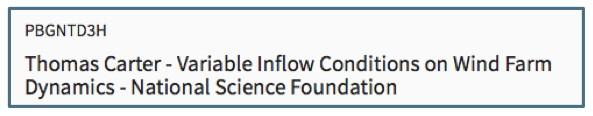
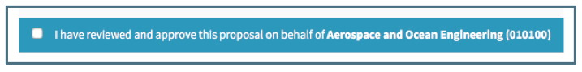
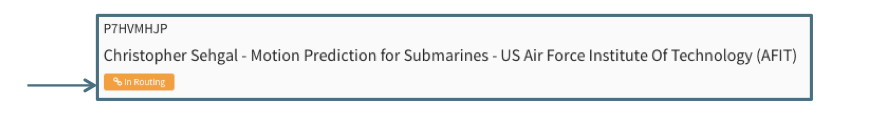

**Approvals / Approving**

# Approval Navigation
The Approval Navigation is visible to all Users though only Approvers will see proposals on which they are approvers here.

Located at the bottom of the left Navigation pane, the Approval section contains three subsections: To Be Approved, Pending and Approved.  The section can be collapsed or expanded.  When the navigation pane is collapsed, only the icons for the subfolders will show.

**To be Approved**

All proposals waiting on the User's Organization for approval are listed in the Summary Pane. This could mean the User is required to approve or may allow for the approval of one of several authorized Approvers or Delegates. The gavel icon indicates a decision is waiting to be made.

**Pending**

All proposals on which the User is listed an approver or delegate that have not been approved by all required Organizations are listed in the Summary.  This means all proposals that will require the User's Organization approval after another party approves and proposals which the User's Organization has already approved and are waiting on another party's approval.  It also includes all the proposals included in "To be Approved."  The question mark icon indicates approval has not been granted by all parties.

**Approved**

All proposal that have been approved by all required Organizations are listed in the Summary Pane.  The checkmark icon indicated all required approvals have been granted.

**Canceled**

When a proposal needs to be updated while it routing, the routing can be canceled, updated, and then re-routed.  If a proposal needs to be updated after all approvals are received, the approval can be discarded and then the proposal updated and re-routed.  The Canceled folder contains all approvals that have been canceled or discarded, with a notification at the top indicating the circumstances.

# Approval Editor
Choosing a proposal from the summary view of any of the Approval folders will display a read-only Editor that contains subset of data from the Proposal Editor.  

**Header**

The Header includes the proposal number, the PI, the proposal label and the Sponsor name.

**Approval Checkbox**

When a proposal is waiting on the User's Organization in "To Be Approved" or "Pending," there will be an Approval checkbox under the header.  Once any one of Approvers or delegates for the User's Organization have approved, this option is no longer available.

**Approval Decisions**

This section lists all of the Organizations required to approve the proposal.  If there are multiple approval chains, they are designated by a separate subsection.

The above image illustrates the following:

- The User's Organization will be emphasized in blue when an approval is still required.  
- An organization that has no parent organization will have no chain of approvers but only have itself in the list.
- All organizations that have approved will have the approved indicator.
- The name of the approver and the date and time of approval are listed for all approvals.
- If one organization is in multiple chains, it will be listed in each but the approver for that organization will only need to approve once.

**Work Summary**

This section is a read-only summary of the data in the Proposal Editor.  

Information that is grayed out in the Budget Information section indicates the proposal budget does not include these circumstances.

**Files**

The files log is located at the top of the approval editor next to the save button.  

The file log lists all files attached to the proposal.  The most recent version of each file can be accessed by clicking on the file name.

## Approving the Proposal
Approvers log in to Summit and see a list of proposals waiting for their approval in "Approvals / To Be Approved."  Choosing the Proposal in the Summary Pane will display a read-only view of the basic Proposal details in the Editor. To approve the proposal, the User checks the box at the top of the Editor indicating they have reviewed and approve the proposal.

Once the User checks the box the proposal will no longer be in their "To be approved."  

Approvers listed in multiple approval chains will only receive a notification when all the chains are ready for their approval.  When they check the approval box, they will approve for all chains and not need to approve for each separately.  In the example below, the approver will approve for the College of Engineering in both chains when he clicks the approved checkbox:

# Approvals in the Proposal
**Proposal Summary**

The Summary Pane displays the routing chain icon or the approved icon on the left of the summary for the proposal

Users can also search by proposal status in the summary view.

**Proposal Editor**

**Header**

Proposal in Routing will display the "In Routing" chain icon and indicator in the header of the proposal.

Once the proposal has been approved by all organizations, the status changes to Approved.  The header will then display the "Approved" checkmark icon and indicator.

**Approval Decision Section**

In the Proposal Editor, Users can track the approval process in the Approval Decision section.  This section shows which organizations have approved and which approvals are still pending.

 Notice the following in the above:

 - A link to the budget chosen for routing is located at the top of the section

 - The pending icon (question mark) appears to the left of the organization name when that organization's approval is required for the approval process to proceed to the next level.

 - Clicking the down caret next to the organization name displays a list of the approver and approver delegates

 - Organizations that have approved have a checkmark.

 - The name of the person who approved and the time they approved displays on the right.

 - If an organization does not need to approve due to conditional approval preferences, it is is indicated to the left of the organization name.
