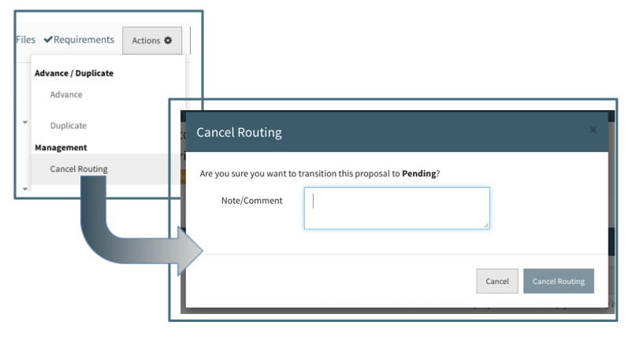
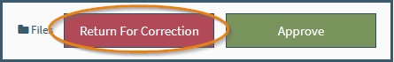
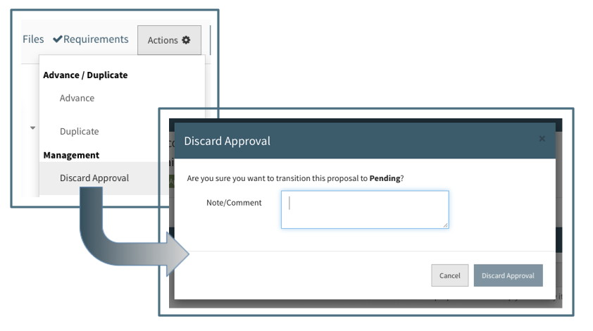
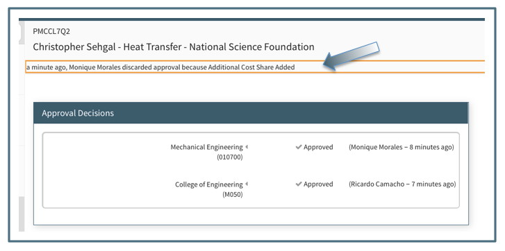

**Approvals / Canceling**

## Canceling the Routing
If during the routing process the required fields need to be updated or the proposal no longer needs to be approved, the routing may be canceled.  To cancel routing, anyone on the Proposal Team or Support Staff may use the Action Menu and choose the "Cancel Routing" options.   This will open a dialogue box in which the reason for canceling must be indicated.  For example, if major budgeting changes are required, a new budget would need to be routed for review and approval.

Canceling routing will hide the approval decisions section, allow editing to all required fields and remove the In Routing status.  The proposal can then be updated and re-routed.  The reason for canceling will be indicated in the approver's view along with when, and by whom it was canceled.

## Return for Correction
As an approver, you can send an approval back to the proposal team for correction if an item does not meet your expectations.  This action will take the proposal out of routing and give the proposal team a chance to correct any deficiencies that were noted by the approvers.

While in the approval, click the "Return For Correction" button in the top right corner (shown circled below).

From there a modal will pop-up asking for your reason on why you are returning it for correction.  You need to leave a comment before the "Return for Correction" button will become enabled.

Once the button is clicked, the approval will move from "To be approved" to the "Canceled" folder and the proposal will come out of routing for the proposal team to make any edits.

Then once the proposal team is ready, they can put the proposal back into routing for the approvers to once again review, then approve/return the approval.

## Discarding the Approval
If after a proposal has been routed and is in the Approved status and the required fields need to be updated, the approval may be discarded.  To discard the approval, anyone on the Proposal Team or Support Staff may use the Action Menu and chose the "Discard Approval" option.  This will open a dialogue box in which the reason for discarding must be indicated.  For example, if additional cost share is required, a new budget would need to be routed for review and approval.

Discarding the approval will clear the approval status, hide the approval decision section and allow editing to all required fields.  The proposal can then be updated and re-routed. The reason for discarding the approval will be indicated in the approver's view along with when, and by whom it was discarded.

## Email Notifications

Whether the routing is canceled, the approval returned for correction, or the approval discarded (all 3 actions described above); an email is sent to all approvers that have been notified so far and proposal team members about this change from a previously routing/approved status back to preparing.  The email will state which of the 3 transition took place and will give the comment left by the person who committed the action.

For example, when canceling routing, a modal displays needing a comment to enable the "Cancel Routing" button.

Once clicking the "Cancel Routing" button, an email will go to all Proposal Team members and staff, as well as any approvers already notified previously for approving.

As seen in the example email above, the action taken and proposal ID is noted in the subject line.  In the body of the email it will also give similar information, but also the reason the user canceled routing, as well as what is needed from the email recipients.  This example is for proposal team members, which states how to sign in and after correcting what is needed, to re-route the proposal for further review and then approval.

 
