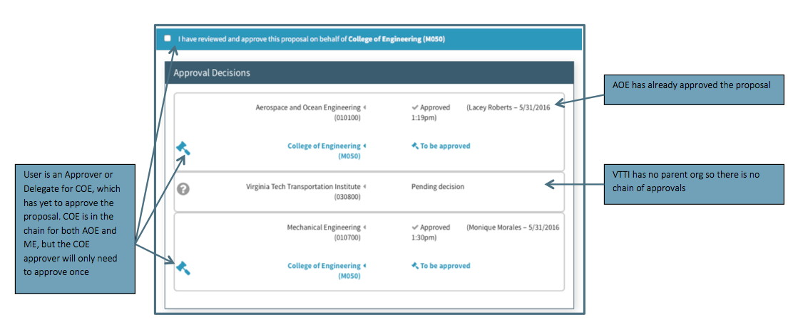
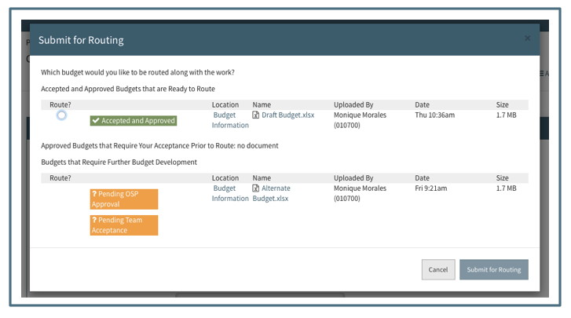
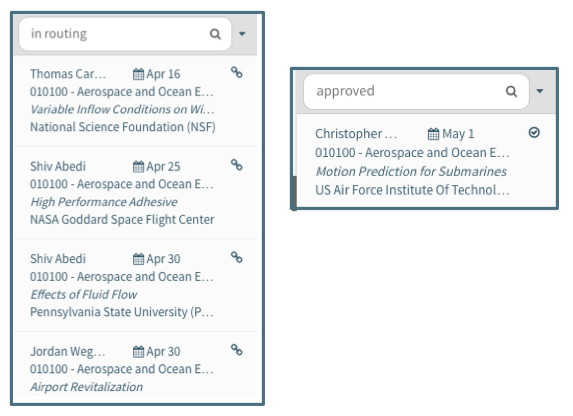
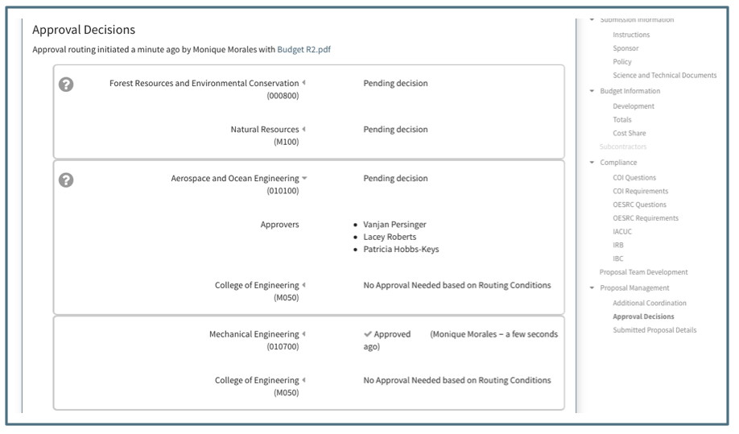

**Approvals / Proposal Routing**

The Proposal Routing and Approval function in Summit allows for Users to submit proposals for routing.  Doing so alerts the appropriate approvers there is a proposal awaiting their review and approval.  Once the proposal is approved by all required parties, the Approved status is indicated in the proposal and it may then be submitted to the sponsor.

# Approval Navigation
The Approval Navigation is visible to all Users though only Approvers will see proposals on which they are approvers here.

Located at the bottom of the left Navigation pane, the Approval section contains three subsections: To Be Approved, Pending and Approved.  The section can be collapsed or expanded.  When the navigation pane is collapsed, only the icons for the subfolders will show.

**To be Approved**

All proposals waiting on the User's Organization for approval are listed in the Summary Pane. This could mean the User is required to approve or may allow for the approval of one of several authorized Approvers or Delegates. The gavel icon indicates a decision is waiting to be made.

**Pending**

All proposals on which the User is listed an approver or delegate that have not been approved by all required Organizations are listed in the Summary.  This means all proposals that will require the User's Organization approval after another party approves and proposals which the User's Organization has already approved and are waiting on another party's approval.  It also includes all the proposals included in "To be Approved."  The question mark icon indicates approval has not been granted by all parties.

**Approved**

All proposal that have been approved by all required Organizations are listed in the Summary Pane.  The checkmark icon indicated all required approvals have been granted.

**Canceled**

When a proposal needs to be updated while it routing, the routing can be canceled, updated, and then re-routed.  If a proposal needs to be updated after all approvals are received, the approval can be discarded and then the proposal updated and re-routed.  The Canceled folder contains all approvals that have been canceled or discarded, with a notification at the top indicating the circumstances.

# Approval Editor
Choosing a proposal from the summary view of any of the Approval folders will display a read-only Editor that contains subset of data from the Proposal Editor.  

**Header**

The Header includes the proposal number, the PI, the proposal label and the Sponsor name.

**Approval Checkbox**

When a proposal is waiting on the User's Organization in "To Be Approved" or "Pending," there will be an Approval checkbox under the header.  Once any one of Approvers or delegates for the User's Organization have approved, this option is no longer available.

**Approval Decisions**

This section lists all of the Organizations required to approve the proposal.  If there are multiple approval chains, they are designated by a separate subsection.

The above image illustrates the following:

- The User's Organization will be emphasized in blue when an approval is still required.  
- An organization that has no parent organization will have no chain of approvers but only have itself in the list.
- All organizations that have approved will have the approved indicator.
- The name of the approver and the date and time of approval are listed for all approvals.
- If one organization is in multiple chains, it will be listed in each but the approver for that organization will only need to approve once.

**Work Summary**

This section is a read-only summary of the data in the Proposal Editor.  

Information that is grayed out in the Budget Information section indicates the proposal budget does not include these circumstances.

**Files**

The files log is located at the top of the approval editor next to the save button.  

The file log lists all files attached to the proposal.  The most recent version of each file can be accessed by clicking on the file name.

# Approval Process
When a proposal is ready to be routed for Departmental and College or Institute approval, any full access User can initiate the routing process.  All approvers and delegates assigned to the proposal are notified and must log in to Summit to review and approve the proposal.  Each organization on the proposal has its own approval chain, but the approvals for each chain can be done in parallel and do not need to wait on the other chains. For example, there may be two departments in two different colleges assigned to approve the proposal.  Both departments will be notified at the same time. Each college will be notified once their department has approved. The Proposal Editor tracks where the proposal is in the process and documents which approvals are pending and which are complete.

## Submit for routing
All Users with full access can submit a proposal for routing by choosing the "Submit to Routing" option on the Proposal action menu

Choosing this option will activate a dialogue box where the User must choose a budget file to be used for routing.  Only budgets files that have been approved by Pre-Award can be routed.  Choosing a budget here will allow the approvers to view this file and indicate that it is the version being submitted to the sponsor.

## Validations for Routing
After the budget has been choose, when the user clicks the "Submit for Routing" button, the system will confirm all required fields have been completed.  If all of the required fields are not completed, a notification will appear in the lower right indicating which fields must be complete before routing can begin.  

The following is a list of all fields required before routing:

- All questions in the Compliance sections
- The following fields are entered: Proposal Label, Proposal Full Title, Program Type, Research Theme, Research Initiative, Building, Period of Performance, Performance Location, Indirect Type, Indirect Rate, Indirect Rate Reason, Subcontracts, Special Indirect Distribution, Subfunds Needed, Special Administrative Costs, Total Direct Costs, Total Indirect Costs
- If Cost Share is marked "yes," then Total Cost Share, Rationale and Requirement fields are also required
- If Personnel Cost Share is marked "yes," then at least one person must be entered with an organization, percent effort, salary, fringe and fund source
- If Non-Personnel Direct Cost Share is marked "yes," then at least one item must be added with Type, Organization, Total for all years and Funding source
- If Indirect Cost Share is marked "yes," then at least one of the fields must be completed
- If Third Party Cost Share is marked "yes," then at least one contributor must be added with the Total Cost Share Commitment and Type fields completed

## In Routing status
Once the proposal is in routing, the status changes to "In Routing." The chain icon indicates the proposal is in routing and has not yet been approved by all parties.  This status is captured in the Proposal Header, Summary Pane and Calendar View.

All required fields become read-only fields after a proposal is submitted for routing.  

## Approver Assignment
When a proposal is submitted to routing, organizations and their designated approvers and delegates are assigned to approve it.  At least one approver or delegate from each assigned organization must approve the proposal.  

**How organizations are assigned**

Organizations are assigned based upon the data in the Proposal editor. Each proposal will always have a submitting org assigned.  In addition, the following will also be assigned as applicable:

 - Responsible organization for the PI and Co-PI regardless of credit percentage.
 - Proposal Team member with credit

 - Any organization providing Cost Share
 - Parent organization of any of the above.  Parent Organization is a designation in the Summit Organization Editor.  See the Management/Organization section for further information.

**How approvers are assigned**  

Specific approvers and their delegates for each organization are managed by departmental representatives in the Enterprise Directory.  The Organization Editor, available to OSP personnel, lists all approvers and delegates listed in the Enterprise Directory.

## Conditional Approval

Organizations may choose to approve proposals only under specific conditions.  If an organization has chosen to approve only in one or more of the approval conditions, they will not be in the approval chain for proposals not meeting the conditions. If an organization does not indicate it must only approve under certain circumstances, it will be in the approval chain for all proposals.

The conditions for which an organization may choose to limit its required approval are:
- Cost Share
- Special Administrative Costs on budget
- Special Distribution of Indirect

Organizations that conditionally approve are indicated in the Organization Editor.  Pre-Award users have access to view this information.  To request a change in the conditional status of an organization, contact the Organization's Pre-Award Administrator or summithelp@vt.edu.

For example, if AOE has indicated it only wishes to review and approve proposals with Cost Share, it will not see the proposal because it does not have Cost Share in the budget.  The image above shows an proposal being submitted with AOE as the submitting org and ME as a Co-PI org.  AOE is not included in the first chain because the proposal does not meet the conditions indicted for AOE.

## Approver Notifications
A notification is emailed to all Approvers and delegates assigned to a proposal once it is their turn in the approval chain to approve.  For example, all departments will receive a notification that approval is required, but a college will not receive notification until the department has approved it.  If a college is in more than one approval chain, it will not receive a notification until all the departments under it have approved.

For example, if the proposal needs to be approved by both Mechanical Engineering (ME) and Aerospace and Ocean Engineering (AOE), the College of Engineering will not be notified until both ME and AOE have approved.

## Approving the Proposal
Approvers log in to Summit and see a list of proposals waiting for their approval in "Approvals / To Be Approved."  Choosing the Proposal in the Summary Pane will display a read-only view of the basic Proposal details in the Editor. To approve the proposal, the User checks the box at the top of the Editor indicating they have reviewed and approve the proposal.

Once the User checks the box the proposal will no longer be in their "To be approved."  

Approvers listed in multiple approval chains will only receive a notification when all the chains are ready for their approval.  When they check the approval box, they will approve for all chains and not need to approve for each separately.  In the example below, the approver will approve for the College of Engineering in both chains when he clicks the approved checkbox:

## Canceling the Routing
If during the routing process the required fields need to be updated or the proposal no longer needs to be approved, the routing may be canceled.  To cancel routing, anyone on the Proposal Team or Support Staff may use the Action Menu and choose the "Cancel Routing" options.   This will open a dialogue box in which the reason for canceling must be indicated.  For example, if major budgeting changes are required, a new budget would need to be routed for review and approval.

Canceling routing will hide the approval decisions section, allow editing to all required fields and remove the In Routing status.   The proposal can then be updated and re-routed.  The reason for canceling will be indicated in the approver's view along with when, and by whom it was canceled.

## Discarding the Approval
If after a proposal has been routed and is in the Approved status and the required fields need to be updated, the approval may be discarded.  To discard the approval, anyone on the Proposal Team or Support Staff may use the Action Menu and chose the "Discard Approval" option.  This will open a dialogue box in which the reason for discarding must be indicated.  For example, if additional cost share is required, a new budget would need to be routed for review and approval.

Discarding the approval will clear the approval status, hide the approval decision section and allow editing to all required fields.  The proposal can then be updated and re-routed. The reason for discarding the approval will be indicated in the approver's view along with when, and by whom it was discarded.

# Approvals in the Proposal
## Summary
The Summary Pane displays the routing chain icon or the approved icon on the left of the summary for the proposal

Users can also search by proposal status in the summary view.

## Editor

**Header**

Proposal in Routing will display the "In Routing" chain icon and indicator in the header of the proposal.

Once the proposal has been approved by all organizations, the status changes to Approved.  The header will then display the "Approved" checkmark icon and indicator.

**Approval Decision Section**

In the Proposal Editor, Users can track the approval process in the Approval Decision section.  This section shows which organizations have approved and which approvals are still pending.

 Notice the following in the above:
 - A link to the budget chosen for routing is located at the top of the section
 - The pending icon (question mark) appears to the left of the organization name when that organization's approval is required for the approval process to proceed to the next level.
 - Clicking the down caret next to the organization name displays a list of the approver and approver delegates
 - Organizations that have approved have a checkmark.
 - The name of the person who approved and the time they approved displays on the right.
 - If an organization does not need to approve due to conditional approval preferences, it is is indicated to the left of the organization name.
