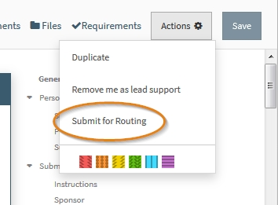
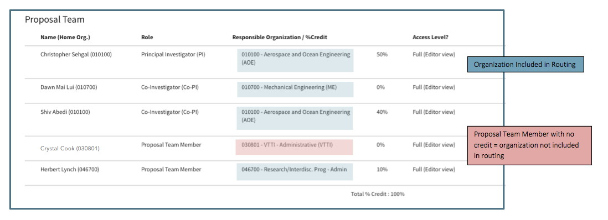

**Approvals / Routing**

# Routing Process
When a proposal is ready to be routed for Departmental and College or Institute approval, any full access User can initiate the routing process.  All approvers and delegates assigned to the proposal are notified and must log in to Summit to review and approve the proposal.  Each organization on the proposal has its own approval chain, but the approvals for each chain can be done in parallel and do not need to wait on the other chains. For example, there may be two departments in two different colleges assigned to approve the proposal.  Both departments will be notified at the same time. Each college will be notified once their department has approved. The Proposal Editor tracks where the proposal is in the process and documents which approvals are pending and which are complete.

## Submit for routing
All Users with full access can submit a proposal for routing by choosing the "Submit to Routing" option on the Proposal action menu

Choosing this option will activate a dialogue box where the User must choose a budget file to be used for routing.  Only budgets files that have been approved by Pre-Award can be routed.  Choosing a budget here will allow the approvers to view this file and indicate that it is the version being submitted to the sponsor.

## Validations for Routing
After the budget has been choose, when the user clicks the "Submit for Routing" button, the system will confirm all required fields have been completed.  If all of the required fields are not completed, a notification will appear in the lower right indicating which fields must be complete before routing can begin.  

The following is a list of all fields required before routing:

- All questions in the Compliance sections
- The following fields are entered: Proposal Label, Proposal Full Title, Program Type, Research Theme, Research Initiative, Building, Period of Performance, Performance Location, Indirect Type, Indirect Rate, Indirect Rate Reason, Subcontracts, Special Indirect Distribution, Subfunds Needed, Special Administrative Costs, Total Direct Costs, Total Indirect Costs
- If Cost Share is marked "yes," then Total Cost Share, Rationale and Requirement fields are also required
- If Personnel Cost Share is marked "yes," then at least one person must be entered with an organization, percent effort, salary, fringe and fund source
- If Non-Personnel Direct Cost Share is marked "yes," then at least one item must be added with Type, Organization, Total for all years and Funding source
- If Indirect Cost Share is marked "yes," then at least one of the fields must be completed
- If Third Party Cost Share is marked "yes," then at least one contributor must be added with the Total Cost Share Commitment and Type fields completed

## In Routing status
Once the proposal is in routing, the status changes to "In Routing." The chain icon indicates the proposal is in routing and has not yet been approved by all parties.  This status is captured in the Proposal Header, Summary Pane and Calendar View.

All required fields become read-only fields after a proposal is submitted for routing.  

## Approver Assignment
When a proposal is submitted to routing, organizations and their designated approvers and delegates are assigned to approve it.  At least one approver or delegate from each assigned organization must approve the proposal.  

**How organizations are assigned**

Organizations are assigned based upon the data in the Proposal editor. Each proposal will always have a submitting org assigned.  In addition, the following will also be assigned as applicable:

 - Responsible organization for the PI and Co-PI regardless of credit percentage.
 - Proposal Team member with credit

 - Any organization providing Cost Share
 - Parent organization of any of the above.  Parent Organization is a designation in the Summit Organization Editor.  See the Management/Organization section for further information.

**How approvers are assigned**  

Specific approvers and their delegates for each organization are managed by departmental representatives in the Enterprise Directory.  The Organization Editor, available to OSP personnel, lists all approvers and delegates listed in the Enterprise Directory.

## Conditional Approval

Organizations may choose to approve proposals only under specific conditions.  If an organization has chosen to approve only in one or more of the approval conditions, they will not be in the approval chain for proposals not meeting the conditions. If an organization does not indicate it must only approve under certain circumstances, it will be in the approval chain for all proposals.

The conditions for which an organization may choose to limit its required approval are:

- Cost Share
- Special Administrative Costs on budget
- Special Distribution of Indirect

Organizations that conditionally approve are indicated in the Organization Editor.  Pre-Award users have access to view this information.  To request a change in the conditional status of an organization, contact the Organization's Pre-Award Administrator or summithelp@vt.edu.

For example, if the College of Architecture has indicated it only wishes to review and approve proposals with Cost Share, it will not see an approval if cost share has been marked on the proposal. The image above shows a proposal being submitted with Building Construction as the submitting org. The College of Engineering is not included in the approval chain (noted by circled text) because the proposal does not meet the conditions indicted and thus once AOE approves, the chain/approval will be approved.

## Approver Email Notifications
A notification is emailed to all Approvers and delegates assigned to a proposal once it is their turn in the approval chain to approve.  For example, all departments will receive a notification that approval is required, but a college will not receive notification until the department has approved it.  If a college is in more than one approval chain, it will not receive a notification until all the departments under it have approved.

For example, if the proposal needs to be approved by both Mechanical Engineering (ME) and Aerospace and Ocean Engineering (AOE), the College of Engineering will not be notified until both ME and AOE have approved.
