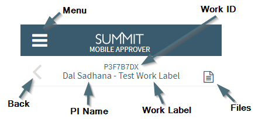

**Approvals / Mobile Approver**

The purpose of the Summit Mobile Approver is to give the ability for approvers who normally use the desktop Summit application for approving proposals that are in routing the chance to also view, approve, and return for correction approvals using your mobile devise.

# Logging In
For each user, there may be multiple ways to get to the Mobile Approver on your mobile device.  The first way is to use the URL link in your devise web browser.  You'll still login via CAS as you would on the desktop.  Once you have the mobile approver displaying, then you can either save it as a bookmark or add it to your Home screen for quick access.

Once logged in via CAS, you will be taken to your "To Be Approved" folder.

# Navigation
The same folders that appear in the Desktop version of Summit, will also appear in the Mobile Approver

# Sections
**Approval Header**  
Once

**General Information**  

The General Information section of the mobile approver has the Full Title, Sponsor & Target Deadlines, Sponsor Name, Type of Work, and Submitting Organization.

**Proposal Team**  
Each Proposal Team member is listed, starting with the Principal Investigator (PI), the CO-PIs, followed by any Proposal Team members.  

Tapping on an individual's name, will twirl open additional information; comprising the Credit Organization for the user,
the credit percentage, and the Access Level.

The last piece of information below all Team members is the Total % Credit, which should always total to a 100%.

**Budget Information**  

The budget section comprises the budget file (excel document that can be downloaded on your mobile device if you have the proper applications to view such documents), Period of Performance, Budget Location, Indirect Rate, Indirect Reason, and Indirect Type.

If Budget includes Cost Share, Form B, Form C, Subfunds, or Subcontractor

- Budget Totals
    - Direct Costs
    - Indirect Costs
    - Total Costs

**Cost Share**

**Subcontractors**

**Compliance**  
Only compliance questions answered in the affirmative in the work will show in this section.  For example, as you see below only two bullet points are shown indicating there will be research that involves Organization or Foreign Nationals and that the project will use Vertebrate Animals.  As also in the desktop approval, it will not show every question that is answered in the Compliance area of the work item.

**Approval Decisions**

# Actions

There are three actions a user can perform in the mobile approver, the same three actions that can be performed in the desktop approval.  The descriptions for the three are listed below:

**Approve**

**Return for Correction**

**Remove Outdated Request**

# Files

# Limitations  

- File downloading
    - Can only download/view files your mobile device is already capable of handling
- Cost Share in the Mobile Approver only shows one level down from the section totals and does not include individual pieces of data like percent amounts for personnel cost share.

 
