**Approvals / Mobile Approver**

 

The purpose of the Summit Mobile Approver is to give the ability for approvers who normally use the desktop Summit application for approving proposals that are in routing the chance to also view, approve, and return for correction approvals using your mobile device.

## Logging In
For each user, there may be multiple ways to get to the Mobile Approver on your mobile device.  The first way is to use the URL shown here, [https://mobile.summit.cloud.vt.edu/](https://mobile.summit.cloud.vt.edu/) and type it into your device's web browser.  You'll still login via CAS as you would on the desktop.  Once signing in via CAS and have the mobile approver displaying, then you can either save it as a bookmark or add it to your Home screen for quick access.

Once logged in, you will first be taken to your "To Be Approved" folder.  

 

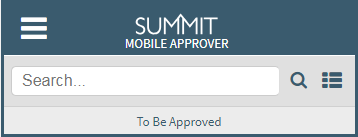

 

## Navigation
The same folders that appear in the Desktop version of Summit will also appear in the Mobile Approver. By clicking the folder icon in the upper right, the 4 Approver folders will expand (To Be Approved, Pending, Approved, and Canceled).

 

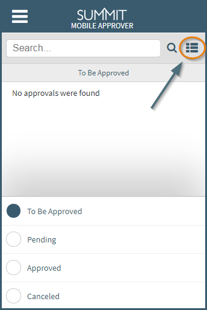

 

## Sections

**Approval Header**  
Once in an approval, as shown below, certain information and navigation items are displayed.

 

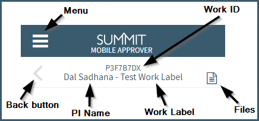

 

**General Information**  
The General Information section of the mobile approver has the Full Title, Sponsor & Target Deadlines, Sponsor Name, Type of Work, and Submitting Organization.

 

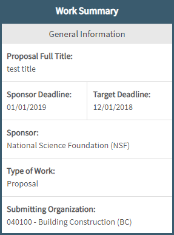

 

**Proposal Team**  
Each Proposal Team member is listed, starting with the Principal Investigator (PI), the CO-PIs, followed by any Proposal Team members.

Tapping on an individual's name will twirl open additional information; comprising the Credit Organization for the Proposal team,
the credit percentage, and the Access Level.

The last piece of information below all Team members is the Total % Credit, which should always total to a 100%.

 

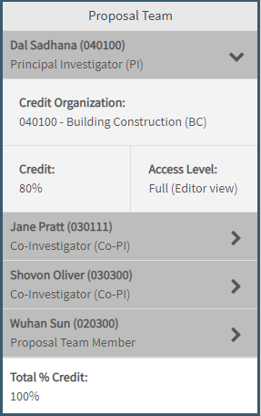

 

**Budget Information**  
The budget section comprises the budget file (most likely an excel document that can be downloaded on your mobile device if you have the proper applications to view such documents), Period of Performance, Budget Location, Indirect Rate, Indirect Reason, and Indirect Type.

 

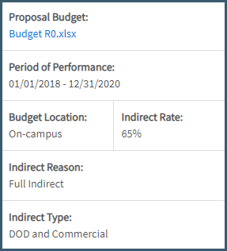

 

If Budget includes Cost Share, Form B, Form C, Subfunds, or Subcontractor they will be individually marked "Yes", if not they will be marked "N/A".

- Budget Totals
    - Direct Costs
    - Indirect Costs
    - Total Costs

 

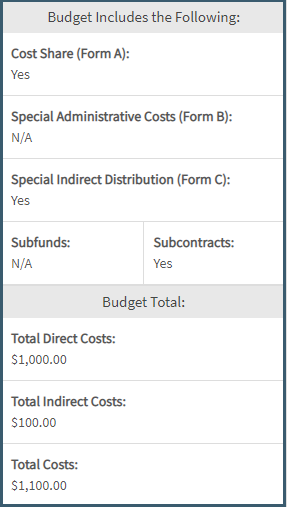

 

**Cost Share**  
The cost share section will display the total cost share amount, rationale, and requirement for the cost share.  Each category of the cost share will also display, along with the individual item totals.

 

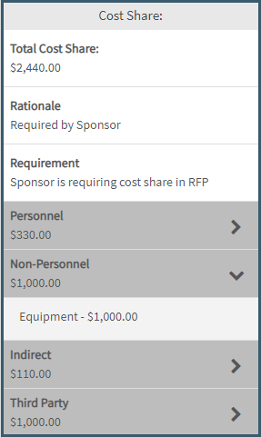

 

**Subcontractors**  
This section will show the name of the Subcontractor, as well as the name of the contact for the sub, their email, and their phone number.

 

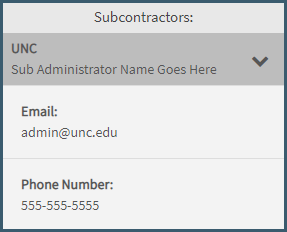

 

**Compliance**  
Only compliance questions answered in the affirmative in the work editor from the desktop will show in this section (not every compliance answer will show, only ones that are applicable and need attention).  For example, as you see below, only two bullet points are shown indicating there will be research that involves International Organization or Foreign Nationals and that the project will use Vertebrate Animals.  

 

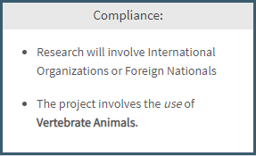

 

**Approval Decisions**  
This section shows the routing chains needed to get an approval into the "Approved" status.  Shown below is an example of a 2 organization routing chain, where the first organization "Building Construction" is the first needed approval.  Once one of the three approvers listed in "Building Construction" approve, it will be sent to the "College of Architecture" for approval.  Then when both organizations have approved, this approval will be "Approved" and the approval itself will be moved to the "Approved" folder.

 

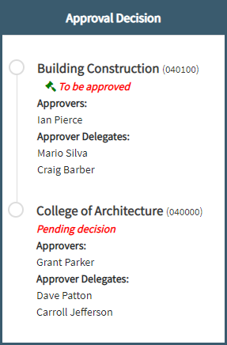

 

## Actions

There are three actions a user can perform in the mobile approver, the same three actions that can be performed in the desktop approval.  The descriptions for the three are listed below:

 

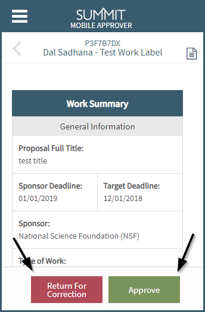

 

**Approve**  
After clicking "Approve" while in the Approval, it will pop-up a modal displaying all organizations you as the user have access to approve.  

 

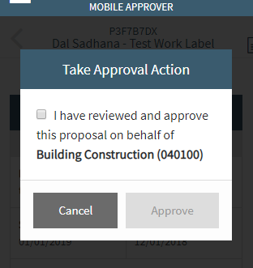

 

If there is one or more check boxes, make sure at least one is selected and it will enable the "Approve" button to finalize your part of the approval and will then either send it to the next in the approval chain or "Approve" the proposal.  If no organization is selected on this screen, then the "Approve" button will stay disabled.

 

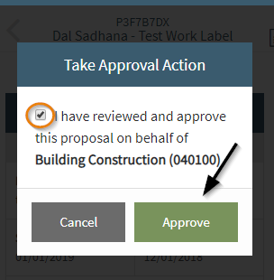

 

**Return for Correction**  
Just as in the desktop version, an approver can send the approval back to the proposal team if a correction is needed.  

 

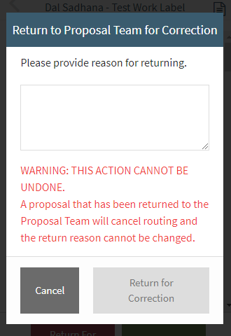

 

When first selecting "Return for Correction", the modal will appear with the button disabled.  It is required to provide text that will be visible, to all users with access to the proposal giving your reason why you took the proposal out of routing. Applicable users will also receive an email with the same information.

 

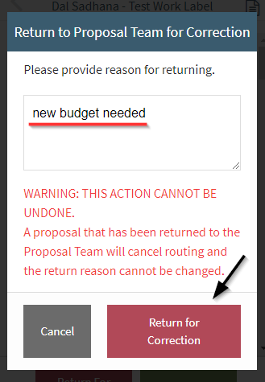

 

**Remove Outdated Request**  
When a proposal is taken out of routing, the approval will stay in the To be Approved list where a user can acknowledge the cancellation.  The date, user that canceled routing, and the comment left by the user that canceled will appear in the acknowledgment.

 

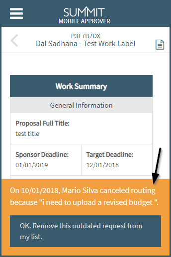

 

## Files

While in an approval, clicking the top right file icon takes you to the approval's files.  

 

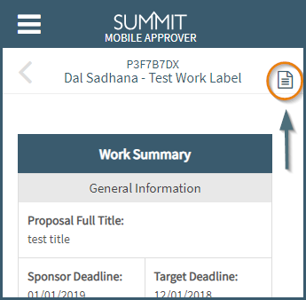

 

It will list all files except that of the budget (which can be found specifically in the budget section of the approval) and will not shows any subcontractor files.  One other file exception is noted below in the Limitations section.

 

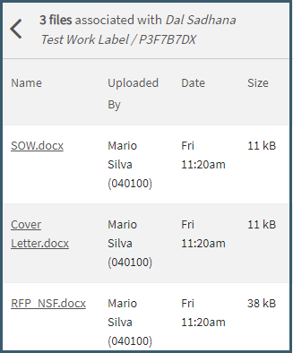

 

## Limitations  

- File downloading
    - Can only download/view files your mobile device is capable of handling
- Cost Share in the Mobile Approver only shows one level down from the section totals and does not include individual pieces of data like percent amounts for personnel cost share.

 
