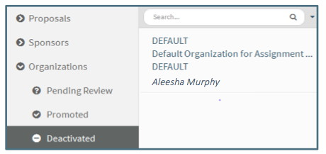
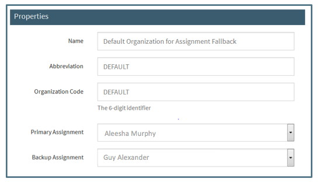

**Management / Assignees**

The Assignee Navigation Item is the list of all current Pre-Award Assignees and provides an Out of Office function for each.  The list of current assignees is managed by the CREST team.  The information in Assignees is used to assign new proposals to Pre-Award Associates and to perform Bulk Changes.

# Assignee Navigation
## Assignee Summary Pane
Current assignees are listed in the Summary Pane.  If an assignee has been marked Unavailable for Assignment, an indicator is visible in the summary pane.

## Assignee Editor
The Assignee Editor currently contains only the option to mark or unmark a person as Unavailable for Assignment

There are no data fields or actions available for assignees.

# Unavialable Assignee
Indicating an Assignee is Unavailable for Assignment makes the following changes to proposals:

## Pre-Award All Open Folder indicator
The Pre-Award Navigation Item for “All Open” will show the Unavailable Icon next to the Pre-Award Associates who are marked as Unavailable for Assignment:

## New proposals
When an Assignee has been marked as Unavailable for Assignment, all of their currently assigned proposals remain assigned to them.  Only new proposals assigned to them after they have been marked Unavailable for Assignment will be assigned to the Back-Up Assignment listed on the Organization Editor.  

In the example below, when Heather Buchanan is marked as Unavailable for Assignment in the Assignee Editor, new proposals will be assigned to Mark Habib as the designated Back-Up assignment in the Organization Editor:

  Note: When the Back-Up Assignee is also marked Unavailable, the proposal will be assigned to the Default Assignee (see below for further details).

## Reassignment Warning
Proposals can be individually reassigned by using the Action menu in the proposal.  When a person is marked as Unavailable, it is still possible to manually reassign a proposal to them.  The User will receive a warning that the person is Unavailable, but it will not prevent the reassignment.

# Managing Assignees
New Assignees can be added by the CREST team upon request.
Removing Assignees is also a function of the CREST team.  The following procedure should be used before requesting removal of an assignee:
After the person has left OSP and before their replacement is ready to take new assignments:

-	Mark the assignee as “Unavailable for Assignment” in the Assignee Navigation Item.  This will send all new proposals to the designated Back-Up Assignee.
-	Use the Proposal Bulk Changes function to reassign open proposals
-	Use the Organization Bulk Changes function to update back-up status as needed (Optional)
-	Do not use Organization Bulk Changes to change the Primary Assignment until the replacement is ready to take new assignments

Once their replacement is ready to take assignments:

-	Request a new assignee be added by the CREST team
-	Use the Organization Bulk Changes to make the new Pre-Award Associate the Primary Assignee on all organizations that are assigned to the former Pre-Award Associate
-	Use the Organization Bulk Changes to update back-up status as needed
-	Request the CREST team to remove the former Pre-Award Associate from the Assignee List

# Default Assignee
A new proposal is assigned to the DEFAULT Assignee in the following circumstances:
-	The Primary Assignee and the Back-Up Assignee are marked as Unavailable
-	A proposal is created with a newly created org as the Submitting Org

The DEFAULT assignee is designated in the DEFAULT Org Editor located in the Deactivated Organization list:

When the person designated as the DEFAULT assignee is marked Unavailable, a back-up DEFAULT assignee must be designated.  This is done in the Org Editor for the DEFAULT org:

If a Back-Up DEFAULT Assignee is not designated when the Primary DEFAULT assignee is Unavailable, all proposals that would be assigned to the DEFAULT will continue to be assigned to the Primary DEFAULT assignee even though that person is marked as Unavailable.   
The Primary DEFAULT Assignee should not be temporarily changed.  The Back-Up option should be utilized each time the Primary DEFUALT Assignee is Unavailable.
