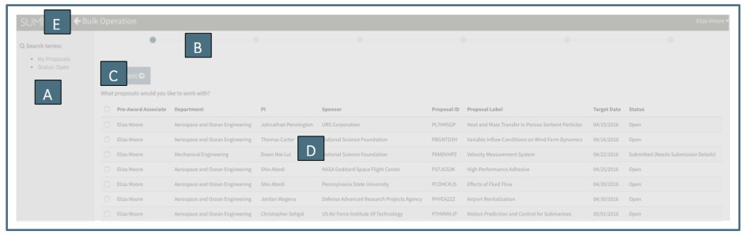
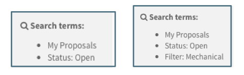

**Management / Bulk Operations**

The Bulk Operation feature of Summit allows the User to access data from multiple records and either make a bulk change or export the data in bulk. Making changes with the Bulk Operation function is limited to designated OSP personnel (currently Pre-Award Management).  All Users have access to the data export feature.

# General Navigation
Three parts of the Summit Dashboard are used in a Bulk Operation:

A. The Navigation Pane is the left column listing all of the Navigation Items.  Bulk Operations are performed based upon the highlighted Navigation Item. In the example above, the Bulk Operation would be performed on All Open items.

B.	The Search Field narrows the list of items in the Summary Pane.  Bulk Operations are performed based upon the full list in the summary field or a subset of the list narrowed through the search field.  Current search criteria limited to: PI, Sponsor, Label, Assigned Pre-Award Associate, Submitting Org (number or name) and Creator.  In addition, for closed proposals search criteria include type of closure.

C.	The down caret next to the search field provides access to the Bulk Operation functions.

## Bulk Operations Screen
The Bulk Operations screen contains the following sections:

A.	The left column includes a description of the search terms on which the Bulk Operation is being performed.  Using the search field in the Summary Pane can narrow the search.  The first example below shows the User was in “All Open” and did not narrow a search.  The second example shows the User searched by the terms “Mechanical” to return all proposals in Mechanical Engineering.

    Note that a search for “Chemistry” will also bring back any applicable “Biochemistry” proposals.  For a search for only Chemistry, the organization number would be a more specific search.

B. The Progress Bar at the top of the screen indicates how far the User has progressed through the Bulk Operation process.  In the example above, the User is in the first stage “Items.”  If the User was farther along in the process, the Progress Bar would show it as follows:

C.	Cancel or Previous/Next buttons appear above the operation space on the first stage and below the operation space in subsequent spaces.   Pushing cancel will bring the User back to the main Summit page.  The Previous and Next buttons move the User through the Bulk Operation process.

D.	The operation space is the main section of the page where the User will be asked to make or confirm decisions and be notified of the status of the operation.

E.	At the very top of the page is a “Back Arrow” that navigates the User out of Bulk Operations and returns them to their previous Summit screen

## General Bulk Operation Process
Once the User has entered the Bulk Operation screen they have already narrowed their search.  The following describes the general process depicted in the Progress Bar that all Bulk Operations follow:

**Items**

This stage of the bulk operation lists all of the items within the search terms the User designated in the main Summit page and allows the User to further narrow the list.  The User can click on individual items or proceed with all of the items in the list by checking the boxes on the left of the list:

**Operation**

The Operation stage provides the User with one or more types of operations that can be performed on the items they have chosen.  Most Users will see only the option to export data to a downloadable file.   Users who have access to other bulk changes will also see other options such as Reassign or Modify Assignee.  

**Details**

The User describes exactly what they want to do in the Details section.    The options for details are dependent upon the chosen operation.

**Confirm**

This stage describes what action will be performed and informs the User how many items will be affected by the action.  If the User clicks submit, the action will be performed.  The User can click previous or navigate out of Bulk Operations to revise or cancel the action.   There is no “undo” button.  For Users with access to Bulk Changes, to undo the action the User will need to perform another Bulk Operation to reverse it.

**Processing**

This stage is a progress bar indicating how much of the action has been completed.

**Finished**

This stage is a notice to the User that the action is complete.

# Proposal Bulk Operations
Proposal Bulk Operations are limited to Pre-Award Management Users.

## Proposal Items
The Items appearing in this initial step of the Bulk Operation are based upon the Navigation Item from which the User initiated the Bulk Operation as well as any search of the Summary Pane.  For Proposals, the User can initiate a Bulk Operation from “My Open,” “All Open,” a specific Pre-Award Associate under “All Open,” or “Admin Review.”  Currently the only operation available for Proposals is Reassign, and since closed proposals cannot be reassigned, there are no Proposal Bulk Operations available for closed proposal (only Data Export).

The search was:

Each Item listed for a Proposal Bulk Operation includes basic information about the proposal to assist the User in deciding which items they want to continue changing.  The columns indicate the currently assigned Pre-Award Associate, Submitting Department Name, PI, Sponsor Name, Proposal ID, Proposal Label, Target Submission Date and the Status.  The proposals are listed in order of Target Date with the most recent on top.

Clicking on the checkbox to the left of the row will select the proposal for the operation.  If the User clicks on the top checkbox in the header column, all items will be selected for the operation.

## Proposal Operations
From Proposals, the Operations available to a Pre-Award Management User are to Reassign or Export the data.  (See below for information of data export.)  Reassigning a proposal will change the Pre-Award Associate assigned to the selected proposals but will not change any future proposals created.

## Proposal Details
The Reassign Operation has two available detailed options:

**Assign to a Specific Person**

This option allows the User to reassign the selected proposals to any Assignee in the dropdown list (taken from the list in the Assignee Summary Pane).

  

**Use System Defaults**

This option will assign the selected proposals to the Back-Up Assignee in designated in the Organization Editor.  If the Back-Up is marked as Unavailable, the DEFAULT (primary or back-up) will be assigned.

## Proposal Confirm / Process / Finished
After selecting the details of the operation, the User can click next to confirm and finish the bulk operation.  After the User clicks “Confirm,” there is no “undo” button.  To undo the action, the User will need to perform another bulk operation to reverse the previous action.

# Organizations Bulk Operations
Organization Bulk Operations are limited to Pre-Award Management Users.

## Org Items
The Items appearing in this initial step of the Organization Bulk Operation are based upon the Navigation Item from which the User initiated the Bulk Operation as well as any search of the Summary Pane.  For Organization Bulk Operations, the User can initiate from “Pending Review,” “Promoted,” or “Deactivated.”   For quick reassignment, the User can use the Search function in the Summary Pane to find all organizations assigned to a specific person – though this will bring up both that person’s Primary and Back-Up Assignments.

Each Item listed for an Organization Bulk Operation includes basic information about the organization to assist the User in deciding which items they want to continue changing.  The columns indicate the currently assigned Organization Name, Abbreviation and 6-digit code, as well as Primary and Back-Up Assignee.  The proposals are listed in alphabetical order by Organization Name.

Clicking on the checkbox to the left of the row will select the proposal for the operation.  If the User clicks on the top checkbox in the header column, all items will be selected for the operation.

## Org Operations
The only current Operation available for Organizations to a Pre-Award Management User is to Modify Assignee.  Reassigning a proposal will change the Pre-Award Associate assigned to all future proposals created but will not change the Assignee on current proposals.

## Org Details
The Modify Assignees Operation has two available detailed options.  Users can choose to modify only the Primary or Back-Up Assignee or modify both at the same time.

**Change Primary Assignee**
This option allows the User to change the Primary Assignment for the selected Organizations.  This action will assign to the selected person all newly created proposals with the selected organizations named as Submitting Organizations.

In the example above, Cecelia Little will replace Mark Habib as the Assignee for all new proposals created with 4-H General & Administration (064300) or Accounting & Information Systems (007000) listed as Submitting Org.

**Change Backup Assignee**
This option allows the User to change the Back-Up Assignment for the selected Organizations.  This action will make the selected person the Back-Up Assignee on all newly created proposals with the selected organizations named as Submitting Organizations.

## Org Confirm / Process / Finish
After selecting the details of the operation, the User can click next to confirm and finish the bulk operation.  After the User clicks “Confirm,” there is no “undo” button.  To undo the action, the User will need to perform another bulk operation to reverse the previous action.

 
