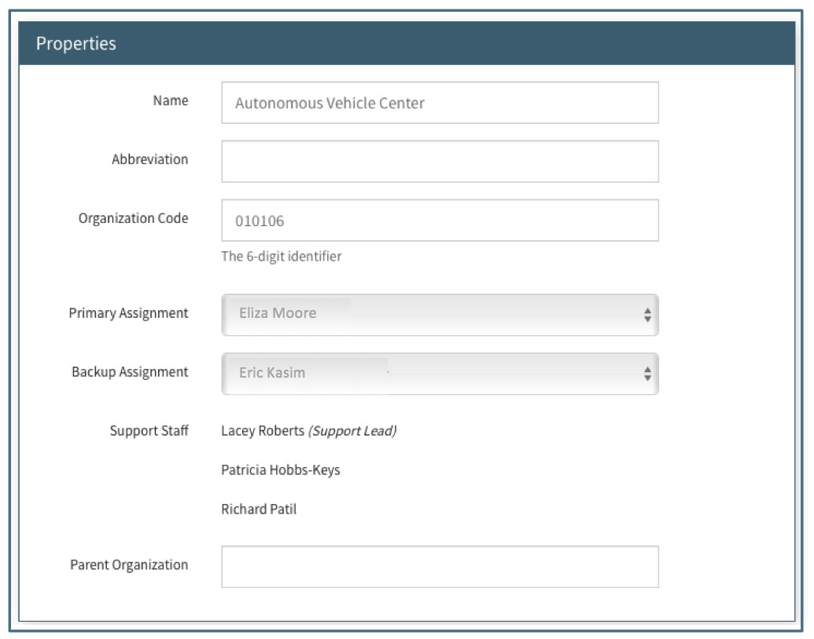

**Management / Org Editor**

The Organization Management section was designed as a tool to manage the University Organizations in Summit.  A Promoted org is one for which the official name and 6 digit number has been verified, Pre-Award Assignees indicated, and any applicable abbreviation has been included.  Also included in Promoted orgs are the Support Staff and Approvers for each organization.

# Navigation
Organizations appear in the Navigation pane for all Sponsored Programs Users and allows for creating, editing and deactivating University Organizations.

## Navigation Pane

**Pending Review:**
An org in Pending Review is one that was confirmed as a new org in the Proposal Initiator or Proposal Editor.  This means that the User searched for the org name or number and did not find it in the list of Promoted or Pending Orgs provided. The orgs in the Pending Review list are in alphabetical order by name.

**Promoted:**
An org in the Promoted list is one that has been reviewed by the designated OSP “Org Vetter.”  This means the information on the org has been reviewed and confirmed as accurate and complete.
The orgs in the Promoted list are in alphabetical order by abbreviation (or name if no abbreviation)

**Deactivated:**
An org in the Deactivated list is one that the designated OSP “Org Vetter” has indicated is no longer an active org.  The org may have become obsolete or merged with another.

## Summary View
The Summary View lists all the orgs for the navigation section the User is in (Pending/Promoted/Deactivated).  The text in the summary view shows the Organization Abbreviation (if there is one), Organization Full Name, Organization Number and the Primary Pre-Award Assignee (when applicable).

If the Organization name is too long it cannot be shown in full on the summary pane.  Hovering over the truncated name will show the full name.

The Summary View can be searched by Abbreviation, Full Name, Org Number or Pre-Award Assignee (Primary or Back-Up).

**Pending Review**

The Summary view for orgs in the Pending list shows the org name and number.  They are listed in alphabetical order.

**Promoted**

The Summary view for orgs in the Promoted list shows the org abbreviation (if applicable), full name, org number and the current assigned Pre-Award Associate.  They are listed in alphabetical order by full name.

**Deactivated**

The Summary view for orgs in the Deactivated list shows the org abbreviation (if applicable), full name, org number and Pre-Award Associate signed at time of deactivation.  They are listed in alphabetical order by full name.  The Deactivated list contains both those rejected from Pending and Deactivated from Promoted so those that were rejected without completing the fields will have less information available.

## Editor
The Editor contains the detail regarding the organization.  Several of the fields are required while the rest are optional.

**Properties**

*Name:*
This required field is the full official name of the organization.  Abbreviations are not used in this field unless the org’s official name contains an abbreviation.  For Example, the full name for Vet Med is "Virginia-Maryland College of Veterinary Medicine."

*Abbreviation:*
This optional field allows the org’s official abbreviation to be used in searching.  The abbreviation used for a sub-unit may be the abbreviation for the overall organization.  For example, the Appomattox Cooperative Extension Service org 059200 has “VCE” as the abbreviation and the Virginia-Maryland College of Veterinary Medicine has "VetMed" as the abbreviation.

*Organization Code:*
This required field is the 6 digit Virginia Tech assigned number.

*Primary Assignment:*
This required field is the Pre-Award Associate who is assigned to work with the organization.

*Back-Up Assignment:*
This required field is the Pre-Award Associate who is assigned to work with the organization when the Primary Assignment is not available.

*Support Staff:*
This non-editable field contains a list of persons associated with the org who will automatically receive access when the org is listed in the proposal initiation as the submitting org.  One or more may be designated as “Lead Support” to indicate they will be able to view the proposal in “My Open.”  All support staff not listed as “Lead Support” will be able to view the proposal in “All Open.”

*Parent Organization:*
This optional field is available for the org number of a parent organization.  It can be a 6 digit org number or a 3 character management identifier.  This data is used for Routing and Approval processes to determine if one organization can approve on behalf of another.

**Associated Proposal Summary**

This section is only shown for orgs in Pending Review.  The fields here give a brief overview of the original proposal for which the org was created.  There may be additional proposals associated with the Pending org.  The fields include Proposal label, Proposal ID, Principal Investigator, Pre-Award Associate, Solicitation Details and Proposal Status.   The fields are updated if the proposal fields are updated.

# Management
When a new organization is created by a User in the Proposal Initiator or Editor, it is listed in the Pending Review orgs with only the name and org number the User provided upon creation.  It is the responsibility of the designated "Org Vetter(s)" to confirm the name and number and complete the remaining required fields before promoting the org.

## Promoting an Org
Once the required fields are completed, the designated OSP Org Vetter can promote an org by clicking on the “Promote” option in the action menu.  A Promoted org will appear in the “Promoted” list.  Any proposals associated with this org will no longer have the “Unvetted Organization” notice under the submitting org field.

## Rejecting an Org
An org is rejected only from the Pending org list.  Rejecting an org happens when the org that should be associated with the proposal is already a Promoted org.  This could happen if the User created a sponsor instead of choosing the correct org from the search dropdown.  When it is determined that an org should be rejected, the designated OSP Org Vetter can reject by clicking on the “Reject” option in the action menu.  They will then be asked to search for and choose a Promoted org to use for the associated proposal(s) in place of the one being rejected.  When an org is rejected, it is moved to the Deactivated list.

When an Org is rejected, the replacement org will be shown in the Proposal Editor wherever the rejected org was listed.

## Deactivating and Org
An org is deactivated only from the Promoted list.  Deactivating an org happens when an org is no longer in existence and can no longer be used as an org on new proposals.  When it is determined that a sponsor should be deactivated, the designated OSP Org Vetter can deactivate by clicking on the “Deactivate” option in the action menu.  When a sponsor is deactivated, it is moved to the Deactivated list.

Proposals (open or closed) associated with a deactivated org will have two indicators to the User that the org is now deactivated:

- The Summary View will show the org number and name/abbreviation crossed through.

- The org field will include [inactive] before the name.

