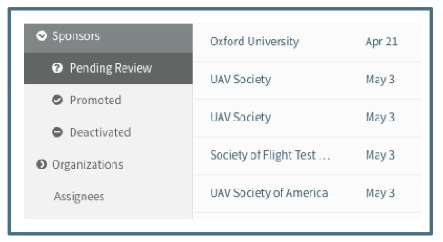

The Sponsor Management section was designed as a tool to manage the Sponsors in Summit.  A Promoted Sponsor is one for which the official name, type, VT Identifier and any applicable abbreviation has been included.  Also included in Promoted Sponsors is a keyword field from which OVPR can manage specific requirements and notification (see Sponsor Keywords section below).  

# Overview

## Navigation Pane

**Pending Review**

A sponsor in Pending Review is one that was confirmed as a new sponsor in the Proposal Initiator or Proposal Editor.  This means that the User searched for the sponsor name and did not find it in the list of Promoted Sponsors provided.
The sponsors in the Pending Review are listed by creation date.

**Promoted**

A sponsor in the Promoted list is one that has been reviewed by the designated OSP “Sponsor Vetter.”  This means the information on the sponsor has been reviewed and confirmed as accurate and complete..
The sponsors in the Promoted list are in alphabetical order by abbreviation (or name if no abbreviation)

**Deactivated**

A sponsor in the Deactivated list is one that the designated OSP “Sponsor Vetter” has indicated is no longer an active sponsor.  The sponsor may have closed or merged with another.  A Deactivated sponsor can also be a sponsor the system automatically moved from the pending list to the Deactivated list when sponsor name changed on the proposal with which it was associated and therefore this “old” name has no associated proposal.

## Summary View

**Pending Review**

The Summary view for sponsors in the Pending list shows the sponsor name that was entered and the date on which it was confirmed as a new sponsor.  They are listed in order of creation date.

**Promoted**

The Summary view for sponsors in the Promoted list shows the sponsor abbreviation (if applicable), full name, VT Identifier and the date on which it was promoted.  They are listed in alphabetical order by full name.

**Deactivated**

The Summary view for sponsors in the Deactivated list shows the sponsor abbreviation, name, VT Identifier and date on which it was deactivated.  They are listed in alphabetical order by full name.  The Deactivated list contains both those rejected from Pending and Deactivated from Promoted so those that were rejected without completing the fields will have less information available.

# Management

## Newly Created Sponsors
A new sponsor is created when a User types in a name of a sponsor that is not in the Promoted list and clicks the “Confirm, New Sponsor” options.  The newly created sponsor is located in the Pending list.

Sponsors in the Pending list do not appear as options in the sponsor search field, so a single sponsor can be created multiple times.  For example, several different PIs could be applying to an RFP for the same new sponsor.  Each of those PIs can create and confirm the new sponsor.  The Pending list will include every time that same sponsor was created.  

It is the responsibility of the designated OSP Sponsor Vetter to promote one of the multiples and reject the remaining.  See information on Rejecting a Sponsor and Vetting Process below.

## Sponsor Editor Fields
The following fields are included in the Sponsor Editor of a Pending Sponsor:

**Name**

This required field is the full official sponsor name.  Abbreviations are not used in this field unless the sponsor’s official name contains an abbreviation.  The following rules apply to the names of Federal and State Agencies, including international government bodies:
1.	Add Governmental entity in front of name for example: US, Virginia, South Carolina  to distinguish which Forest Service
2.	For top level Federal Agencies, use “US”  For example, US Department of Defense or US Department of Agriculture.
3.	For Federal Agencies that are not top level, such as Army or Forest Service, that may be associated with state or other sovereign nation, use “US”  For example, US Army even though this is under the US Department of Defense and US Forest Service even though this is under the US Department of Agriculture.
4.	Always spell the words out.  For example, do not use “Dept” or “VA” in the name.
5.	If the Sponsor uses the word “The” at the beginning of their name, use it exactly as they use it.

**Abbreviation**

This optional field allows the sponsor’s official abbreviation to be used in searching.  The abbreviation may be a shortened version of the name.  For example, National Institutes of Health Countermeasures Against Chemical Threats uses the abbreviation “CounterACT” and Kansas State University uses “K-State.”

There is a validation on the abbreviation field.  The following warning will appear if an incorrect abbreviation is filled in and the Save button will be inactive.

**Type**

This required field identifies the following types of sponsors:
1.	Commercial: For Profit entities, including foreign companies, even if the entity has a charitable mission.
2.	VA Commercial: For Profit entities headquartered in Virginia.
3.	Foundations: All Non-profit entities (not just Foundations), including foreign non-profit entities.
4.	VA Local Government: Town, Cities, or Districts of Virginia.
5.	Other State and Local Government: Other States, Local Government in other states, Foreign Governments and Foreign Government entities.
6.	Other Universities: All private universities (even if located in VA) and non-VA state universities, including foreign universities.
7.	Federal: US Federal Agencies.
8.	VA State Government: All Virginia State Agencies.  This includes Virginia State Universities.
9.	Unknown: A temporary option if the Type cannot be determined at the time of proposal.  At the time of award, the sponsor should be updated with the actual Type.

**VT Identifier**

This required field is the 9 digit Identifier used in Banner. There are two validations on this field:
1. The number must be 9 digits before it can be promoted (saving is permitted). 
2. The number cannot be saved if it already exists in Summit, either on a Promoted or Deactivated sponsor.  

**Keywords**

This required field is the 9 digit Identifier used in Banner.

**Alternate Names**

This optional field incorporates names used for sponsors that are not their official full name.  Alternate names are included in search results.  Alternate names include nicknames, previous names and shortened words as well as the following:
1.	When Sponsor’s use the word “The” at the beginning of their name but it is common to refer to them without “The,”  add an alternate name with “, The” at the end.
2.	If the name in Banner is not the official full name being used in Summit, enter the original Banner name as an alternate.
3.	For Cities, Towns and other municipalities add the name with state in the alternate to identify more precisely.  For example, “Montgomery County” as the official name and “Montgomery County Virginia” as an alternate to distinguish it from “Montgomery County Georgia.

Alternate names are added by clicking on "+Add Alternate Name"                                                 and completing the field. After the first alternate name is added, a subsection for Alternate Name(s) is created in the sponsor properties section.  Multiple alternate names can be associated with a single sponsor.

Alternate names should also be added to Promoted sponsors as the designated OSP Sponsor Vetter sees Users creating a sponsor because they do not recognize the Promoted sponsor’s official name.

**Associated Proposal Summary**
This section provides reference information on the proposal from which the Pending sponsor was created.  This allows the designated OSP Sponsor Vetter easy access to the relevant information.

The Proposal Status indicates where in the process the proposal that created this Sponsor is at.  In the example above, it is Pending, meaning that it is still in development and has not been submitted to the sponsor.  This field would show if it were "Submitted but not Closed" or "Closed (Abandoned)" etc.   A proposal cannot be closed with the reason being submitted to sponsor until the Sponsor has been vetted.

**Review Tasks**
This section is a tool for the designated OSP Sponsor Vetter to use through the vetting process to guide them in completing all the necessary steps of the vetting process before promoting a sponsor.  It is not required that the checkboxes be marked completed before vetting.  Additional checklist items can be added as necessary by clicking on "+ Add Checklist Item"

## Promoting a Sponsor
Once the required fields are completed, the designated OSP Sponsor Vetter can promote a sponsor by clicking on the “Promote” option in the action menu. A Promoted sponsor will appear in the “Promoted” list and be included in the sponsor search results from the proposal initiator and proposal editor.

A sponsor can also be promoted from the Deactivated list back to the Promoted list.

For a full description of the Vetting Process see the Management/Sponsor Vetting section.

## Rejecting a Sponsor
A sponsor is rejected only from the Pending sponsor list.   Rejecting a sponsor happens when the sponsor that should be associated with the proposal is already a Promoted sponsor.  This could happen if
1.	User created a sponsor instead of choosing the correct sponsor from the search dropdown
2.	Multiple proposals are created for the same new sponsor.  Once the first one is Promoted, the remaining can be rejected and replaced with the newly promoted one

When it is determined that a sponsor should be rejected, the designated OSP Sponsor Vetter can reject by clicking on the “Reject” option in the action menu.  They will then be asked to search for and choose a Promoted sponsor to use for the associated proposal in place of the one being rejected.  When a sponsor is rejected, it is moved to the Deactivated list.

## Deactivating a Sponsor
A sponsor is deactivated only from the Promoted list.  Deactivating a sponsor happens when a sponsor is no longer in existence and can no longer be used as a sponsor on new proposals.    When it is determined that a sponsor should be deactivated, the designated OSP Sponsor Vetter can deactivate by clicking on the “Deactivate” option in the action menu.  When a sponsor is deactivated, it is moved to the Deactivated list.

Sponsors in the Deactivated list will not appear in the sponsor search field.  The User will be given the option to create a new sponsor that will be put into the Pending list.  It is the responsibility of the designated OSP Sponsor Vetter to search both promoted and deactivated sponsors when vetting a new sponsor.

Open proposals associated with a deactivated sponsor will have two indicators to the User that the sponsor is now Deactivated:

1. The Summary View will show the sponsor name crossed through. 
2. The sponsor field will include [Inactive] before the name.

## Changing the Sponsor after Proposal Initiation
After a proposal is initiated, a newly created sponsor is placed in the Pending list and associated with this new proposal.  If a user changes the sponsor associated with the proposal before the Pending sponsor is Promoted, that Pending sponsor will automatically be moved to the Deactivated list.    If the sponsor has already been Promoted, it will stay in the Promoted list even if there are no other proposals associated with it.  The logic is that a Pending sponsor is directly associated with a specific proposal but a Promoted sponsor can have multiple or no proposals associated with it.
## After Proposal Closing
**Changing the Sponsor**

If a User changes the sponsor associated with a proposal after the proposal is closed, the new sponsor name will be displayed in all sponsor fields for the proposal.  The system captures the name at closure in the Submitted Proposal Details in the Proposal Management section of the proposal.  The Sponsor Name at Proposal Closure  field will capture the sponsor name associated with the proposal at the time the proposal was closed.  If the sponsor name changes multiple times after a proposal is closed, only the name of the sponsor that was used at the time of closure will be recorded.

When a new sponsor is created for a closed proposal, the Associated Proposal Summary section of the sponsor editor will indicate that the sponsor is closed.

**Deactivating the Sponsor**

Closed proposals associated with a deactivated sponsor will have the same two indicators to the User as open proposals do that the sponsor is now Deactivated:
1. The Summary View will show the sponsor name crossed through. 
2. The sponsor field will include [Inactive] before the name.

## Creating a Sponsor from the Sponsor Navigation
Designated Users can create a sponsor directly from the Sponsor navigation without having to create a proposal and confirm a new sponsor.  To do this, the User can click on the “Create Sponsor” button from the Sponsor navigation.  Once they have clicked on “Create Sponsor,” a dialogue box will appear that allows the user to enter the sponsor properties.  The sponsor name, type, identifier (9 digits) are required fields.   When the User clicks “Save,” the sponsor will be created and added to the Promoted list.

# Sponsor Keywords
In order to accommodate several different processes that are required in association with sponsors, Summit includes the capability of associating keywords with sponsors.   When a proposal is associated with a sponsor with a designated keyword, a specific action is triggered.

## Standard keywords

## Selecting Sponsor keywords
A User associates keywords with a sponsor by typing the keyword in the keyword field and then clicking on the “Add…” option in the dropdown.   Multiple keywords can be included.  The keywords can be added during the vetting process or after the sponsor has been promoted.  

## Keywords in the Proposal
When a sponsor has a keyword associated with it, the proposal editor indicates the keyword under the sponsor field:

