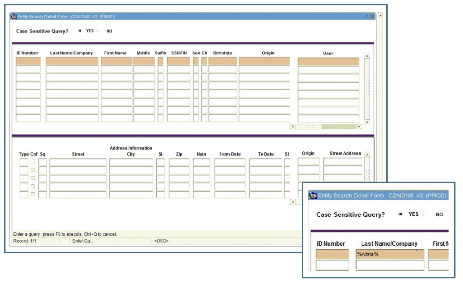
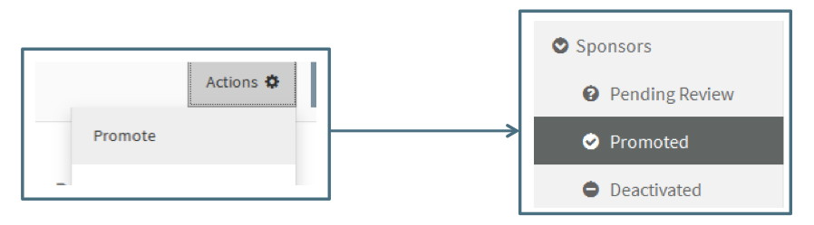

**Management / Sponsor Vetting**

For general information about Sponsor Navigation, see the Management/Sponsors section.

# Promoting a Sponsor
The following **10 step process** should be followed when Vetting a Sponsor.  

## 1. Confirm Actual Sponsor Name
A. Use the Associated Proposal Summary to view RFP (if available) to confirm sponsor full name and/or consult with the assigned Pre-Award Associate  

B. To access the full proposal, click on Proposal Navigation Item and choose All Open or All Closed (depending upon the proposal status).  Use the Search field to search by the Proposal label, Proposal ID, PI or Pre-Award Associate

C. Search internet for sponsor website to determine full/real name

D. Use Sponsor naming rules described in Management/Tools under "Sponsor Editor Fields/Name" to complete the Name field.

## 2. Verify Sponsor is Not in Summit
A. Search Promoted List to determine if the sponsor has already been vetted under a different name.   Use the search field to search by variations of the name and abbreviation to ensure there will be no duplicate Promoted Sponsors.  

If Pending Sponsor is already a Promoted Sponsor, Reject the Pending sponsor and replace with the Promoted Sponsor (See Rejecting a Sponsor below)

B. Search Deactivated List to determine if the sponsor was rejected or deactivated.

If the Pending Sponsor is already a Deactivated Sponsor, determine if the Deactivated sponsor needs to be “reactivated” or Promoted back to the Promoted List or if it is more appropriate to Promote the duplicate sponsor (consult with CREST team and/or Pre-Award Management if unsure which is preferable in a given situation).

## 3. Search Banner for VT Identifier
A. Search Banner screen GZAIDNS for results that match the Sponsor

 Search by name or SSN/FIN (Tax ID Number).  When searching by the name, use “%” before and after the name or part of the name to ensure a complete search.   Always search by abbreviations or the most specific word in the sponsor name.  For example, searching by “National” will bring back too many results for “National Institutes of Health,” but searching or “%NIH%” will bring back more specific matches.

 

 B.Find the best match to the Sponsor Name

 

 In the example above, the Sponsor Vetter will need to determine from the RFP or other Sponsor communications which name is the most appropriate to use.

 C. •	Find the match with the correct Change Indicator

 

 The Change indicator column – labeled as “Ch” indicates if the sponsor has had a name change or is no longer active:

- N- Name Change:  Indicates the sponsor’s name has changed to something else.  Do not use this option.
- I-Inactive:  Indicates this option is no longer an active sponsor.  Do not use this option.  
- Blank: *Use this option*

D. Confirm the matching sponsor has an SP Type Address.  If there is no SP Type Address, see “Request Sponsor be Added to Banner” below. Do not use a sponsor without an SP Address.

E. If there is a matching sponsor with a blank “Ch” field and an SP Address, copy the matching ID Number into the VT Identifier field.  If not, follow the steps to request the sponsor be added to Banner.

## 4. Request Sponsor be Added to Banner
When a search of Banner as described in the last step does not return a matching Sponsor or the matching Sponsor does not have an SP Address, the Sponsor or Address will need to be added to Banner.    
A. Send a request to the Procurement Department at FDG@vt.edu with the following information:
- Sponsor Full Name
- Sponsor Address  
- If requesting an SP address be added to current sponsor, provide the Banner ID Number, but for security purposes, use “X” for the first digit
- Link to Sponsor website URL

B. Once the Procurement Department confirms the Sponsor or Address has been added to Banner, add the ID Number to the VT Identifier field of the Sponsor Editor.

## 5. Determine Appropriate Type
Use the Type definitions listed in Management/Sponsors under "Sponsor Editor Fields/Type" section and the following clarifications to determine the appropriate type.

- For all Commercial sponsors, search the internet to determine if the business is headquartered in Virginia.  If so, the “VA Commercial” type should be used.
- For all Universities located in Virginia, search the internet to determine if the university is a State University or not.  Universities located in Virginia but not State Universities are considered “Other Universities.”
- Boards should be marked whatever they really are, regardless of the source of the money.  They could be Federal, State, Non-Profit, or Commercial entities.   For example the Virginia Pork Industry Association was set up to distribute federal funds. However, it is a Virginia State     Agency, so it should be marked as “VA State Government.”
- Mark all National Labs as Commercial.
- For Research Foundations from other universities, determine if the university is a public or private university.   If the University is a public university, the Type should be “VA State Government” if the university is located in Virginia or “Other State Government” if not located in Virginia.  For private or non-public universities, the Type should be “Other University.”

## 6. Determine Appropriate Keywords
A. Search the internet to determine if the Sponsor is an agency of NASA, DOD or PHS
- A list of NASA centers and facilities can be found at: http://www.nasa.gov/about/sites/index.html
- A list of PHS agencies can be found at: http://www.hhs.gov/about/agencies/orgchart/index.html and a list of NIH institutes is available at http://nih.gov/icd/
- Search for the sponsor’s website and read the “About” page to determine if there is an affiliation with NASA, DOD or PHS

B. Review the RFP to determine if the sponsor abides by PHS guidelines

C. If the Sponsor is a PHS Agency, include both the “PHS” keyword and the “PHS-Agency” keyword

D. For non-governmental agencies, check the Faculty Owned Business tab of the “PI Approval and Conflict of Interest” spreadsheet located in the Pre Award EFD Folder of the Research Shared Drive.  If the business is on the list, include the “FOB” keyword.  If there are other indicators that the sponsor might be a faculty owned business, consult with the Office of Research Education and Administrative Compliance (OREAC)

E. Always consult with the CREST team or Pre-Award Management if there are any doubts, questions or concerns.  It is important that the Sponsor Vetting process be as thorough and accurate as possible.

## 7. Complete the Sponsor Editor Fields
A. Confirm the required fields (Name, Type, VT Identifier) are complete and accurate.
B. Confirm the additional non-required fields (Abbreviation, Keyword and Alternate Name) are accurate.

## 8. Complete Review Tasks
Use the Review Task checklist to assist in the review process.  New checklist items can be created as reminders of additional tasks that need to be done before Promoting the sponsor.

## 9. Promote
Once the required fields are completed, the designated OSP Sponsor Vetter can promote a sponsor by clicking on the “Promote” option in the action menu. A Promoted sponsor will appear in the “Promoted” list and be included in the sponsor search results from the proposal initiator and proposal editor.

## 10. Reject Duplicate Sponsors
After a sponsor has been promoted, search the Pending List to find any duplicates that can be replaced with the newly promoted sponsor.   In the example below, once the first Powerbridge New York and Clark Construction sponsors are promoted, the second one can be rejected and replaced with the Promoted sponsor.

# Rejecting a Sponsor
A sponsor in the Pending List should be rejected when the correct sponsor is already in the Promoted List.  The following steps should be followed to Reject a sponsor:

1. Confirm with Pre-Award Associate (or PI or Support Staff) that there was a valid reason for creating a new sponsor and not choosing the promoted sponsor.  Make no assumptions!  It is possible two different sponsors have very close names
2. Choose Reject from the Action Menu
3. Choose the Replacement Sponsor.  Typing in the field will bring up options from the Promoted Sponsor List
4. Click “Reject and Replace”

This will move the sponsor to the Deactivated List and associate the proposal with the Promoted Sponsor chosen as the Replacement Sponsor

# Deactivating a Sponsor
A sponsor in the Promoted List can be deactivated if there was an error made in promoting it, if the sponsor is no longer in business or for any other reason that the sponsor should not be used for new proposals.  

When it is determined that a sponsor should be deactivated, the designated OSP Sponsor Vetter can deactivate by clicking on the “Deactivate” option in the action menu.  When a sponsor is deactivated, it is moved to the Deactivated list.

Sponsors in the Deactivated list will not appear in the sponsor search field.  The User will be given the option to create a new sponsor that will be put into the Pending list.  It is the responsibility of the designated OSP Sponsor Vetter to search both promoted and deactivated sponsors for a when vetting a new sponsor.

# New Faculty Owned Businesses
The Office of Research Education and Administrative Compliance (OREAC) works closely with the Office of Sponsored Programs (OSP) to ensure proposals involving collaboration with a Faculty Owned Business (FOB) have the required compliance paperwork submitted.  When OREAC is notified of a new FOB, they will forward the information to the designated OSP Sponsor Vetter.   The following steps should be followed when receiving notice of a new FOB:

1. Search Summit Pending and Promoted
2. If the Sponsor is currently in Summit, add the “FOB” keyword
3. If the Sponsor is not currently in Summit, Create a new sponsor.  Follow the steps above for “Promoting a Sponsor.”   All required fields must be complete before the sponsor can be saved and created.

