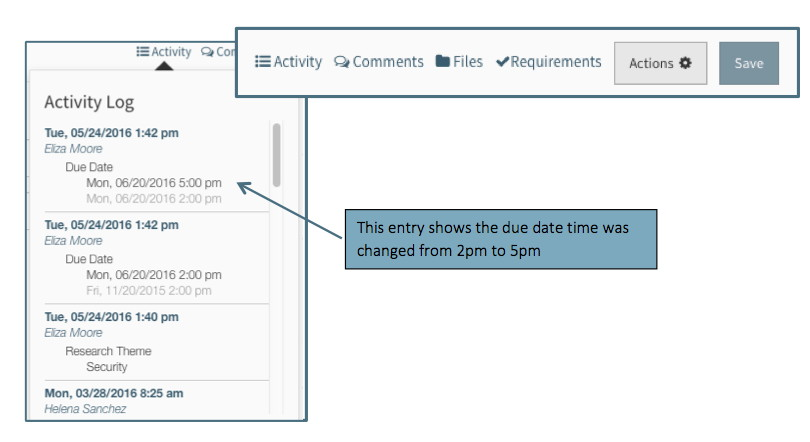

The design of Summit includes three basic panes:

#Navigation Pane
The left hand column is the highest level of navigation and will include a list of all the navigation items to which the User has access.  Most navigation items are expandable with sub-items available.

#Summary Pane
The middle column displays a list of the specific items available in the navigation item.  For example, if the user has clicked on the Proposal navigation item, the Summary Pane will display a list of all proposals to which they have access.

The Summary Pane includes a search field located at the top of the pane.  Typing in the search field will narrow the list of items displayed in the Summary Pane. The items that can be entered as search criteria include: PI Name, Sponsor Name, Submitting Org, Creator Name, and Proposal ID.

The down caret next to the search field provides access to the Data Exports function of Bulk Operations.  See Data Export Section below or Summit System Documentation Vol 2.

At the bottom of the summary pane is a count of the number of items displayed.

#Editor
The third pane located on the right and occupying the majority of the screen is the Editor.  The Editor contains all the information about the specific item on which the User clicked in the Summary Pane.   For example, if the user is in the Navigation Item “My Proposals” and clicks on the proposal for Dr. Ernest in the Summary Pane, the Editor will display the details for that proposal.  Each type of navigation item has a unique set of fields in the Editor providing the details about the item.  

##Header
The header at the top of the Editor displays the item’s identifying information. For example, in a proposal item, the header will include the Proposal ID, PI name, Proposal Label, and Sponsor name.

IMAGE GOES HERE

##Right Hand Navigation
The Editor contains an internal navigation tool on the right side of the screen (designated as the “Right Hand Navigation”).  It lists all the sections and subsections of the item in the Editor in a collapsible format and when the User clicks on a specific section title, that section will be displayed in the Editor.   The selected section is highlighted for easier navigation.

##Help Text
Most of the fields in the Editor have Help Text available to assist the User in completing the fields accurately.  To access the Help Text, the User can place the curser over the label and hover for a couple of seconds.  The Help Text will be displayed for as long as the curser remains over the field label.  Help Text is also available for some labels other than field names, such as the column titles of the personnel section:

##Toolbar
Located to the right of the Header is the Toolbar containing several tools for accessing and managing the data in the Editor:

###Activity Log
A history of activity that has occurred is available for some types of items (such as proposals).  This history is found in the Activity Log located to the right of the header and contains a list of actions along with the date and time they occurred and the person performing the action.  For changes, the old information is gray and the new information that replaced it is normal font.

###Comments Log
A log of communication that occurs via the comments feature is located to the right of Activity Log.  The Comments Log is an interactive log that displays all the comments within the proposal and allows the User to reply or create new comments.  Each comment thread is given a title or topic and each comment shows who made it and when.  See the Tools tab for full description of the comments features.

###Files Log
A log of every file attached in the proposal is located to the right of the Comments Log.  The Files log is an interactive list of all the current versions of the files.  All the actions associated with a file except comment are accessible in the Files log.  Clicking on the file location will take the User to the file in the proposal editor.  Clicking on the file name will open the file in a separate window.

IMAGE GOES HERE

###Requirements Checklist

#Global Navigation
In addition to the three panes, there are several global functions consistent throughout the system:

##Save
The Save button is located at the right of the Header

The Save function in Summit is not implicit, which means the User must explicitly click on the Save button in order for the changes to be saved.  The Save button changes colors as an indication of the saved status of the proposal:

When the “Unable to Save” warning appears, the user can click on “View Errors” to see a list of errors and link to the field:

The refresh button at the top allows the User to refresh the list of errors so that they can keep the message open while they are working on correcting the errors.

If the User forgets to save their work and clicks out of the proposal to another item in the Summary or Navigation Panes, a dialogue box will appear warning the User of unsaved changes.  The User is given the option to discard the changes and continue on, return to the Editor, or to Save the changes and move on.

If the User tries to navigate away from an unsaved proposal that also has errors, the dialogue box will give them the option of returning to the editor or discarding changes.  The proposal cannot be saved from the dialogue box because the errors must be resolved first.

##Get Started Button
Each navigation item has a button above the Summary Pane for the User to Get Started on a new item.  The button relates to the navigation item so that when the user is in a proposal, the Get Started button allows for initiating a proposal.

##Collapsing Panels
Depending upon the User’s needs and preferences, the Navigation and / or Summary panes can be collapsed to accommodate a larger view of the editor. The collapse arrows at the bottom right of the Navigation Pane will collapse the Navigation Pane.  Once the Navigation Pane is collapsed, the Summary Pane can also be collapsed by clicking the collapse arrows that appear at the bottom right.  The User can enlarge the panes by clicking on the expand arrows that appear at the bottom of the collapsed Navigation Pane.

When collapsed, the Navigation Pane icons remain visible for easy navigation.  The Summary Pane disappears all together when collapsed.

