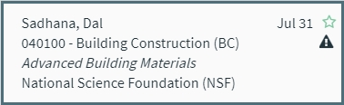
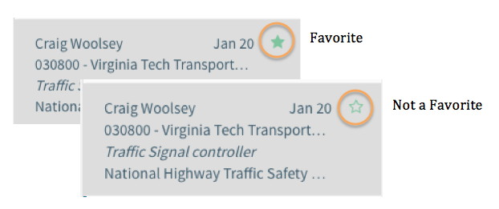
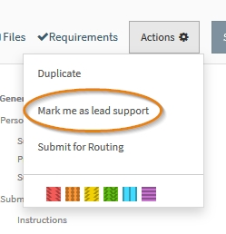
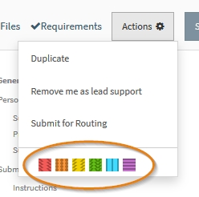

**Navigation / Summary View Indicators**

# Proposal Summary View Indicators
Within the Summary view for proposals, there are several indicators that will appear in specific circumstances as a quick reference for the User.

### New and Unviewed Proposals
Within the User’s My Open Proposals, any newly created and unviewed proposals display in bold with a blue bar on the left side of the Summary.  This indicator only appears in My Open, not All Open or other navigation items.

   

### Sponsor Deadline
If the proposal has a sponsor deadline in addition to a target due date, a calendar icon will display to the left of the target date. Hovering over the calendar icon will reveal the sponsor deadline.  Note that the target date defaults to the sponsor deadline if no target date was entered but a sponsor deadline was.

### Administrative Review
When a proposal is in Admin Review, a warning icon will display at the top right of the Summary View.  The icon appears in My Open and All Open navigation items.

Proposals appear in Admin Review in the following circumstances:
-	When the Administrative and/or Technical Documents have not been marked received by OSP according to OSP Policy 10-01, the system will automatically mark the proposal for Administrative Review
-	The proposal has been manually marked for Administrative Review
Pre-Award Management is responsible for reviewing all proposals in Admin Review and determining if they may be submitted.

### Submitted but not Closed
If a proposal has been marked as submitted but not yet closed, a submitted icon will display at the top right of the Summary View.  The Icon appears in the My Open and All Open navigation items

# Proposal Editor View Status Indicators
The Proposal Editor Header displays several status indicators as applicable:

##Admin Review Status
When a proposal is in Admin Review, the status will display in the header.  The label is displayed in My Open, All Open and Admin Review navigation items.

##Submitted but not Closed
When a proposal has been marked as Submitted (using the Action Menu) but not Closed, the status will display in the header.  The label is displayed in My Open and All Open.

##Closed Reason
When a proposal has been marked as Closed by Pre-Award, the reason for closure will display in the header.  The label is displayed in My Closed and All Closed (example below showes a proposal closed for Awarded and Abandoned).

while in **Open**:

- Letter of Intents, White Papers, and Pre-Proposals can be closed for reason of **Abandoned or Submitted** (by Anyone)
- Proposals, Supplements, and Continutations can be closed for reason of **Abandoned or Submission Denied** (by only Pre Award)

while in **Pending Decision**:

- Proposals, Supplements, and Continutations can be closed for reason of **Awarded, Declined, Withdrawn** (by only Pre Award)

# Favorites
Each User can designate a specific proposal as a “favorite” by clicking on the star in the summary pane.  

When the star is solid, it is a favorite.  Clicking on it again makes it an outline and “unfavorites” it.   Proposals designated as favorites will be in the user’s My Open proposals.

# Lead Support Staff
Each support staff person can designate themselves as a lead support staff using the proposal action menu and choosing Mark Me As Lead Support. This moves the proposal into their “My Open” folder. There is no limit or minimum requirement to how many lead support staff are on a proposal.  

Lead Support Staff will be designated as lead next to their name and will see the designation at the top right of the proposal header.  

Each User can also use the “Remove me as lead support staff” action which will move the proposal out of My Open.  Note that you can have a proposal in My Open by using the favorites option without needing to be lead support staff.

    Note: Only support staff marked as Lead Support Staff will receive internal notifications on a proposal.

# Color Tags
An optional feature that allows the User to color code each proposal is available through the color tag feature.  The color tags can be by the action menu while in the proposal:

Color tags are unique to each User.  They will appear on the User’s proposals in both My Open and All Open, though other User’s will not see them.  Color tags are only visible to the User applying them.

When a proposal is color tagged, the User will see the colors in the summary pane and on the of left of the toolbar.

Color tags can be removed by unchecking the color in either the right click menu or the action menu.
