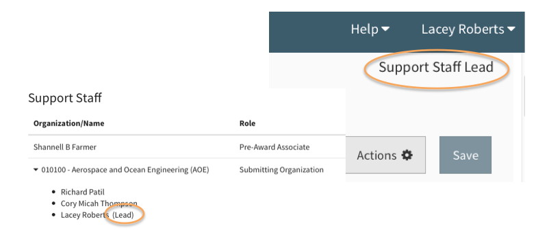
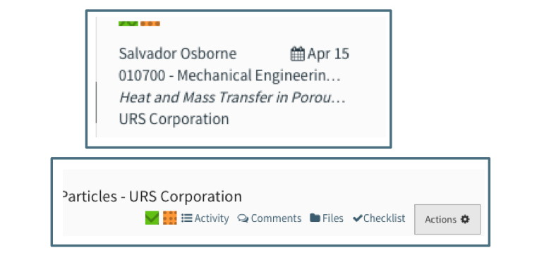

**Navigation / Indicators**

# Summary View Indicators
Within the Summary view, there are several indicators that will appear in specific circumstances as a quick reference for the User.

### New and Unviewed Proposals
Within the User’s My Open Proposals, any newly created and unviewed proposals display in bold with a blue bar on the left side of the Summary.  This indicator only appears in My Open, not All Open or other navigation items.

   

### Sponsor Deadline
If the proposal has a sponsor deadline in addition to a target due date, a calendar icon will display to the left of the target date. Hovering over the calendar icon will reveal the sponsor deadline.  Note that the target date defaults to the sponsor deadline if no target date was entered but a sponsor deadline was.

# Status / Labels
In the Editor of Summit, the Header displays several different statuses and one type of label.  One such example below shows the status for "Preparing", next to the "Admin Review" label. 

Every stage will display the status and/or a label indicating where it is in the process, except for the earliest stage after creating the work.  The earliest stage before routing, is called "Preparing" and no status or label is indicated.  Other than that, from "In Routing" to "Submission Finalized" onto "Awarded", while in the work in the top left of the header will display the status/label.

### Favorites
Each User can designate a specific proposal as a “favorite” by clicking on the star in the summary pane.  

When the star is solid, it is a favorite.  Clicking on it again makes it an outline and “unfavorites” it.   Proposals designated as favorites will be in the user’s My Open proposals.

### Lead Support Staff
Each support staff person can designate themselves as a lead support staff using the proposal action menu and choosing Mark Me As Lead Support. This moves the proposal into their “My Open” folder. There is no limit or minimum requirement to how many lead support staff are on a proposal.  

Lead Support Staff will be designated as lead next to their name and will see the designation at the top right of the proposal header.  

Each User can also use the “Remove me as lead support staff” action which will move the proposal out of My Open.  Note that you can have a proposal in My Open by using the favorites option without needing to be lead support staff.

    Note: By default, only support staff marked as Lead Support Staff will receive internal notifications on a work item.

### Color Tags
An optional feature that allows the User to color code each proposal is available through the color tag feature.  The color tags can be accessed through the action menu while in the proposal:

Color tags are unique to each User.  They will appear on the User’s proposals in both My Open and All Open, though other User’s will not see them.  Color tags are only visible to the User applying them.

When a proposal is color tagged, the User will see the colors in the summary pane and on the of left of the toolbar.

Color tags can be removed the same way they were added, by clicking the one added through the Action menu while in the proposal.

 
