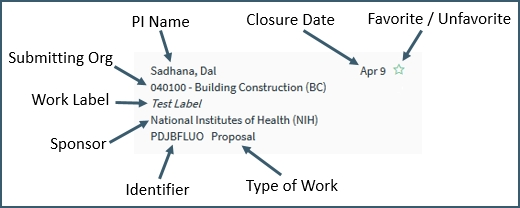

**Navigation / Folder Navigation**

# Work Item Navigation
Summit navigation is divided into several sub-items to facilitate management of the individual User’s work.

## Open
The "Open” navigation item displays all current open work items on which the User is listed as part of the Support Staff or Proposal Team, regardless of role or Submitting Org.   Work items in Open are displayed in order by target date with the most recent first.

The “Open” navigation item expands to display "My Open" subfolder and a subfolder for each PI on which the User is listed as part of the Support Staff or Proposal Team within "People".

For the **Support Team** Open contains:

- Proposals on which they are listed as Support Staff, Support Staff Lead or Creator

- A folder for each PI who has an open proposal with the User listed as Support Staff, Support Staff Lead or Creator.  These could be PIs in other departments when the User is listed as Support Staff for a proposal with a PI from a different department (i.e., if faculty from the User’s department is listed as Co-PI)

        NOTE:  Co-PIs do not have a folder, only PIs.  

For the **Proposal Team** Open contains:

-	Proposals on which they are listed as PI, Co-PI, Proposal Team Member or Creator

-	A folder for each PI who has an open proposal with the User listed as PI, Co-PI, Proposal Team Member or Creator.  These could be PIs in other departments when the User is listed as Co-PI, Proposal Team Member or Creator for a proposal with a PI from a different department.  

        NOTE:  Co-PIs do not have a folder, only PIs.

## My Open
The “My Open” navigation item displays all open proposals on which the User is listed as PI or Support Staff Lead.  

The Summary Pane for Open proposals includes the following information for each proposal in the list:

The full name of the organization and sponsor can be seen by hovering over the item in the summary

Pending proposals are displayed in the Summary View in order by target date with the soonest target date displaying first.   Note that when there is no Target Date provided, the system defaults the Sponsor Deadline date to the Target Date field.

## Pending Decision
The "Pending Decision" navigation item within the Submissions folder displays all proposals (including supplements and continuations) that have been processed into Banner and is now pending the sponsor's decision to the work submitted.

Normally items submitted within the last year that have not been decided on by the sponsor as of yet, are within this folder.

 

#### Awaiting Banner
The "Awaiting Banner" navigation item within the Submissions folder displays all proposals (including supplements and continuations) that have recently been submitted and finalized by Pre Award from the All Open navigation item, but have yet to be entered into Banner by the Processors.

Once a proposal has been submitted to the sponsor and Pre Award has finished all details with the proposal, the Pre Award associate will Finalize Submission from the Actions menu.  Once clicked the proposal will transition to the Awaiting Banner folder where OSP Processors will enter all necessary information into Banner (Virginia Tech's current system of record).  

Normally a proposal is not in this folder for longer than a business day.

## Closed
The “Closed” navigation item displays all closed work items, on which the User is listed as part of the Support Staff or Proposal Team regardless of the role or Submitting Org.   Work items in Closed are displayed in order by closure date, with the most recent on top.

## My Closed
The “My Closed” navigation item displays all closed on which the User is listed as PI or Support Staff Lead.  Closed proposals display in order of closure date, with the most recent appearing first.

The Summary Pane for Closed proposals includes the following information for each proposal in the list:

 
