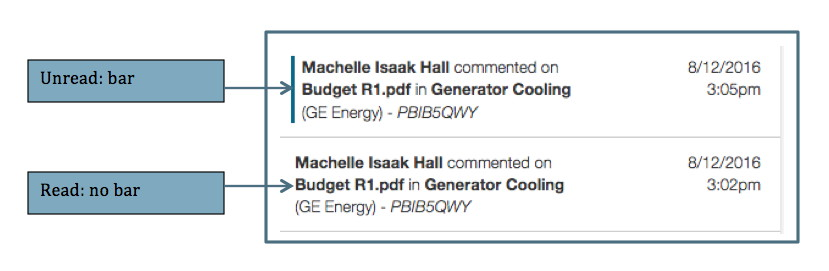
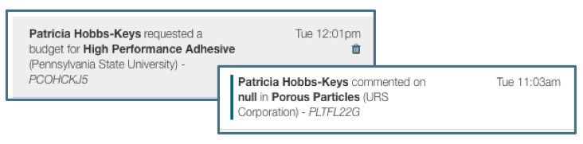

**Navigation / Notifications**

The Notification function in Summit is designed to assist the User in managing their workload by updating the User when others have commented or changed a status.  

# Navigating the Notifications
Notifications are located at the top of the Navigation pane.  When there are new notifications, a number badge appears next to Notifications:

Clicking on the Notifications opens up a list of the notifications.  Opening the Notifications will remove the badge.  Unread notifications are indicated with bar on the left side.  To close the notifications, click on Notifications

Clicking on the notification takes the User to the applicable section of the proposal and marks it as read.

Read notifications remain in the Notifications list until deleted by the User.  To delete a notification from the list, the User can click on the  trash can icon that appears when hovering over the notification.

The text of the notifications includes the following information:

# Types of Notifications
Notifications are sent and a badge will appear or increase in number in the following circumstances:

## New Budget Requested
When a Proposal Team or Support Staff User requests a budget from the Proposal Editor, a notification is sent to the Pre-Award Associate.  Proposal Team and Support Staff do not receive a new budget request notification.

## New Comment or Reply
When a User makes a comment or replies to a comment, other Users with full access to the proposal will receive a notification.  The comments or replies can be made at any available place in the Editor or directly in the Comments log (see below for further information on the Comments Log).

## Document Status Change
When a User updates the status of a Budget Development document, the other Full Access Users on the proposal will be notified of the change.  

See Budget Development section below for more information on status changes.
