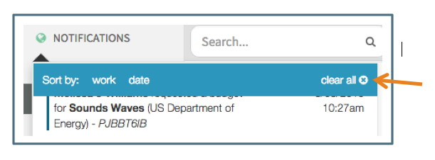

**Navigation / Notifications**

The Notification function in Summit is designed to assist the User in managing their workload by updating the User when others have commented or changed a status.  

# Navigating the Notifications
Notifications are located at the top of the Navigation pane.  When there are new notifications, a number badge appears next to Notifications indicating how many new notifications there are since notifications was last opened. Opening the Notifications will remove the badge.

Clicking on the Notifications opens up a list of the notifications. To close the notifications, click on Notifications.

## Sorting Notifications
The notifications are organized by proposal.  The most recent notifications for each proposal are grouped together.

Notifications can also be sorted by date by clicking on the “date” option at the top.  This will sort the notifications into three categories, “last 24 hours,” “last 7 days,” and “all remaining,” with most recent at top.

To sort by proposal again, click the sort by “work” option

## Text of Notifications
The text of the notifications includes the following information:

## Unread and Active Indicators
Unread notifications are indicated with a bar on the left side.  Read notifications do not have a bar.

Clicking on the notification takes the User to the applicable section of the proposal and marks it as read.

When a User has clicked on a notification, it is indicated as the active notification by the dark highlighting

## Deleting Notifications
Notifications remain in the Notifications list until deleted by the User.  To delete a notification from the list, the User can click on the "x" icon that appears when hovering over the notification.

Notifications can also be deleted in bulk
- To delete all notifications, click on the "Clear All" at the top

- To delete all notifications on a specific proposal, click "Clear Item" at the top of the group of proposal notifications:

- To delete all notifications in one of the sort by date groups (last 24 hours, last 7 days or all remaining), click "Clear All" from the specific group:

# Types of Notifications
Notifications are sent and a badge will appear or increase in number in the following circumstances:

## New Budget Requested
When a Proposal Team or Support Staff User requests a budget from the Proposal Editor, a notification is sent to the Pre-Award Associate.  Proposal Team and Support Staff do not receive a new budget request notification.

## New Comment or Reply
When a User makes a comment or replies to a comment, other Users with full access to the proposal will receive a notification.  The comments or replies can be made at any available place in the Editor or directly in the Comments log (see below for further information on the Comments Log).

## Document Status Change
When a User updates the status of a Budget Development document, the other Full Access Users on the proposal will be notified of the change.  

See Budget Development section below for more information on status changes.
