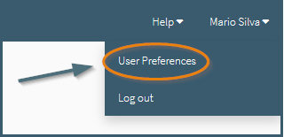
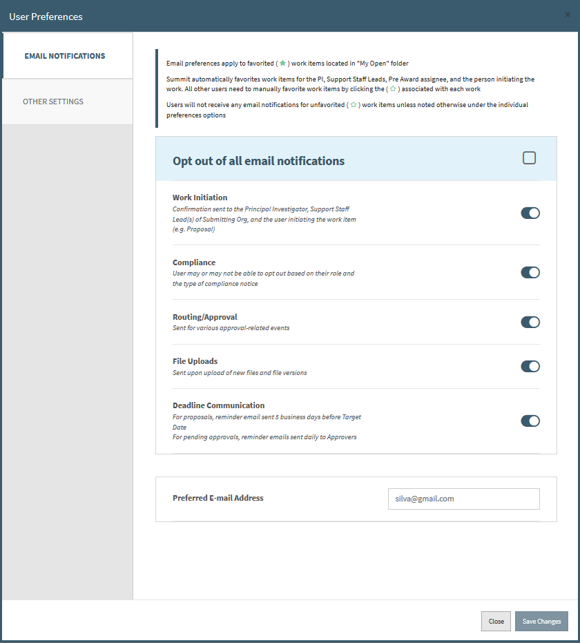
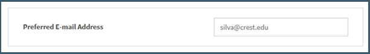
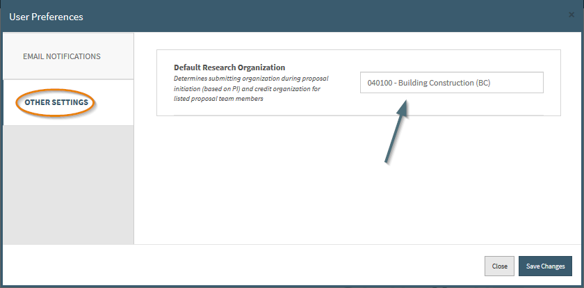
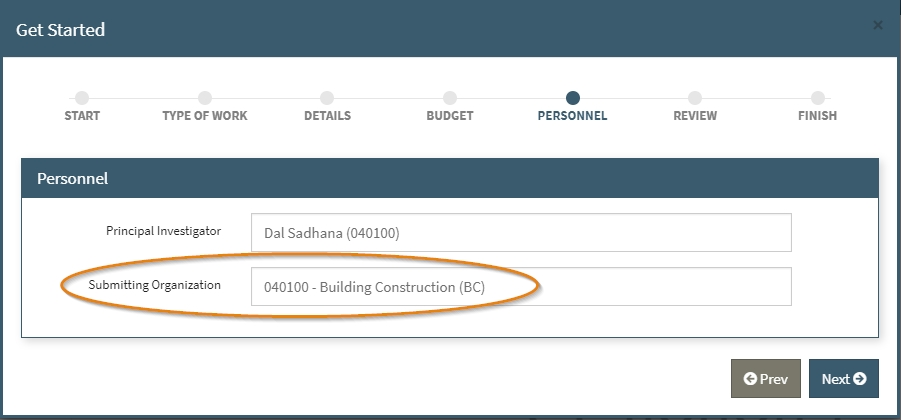
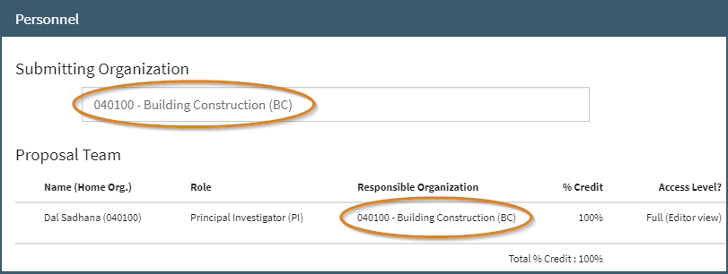

**Navigation / User Preferences**

# User Preferences

A user can change 3 sets of personal settings:

1. **Opt Out/In to various Summit related emails**
2. **Preferred e-mail address**
3. **Default research organization**

To get to this section, click your name at the top right of Summit and then click "User Preferences".

 

 

## E-mail Notifications

Depending on your role within a proposal and if you have the proposal as a favorite, will determine what email notifications you will receive.  The one exception to this is if you are on the Proposal Team (PI, Co-PI, Proposal Team member) you will receive compliance email regardless of your email settings.

New Users to the system by default will have all email notifications turned on.

Below shows every email notification currently in Summit, what category that email corresponds to in the user preferences screen, who will receive that email, and any special circumstances around the email.

<table>
  <col width=17%>
  <col width=19%>
  <col width=42%>
  <col width=22%>
  <tr>
    <th>Email Notification</th>
    <th>Preference Category</th>
    <th>Sent to</th>
    <th>Note</th>
  </tr>
  <tr>
    <td>Work Initiation</td>
    <td>Work Initiation</td>
    <td>Work Creator, PI, Support Staff Leads, Pre Award Associate</td>
    <td>All can opt out</td>
  </tr>
  <tr>
    <td>DoD Notice</td>
    <td>Compliance</td>
    <td>Proposal Team, Users with Preference ON & work favorited</td>
    <td>Proposal Team cannot opt out</td>
  </tr>
  <tr>
    <td>NASA Notice</td>
    <td>Compliance</td>
    <td>Proposal Team, Users with Preference ON & work favorited</td>
    <td>Proposal Team cannot opt out</td>
  </tr>
  <tr>
    <td>PHS Notice</td>
    <td>Compliance</td>
    <td>Proposal Team, Users with Preference ON & work favorited</td>
    <td>Proposal Team cannot opt out</td>
  </tr>
  <tr>
    <td>International Question</td>
    <td>Compliance</td>
    <td>Proposal Team, Users with Preference ON & work favorited</td>
    <td>Proposal Team cannot opt out</td>
  </tr>
  <tr>
    <td>Awaiting Approval</td>
    <td>Routing/Approval</td>
    <td>Immediate Approvers in the organization</td>
    <td>All can opt out</td>
  </tr>
  <tr>
    <td>Routing Canceled</td>
    <td>Routing/Approval</td>
    <td>Users with Preference ON & work favorited</td>
    <td>All can opt out</td>
  </tr>
  <tr>
    <td>Return for Correction</td>
    <td>Routing/Approval</td>
    <td>Users with Preference ON & work favorited</td>
    <td>All can opt out</td>
  </tr>
  <tr>
    <td>Approval Discarded</td>
    <td>Routing/Approval</td>
    <td>Users with Preference ON & work favorited</td>
    <td>All can opt out</td>
  </tr>
  <tr>
    <td>File Uploads</td>
    <td>File Uploads</td>
    <td>Users with Preference ON & work favorited</td>
    <td>All can opt out</td>
  </tr>
  <tr>
    <td>File Version Uploads</td>
    <td>File Uploads</td>
    <td>Users with Preference ON & work favorited</td>
    <td>All can opt out</td>
  </tr>
  <tr>
    <td>Target Date Reminder</td>
    <td>Deadline Communication</td>
    <td>Users with Preference ON & work favorited</td>
    <td>All can opt out</td>
  </tr>
  <tr>
    <td>Approval Reminder</td>
    <td>Deadline Communication</td>
    <td>Users with Preference ON & work favorited</td>
    <td>All can opt out</td>
  </tr>
</table>

 

    Note: A work is favorited automatically when added as a creator, PI, support staff lead, or the assigned Pre Award associate.

 

**Preferred E-mail Address**
    - By default the email listed here will be the user's pid + @vt.edu, but users can elect to use another email address for Summit communication emails.

 

## Other Settings

**Default Research Organization**

Users associated with multiple organizations can indicate which organization they mainly conduct research under if it is different from their Home Org.  By clicking on the user name at the top right of the screen and choosing the User Preferences option, then Other Settings to the left, users can indicate a Default Research Organization.

The organization listed here will be the pre-populated organization in the submitting org and responsible org fields:
- In the Proposal Initiation, the Default Research Organization defaults in the Submitting Organization field

- In the Proposal Editor, the Default Research Organization defaults in the Submitting Organization field as well as the Responsible Organization field.

Users can still edit the fields for individual proposals. The Default Research Organization can be updated at any time and will only be used on new proposals.  It does not update current fields.

 
