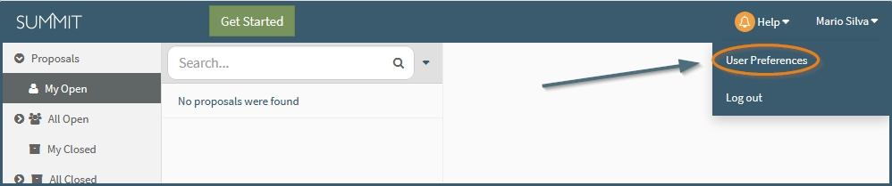
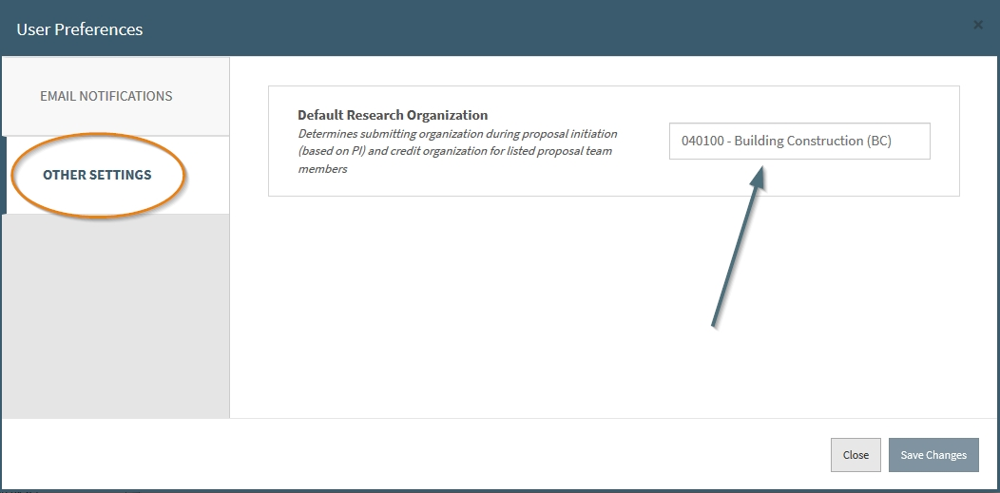
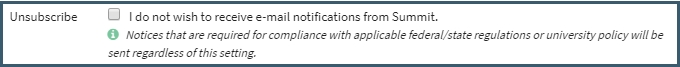

**Navigation / Manage Preferences**

# Manage Preferences

A user currently can change 3 personal settings:

1. Default research organization
2. Subscription to non-essenial Summit emails
3. Preferred e-mail address

To get to this section, click your name at the top right of Summit and then click "Managed preferences".

 

## Default Research Organization

Users associated with multiple organizations can indicate which organization they mainly conduct research under if it is different from their Home Org.  By clicking on the user name at the top right of the screen and choosing the Manage Preferences option, users can indicate a Default Research Organization.

The organization listed here will be the pre-populated organization in the submitting org and responsible org fields:
- In the Proposal Initiation, the Default Research Organization defaults in the Submitting Organization field

- In the Proposal Editor, the Default Research Organization defaults in the Submitting Organization field as well as the Responsible Organization field.

Users can still edit the fields for individual proposals. The Default Research Organization can be updated at any time and will only be used on new proposals.  It does not update current fields.

 

## E-mail Preferences

A user can add/change 2 E-mail related settings currently in their manage preferences:

1. Unsubscribe from non-essenial Summit external communications
    - Currently this only covers emails being sent after proposal creation.

2. Preferred E-mail Address
    - By default the email listed here will be the user's pid + @vt.edu.

 
