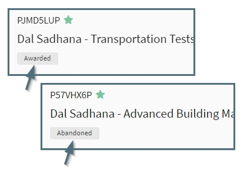

**Navigation / Proposal**

# Proposal Navigation Folders
The Proposal Navigation is divided into several sub-items to facilitate management of the individual User’s work.

## My Open
The “My Open” navigation item displays all open proposals on which the User is listed as PI or Support Staff Lead.  
The Summary Pane for Open proposals includes the following information for each proposal in the list:

The full name of the organization and sponsor can be seen by hovering over the item in the summary

Pending proposals are displayed in the Summary View in order by target date with the soonest target date displaying first.   Note that when there is no Target Date provided, the system defaults the Sponsor Deadline date to the Target Date field.

## All Open
The “All Open” navigation item displays all current open proposals on which the User is listed as part of the Support Staff or Proposal Team, regardless of role or Submitting Org.   Proposals in All Open are displayed in order by target date with the most recent first.

The “All Open” navigation item expands to display a folder for each PI on which the User is listed as part of the Support Staff or Proposal Team.

For the **Support Team** All Open contains:

- Proposals on which they are listed as Support Staff, Support Staff Lead or Creator

- A folder for each PI who has an open proposal with the User listed as Support Staff, Support Staff Lead or Creator.  These could be PIs in other departments when the User is listed as Support Staff for a proposal with a PI from a different department (i.e., if faculty from the User’s department is listed as Co-PI)

- NOTE:  Co-PIs do not have a folder, only PIs.  

For the **Proposal Team** All Open contains:

-	Proposals on which they are listed as PI, Co-PI, Proposal Team Member or Creator

-	A folder for each PI who has an open proposal with the User listed as PI, Co-PI, Proposal Team Member or Creator.  These could be PIs in other departments when the User is listed as Co-PI, Proposal Team Member or Creator for a proposal with a PI from a different department.  

-	NOTE:  Co-PIs do not have a folder, only PIs.

## My Closed
The “My Closed” navigation item displays all closed on which the User is listed as PI or Support Staff Lead.  Closed proposals display in order of closure date, with the most recent appearing first.

The Summary Pane for Closed proposals includes the following information for each proposal in the list:

## All Closed
The “All Closed” navigation item displays all closed proposals, on which the User is listed as part of the Support Staff or Proposal Team regardless of the role or Submitting Org.   Proposals in All Closed are displayed in order by closure date, with the most recent on top.

# Proposal Summary View Indicators
Within the Summary view for proposals, there are several indicators that will appear in specific circumstances as a quick reference for the User.

### New and Unviewed Proposals
Within the User’s My Open Proposals, any newly created and unviewed proposals display in bold with a blue bar on the left side of the Summary.  This indicator only appears in My Open, not All Open or other navigation items.

   

### Sponsor Deadline
If the proposal has a sponsor deadline in addition to a target due date, a calendar icon will display to the left of the target date. Hovering over the calendar icon will reveal the sponsor deadline.  Note that the target date defaults to the sponsor deadline if no target date was entered but a sponsor deadline was.

### Administrative Review
When a proposal is in Admin Review, a warning icon will display at the top right of the Summary View.  The icon appears in My Open and All Open navigation items.

Proposals appear in Admin Review in the following circumstances:
-	When the Administrative and/or Technical Documents have not been marked received by OSP according to OSP Policy 10-01, the system will automatically mark the proposal for Administrative Review
-	The proposal has been manually marked for Administrative Review
Pre-Award Management is responsible for reviewing all proposals in Admin Review and determining if they may be submitted.

### Submitted but not Closed
If a proposal has been marked as submitted but not yet closed, a submitted icon will display at the top right of the Summary View.  The Icon appears in the My Open and All Open navigation items

# Proposal Editor View Status Indicators
The Proposal Editor Header displays several status indicators as applicable:

##Admin Review Status
When a proposal is in Admin Review, the status will display in the header.  The label is displayed in My Open, All Open and Admin Review navigation items.

##Submitted but not Closed
When a proposal has been marked as Submitted (using the Action Menu) but not Closed, the status will display in the header.  The label is displayed in My Open and All Open.

##Closed Reason
When a proposal has been marked as Closed by Pre-Award, the reason for closure will display in the header.  The label is displayed in My Closed and All Closed.

# Favorites
Each User can designate a specific proposal as a “favorite” by clicking on the star in the summary pane.  

When the star is solid, it is a favorite.  Clicking on it again makes it an outline and “unfavorites” it.   Proposals designated as favorites will be in the user’s My Open proposals.

# Lead Support Staff
Each support staff person can designate themselves as a lead support staff using the proposal action menu and choosing Mark Me As Lead Support. This moves the proposal into their “My Open” folder. There is no limit or minimum requirement to how many lead support staff are on a proposal.  

Lead Support Staff will be designated as lead next to their name and will see the designation at the top right of the proposal header.  

Each User can also use the “Remove me as lead support staff” action which will move the proposal out of My Open.  Note that you can have a proposal in My Open by using the favorites option without needing to be lead support staff.

    **Note: Only support staff marked as Lead Support Staff will receive internal notifications on a proposal.**

# Color Tags
An optional feature that allows the User to color code each proposal is available through the color tag feature.  The color tags can be accessed by right clicking on the proposal in the summary pane or accessing the action menu:

Color tags are unique to each User.  They will appear on the User’s proposals in both My Open and All Open, though other User’s will not see them.  Color tags are only visible to the User applying them.

When a proposal is color tagged, the User will see the colors in the summary pane and on the of left of the toolbar.

Color tags can be removed by unchecking the color in either the right click menu or the action menu.
