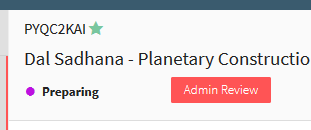

**Navigation / Workflow**

### Preparing
"Preparing" is the first status a work item is in when newly created from the Get Started initiation screen.  Most of the work done will be completed in this stage before it is routed for approvals.

### Administrative Review
When a work item is in "Admin Review", a warning icon will display at the top right of the Summary View and label in the header of the editor.  This is not a status, but only a label and can be displayed during every status while in the Open folder.

Works appear in Admin Review in the following circumstances:

-	When the Technical Documents have not been marked received by OSP according to OSP Policy 10-01, the status is not "In Routing", "Approved", or "Submitted", and the sponsor deadlines is Today.
-	The proposal has been manually marked for Administrative Review
Pre-Award Management is responsible for reviewing all proposals in Admin Review and determining if they may be submitted.

### In Routing
When a proposal is ready to be routed for Departmental and College or Institute approval, any full access User can initiate the routing process. All approvers and delegates assigned to the proposal are notified to approve the proposal. This action in Summit will give it the status of "In Routing" as shown below.  More details about the process can be found [here](../Approvals/Routing.md).

### Approved
This status is achieved when all organizations on the proposal have approved and the status changes from "In Routing" to "Approved". More details about the approval process can be found [here](../Approvals/Approving.md).

### Submitted
If a proposal has been marked as submitted (but not yet closed) while in Open, a submitted icon will display at the top right of the Summary View and "Submitted" label in the Editor header.  The Icon appears in the My Open and All Open navigation items.

### Submission finalized
Once a proposal has been submitted to the sponsor and all work has been completed by Pre Award in Summit, the proposal is transitioned to the Awaiting Banner folder and given the status of "Submission Finalized".  This is where OSP Processors will then enter the proposal information into Banner for official record keeping.

### Pending Decision
After the proposal has been entered into Banner, it is transitioned to the Pending Decision folder and given the "Pending Decision" status where it awaits a decision by the sponsor.

### Closed Reasons
When a proposal has been marked as Closed by Pre-Award, the reason for closure will display in the header.  The status is displayed in My Closed and  Closed (example below shows a proposal closed for Awarded).

while in the **Open** folder:

- Letter of Intents, White Papers, and Pre-Proposals can be closed for reason of **Abandoned or Submitted** (by Anyone)
- Proposals, Supplements, and Continuations can be closed for reason of **Abandoned or Submission Denied** (by only Pre-Award)

while in the **Pending Decision** folder:

- Proposals, Supplements, and Continuations can be closed for reason of **Awarded, Declined, Withdrawn** (by only Pre-Award)

 
