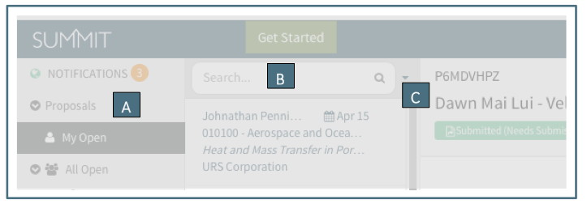
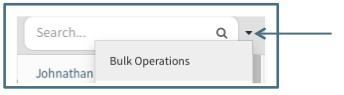
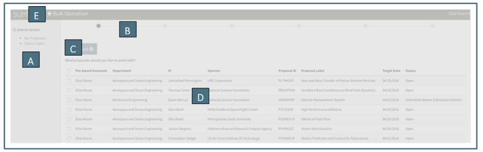
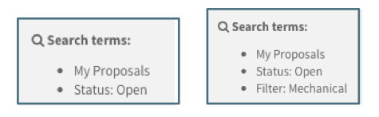
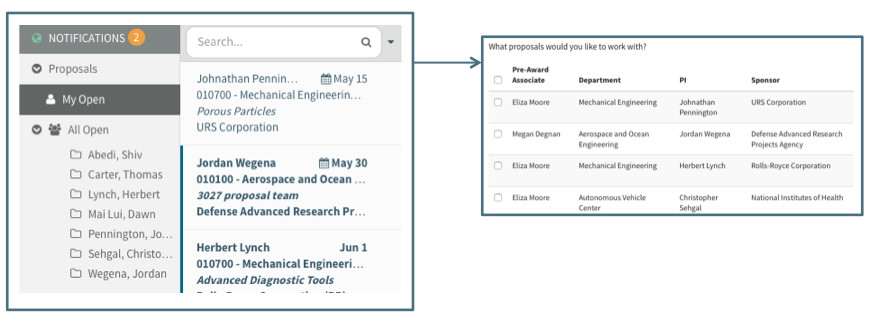
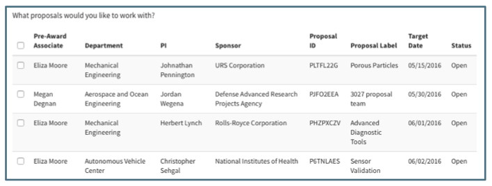
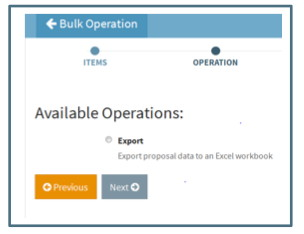
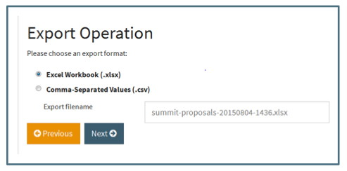
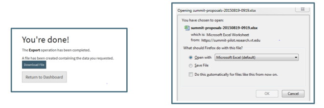
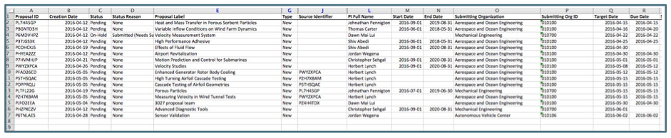

**Reporting / Data Exports**

All Users have access to the Data Export operation of Bulk Operations.  Data Export is currently only available for Proposal Items (not Sponsor or Organizations).  

# General Navigation
Three parts of the Summit Dashboard are used to export data via the Bulk Operation function:

A. The Navigation Pane is the left column listing all of the Navigation Items.  Bulk Operations are performed based upon the highlighted Navigation Item. In the example above, the Bulk Operation would be performed on All Open items.

B.	The Search Field narrows the list of items in the Summary Pane.  Bulk Operations are performed based upon the full list in the summary field or a subset of the list narrowed through the search field.  Current search criteria limited to: PI, Sponsor, Label, Assigned Pre-Award Associate, Submitting Org (number or name) and Creator.  In addition, for closed proposals search criteria include type of closure.

C.	The down caret next to the search field provides access to the Bulk Operation functions.

## Bulk Operations Screen
The Bulk Operations screen contains the following sections:

A.	The left column includes a description of the search terms on which the Bulk Operation is being performed.  Using the search field in the Summary Pane can narrow the search.  The first example below shows the User was in “All Open” and did not narrow a search.  The second example shows the User searched by the terms “Mechanical” to return all proposals in Mechanical Engineering.

    Note that a search for “Chemistry” will also bring back any applicable “Biochemistry” proposals.  For a search for only Chemistry, the organization number would be a more specific search.

B. The Progress Bar at the top of the screen indicates how far the User has progressed through the Bulk Operation process.  In the example above, the User is in the first stage “Items.”  If the User was farther along in the process, the Progress Bar would show it as follows:

C.	Cancel or Previous/Next buttons appear above the operation space on the first stage and below the operation space in subsequent spaces.   Pushing cancel will bring the User back to the main Summit page.  The Previous and Next buttons move the User through the Bulk Operation process.

D.	The operation space is the main section of the page where the User will be asked to make or confirm decisions and be notified of the status of the operation.

E.	At the very top of the page is a “Back Arrow” that navigates the User out of Bulk Operations and returns them to their previous Summit screen

# Data Export Process
Once the User has entered the Bulk Operation screen they have already narrowed their search.  The following describes the process in Bulk Operations to export data into a report.

## Items
The Items appearing in this initial step of the export function of Bulk Operations are based upon the Navigation Item from which the User initiated the Bulk Operation as well as any search of the Summary Pane.  The User can initiate a Bulk Operation from “My Open,” “All Open,” a specific “All Open” sub-folder (either Pre-Award Associate or PI, depending upon User’s role), “Admin Review” (for Pre-Award Users), “My Closed,” or “All Closed.”  

Each Item listed for a Proposal Bulk Operation includes basic information about the proposal to assist the User in deciding which items they want to continue changing.  The columns indicate the currently assigned Pre-Award Associate, Submitting Department Name, PI, Sponsor Name, Proposal ID, Proposal Label, Target Submission Date and the Status.  The proposals are listed in order of Target Date with the most recent on top.

Clicking on the checkbox to the left of the row will select the proposal for the operation.  If the User clicks on the top checkbox in the header column, all items will be selected for the data export operation.

## Operation
The Operation stage provides the User with the option to Export data to an Excel workbook.  Users who have Pre-Award Management access will also be given options for other Bulk Operations.

## Details
The Export Operation has two available detailed options to allow the User to choose they type document to be exported and rename the document if desired:

## Confirm / Processing / Finish
After selecting the details of the operation, the User can click next to confirm and finish the bulk operation.   To access the exported data, the User must click “download file.”

The downloaded document, if in excel format will include many data fields in the columns and the selected proposal data across the rows:

