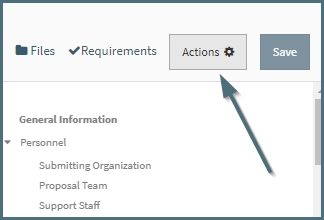
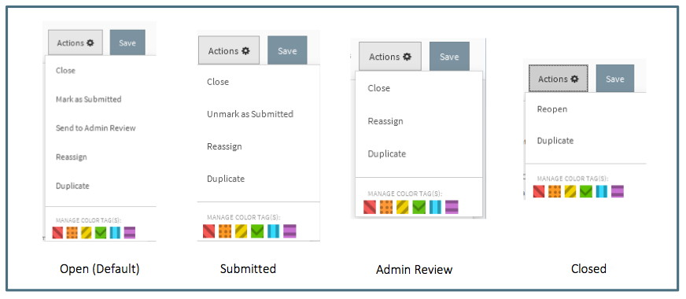
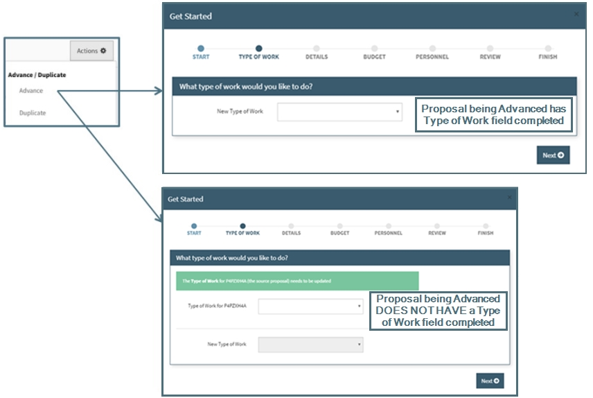
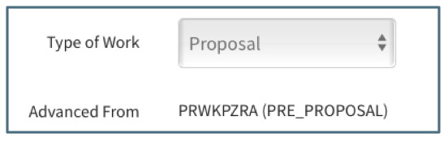
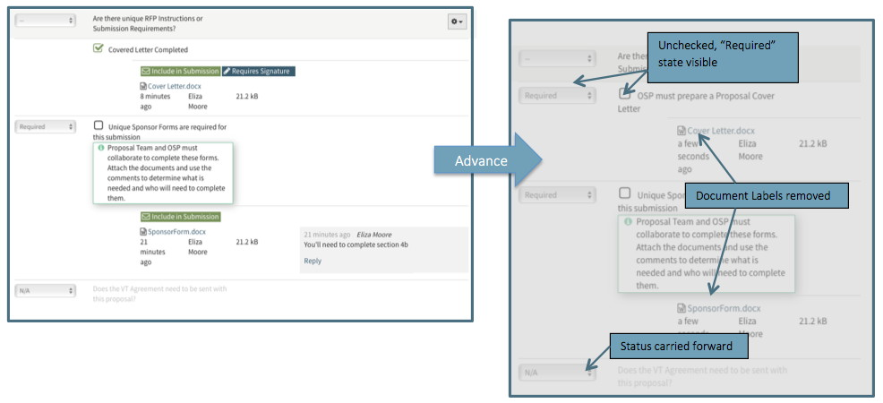
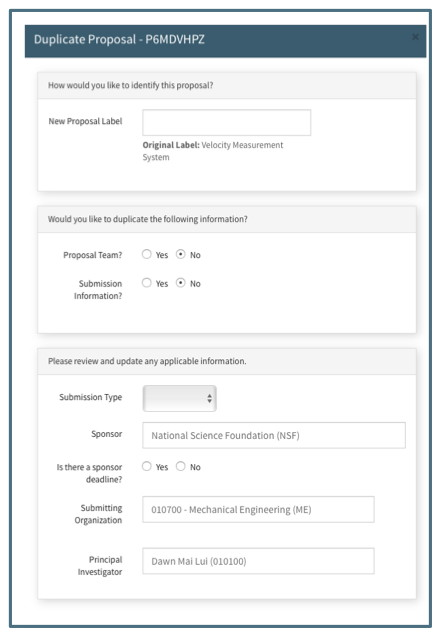
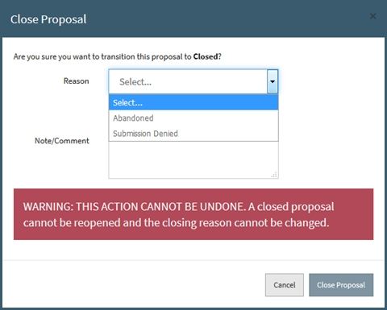
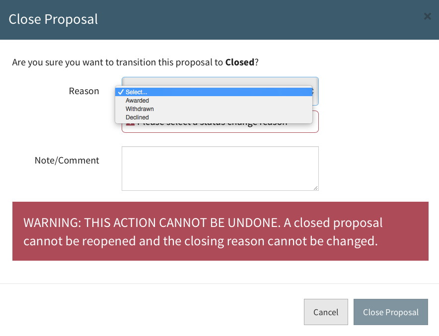
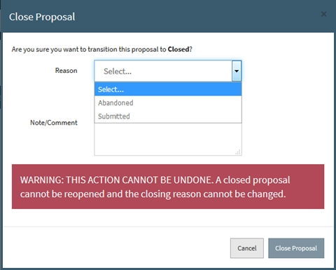
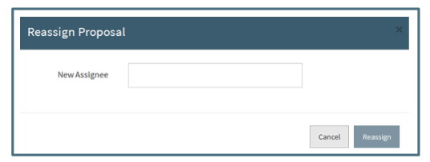

**Tools / Actions**

# Proposal Action Menu
The Actions Button is located at the top right of the proposal screen to the left of the Save button.

When the User clicks on the Action button, a dropdown is displayed revealing several actions available.  Depending upon the status of the proposal and type of User, different actions are available.

The Action Menu is grouped into two main categories of actions: Advance/Duplicate and Management type actions.

# Advance
Advancing means taking one type of submission to the Sponsor and moving it to the next step of the process or revising a prior piece of work to the same work type.  For example, a white paper could become a pre-proposal which could in turn become a full proposal.

The concept of Advancing a proposal is centered around keeping related work connected in Summit and was designed to reduce re-entry of data. When advancing work from one type of proposal to another, Users should use this action to create a related proposal instead of the "Get Started" button to create an entirely new unrelated proposal.

**Types of Work**

Each new submission to a sponsor requires the Type of Work to be identified with one of the following:

- White Paper: A statement of work sent to the Sponsor that will not result in an award until a Proposal has been submitted.
- Letter of Intent: Notice to the Sponsor of intent to submit a Proposal.
- Pre-Proposal: A statement of work and/or budget sent to the Sponsor before a Proposal that does not result in an award.
- Proposal: A full statement of work and budget sent to the Sponsor that may result in an award.
- Supplement: Adding additional funds for additional work on a current award without adding additional time to the project period.
- Continuation: Adding additional funds and additional time for additional work on a current award.

The options to Advance depend upon the Type of Work.  The following shows which types can be advanced to which:

- Letter of Intent -> Letter of Intent, White Paper, Pre-Proposal, Proposal
- White Paper -> Letter of Intent, White Paper, Pre-Proposal, Proposal
- Pre-Proposal -> Pre-Proposal, Proposal
- Proposal -> Proposal, Supplement, Continuation
- Supplement -> Supplement
- Continuation -> Continuation

**Advance Process**

To Advance work, the User can either start from within the previous work or use Get Started if they have the previous work's proposal ID.  If they are in the previous work the user can access the Action Menu and select the Advance action to create a new type of work from the previous piece.  

    Note: Advance is available for Open, Submitted and Closed proposals, but will usually only be used after a proposal has been submitted to the sponsor and further interaction with the sponsor is required.

If the proposal being advanced has an identified Type of Work, the User will be asked only to identify the Type of Work of the new work (1st field below).  If the proposal being advanced does not have the Type of Work field completed, the User will be asked to identify the Type of Work of the original and new work (2nd field below).

After identifying the Type of Work(s), the User will then be taken through the normal "Get Started" wizard to create the new proposal.  The initiator will include data from the proposal being advanced, except Sponsor Deadline and Target Date. All fields are editable so may be updated as necessary.

Creating Advanced work does the following:

- Gives a unique Proposal ID to the Advanced work
- Identifies the work from which it was advanced

- Carries forward all data from Advanced work (Sponsor Due Date and Target Date must be updated before the new work is created)
- Brings forward all comments from original work
- Carries forward all requirement states (e.g. n/a or required) but does not carry forward the completed status (i.e., it "unchecks" the completed box)
- Copies the most recent version of all documents from the original work
- All document labels and approvals are removed

# Duplicate
Duplicating a proposal is available to all Users in every proposal status.  Duplicating a proposal allows the User to copy specific information from one proposal to create a new but similar proposal. This may be useful when one PI is submitting multiple proposals to the same opportunity and the submission information is the same or when using the same proposal team on a different proposal. When a User chooses to duplicate a proposal, a dialogue box will prompt the User to enter the information to be duplicated.  

The middle section in the dialogue box requires the User to indicate if either or both proposal team and submission information will be duplicated.  At least one must be answered yes in order to duplicate the proposal.  If the User indicates the Submission Type is “Revision” or “Other,” an additional field for the Proposal ID or Grant Number is required.  After the User answers the Sponsor Deadline question, the Target Date question will appear.

A proposal duplicated by the Proposal Team or Support Staff is automatically assigned to the Pre-Award Associate assigned to the Submitting Org regardless of the Pre-Award Associate assigned to the original (duplicated) proposal.  A proposal duplicated by a Pre-Award Associate is assigned to that User regardless of the Submitting Org assignment.  In either case, the proposal can be reassigned by a Pre-Award User if necessary.

# Close
For a Proposal, Supplement, and Continuation the Close action is only available to Pre-Award Users.  This action moves the proposal from the Open Navigation Items to the Closed Navigation Items.  When the User chooses this option, a dialogue box appears prompting them to enter the required Reason for Closure and add an optional note/comment.  

The Reasons for Closure while the proposal is Open are:

-	Abandoned: Indicates PI has chosen not to submit proposal or proposal is no longer actively being worked on.
-	Submission Denied: Indicates a proposal that was in Admin Review and marked “Do Not Submit.”

The Reasons for Closure while a proposal is in Submissions are:

-	Awarded: The Sponsor has indicated that they will fund the proposal.
-	Withdrawn: Indicates the proposal was withdrawn from the sponsor.
- Declined: The Sponsor has indicated that they will not fund the proposal.

For a Letter of Intent, White Paper, or Pre-Proposal the Close action is available to all users. This action moves the work from the Open Navigation Items to the Closed Navigation Items.  When the User chooses this option, a dialogue box appears prompting them to enter the required Reason for Closure and add an optional note/comment.

The Reasons for Closure while a Letter of Intent, White Paper, or Pre-Proposal is in Open are:  

-	Abandoned: Indicates PI has chosen not to submit the work or the work is no longer actively being worked on.
- Submitted: Indicates the work has been submitted to the sponsor

 

    Note:  A Closed Proposal cannot be reopened.  To work on a closed proposal, it must be Advanced or Duplicated.

# Mark as Submitted
This action is available to all Users in open proposals except those in Admin Review or already marked as Submitted.  This marks the proposal as one that has already been submitted to the sponsor but is still in the User’s “My/All Open” proposals because there is outstanding required data or documents.  Indicators are displayed in the Header and Summary Pane.  This status is an optional tool available for Users to manage their workload.  A proposal may be closed directly without having been in the Submitted state.

# Unmark as Submitted
This action is available to all Users in proposals in the Submitted status.  This removes the submitted status and returns the proposal to the default Open status.  Information about the submission in the Submitted Proposal Info fields is not affected.

# Send to Admin Review
This action is available to all open proposals except those already in Admin Review or in Submitted status.  Only Pre-Award Users have access to this action. This action moves the proposal to the Admin Review navigation folder seen by Pre-Award Users for Pre-Award Management to review.  Indicators are displayed in the Header and Summary Pane.   This is an optional action that may be used by Pre-Award Associates to move the proposal manually to Admin Review instead of the automatic change that occurs in compliance with OSP Policy 10-01.

# Reassign
Reassignment from one Pre-Award Associate to another is an action available only to Pre-Award Users in any status except closed.  When this action is chosen, a dialogue box will prompt the User for the name of the new assignee.

This action will remove the proposal from the original Pre-Award assignee’s “My Open” proposals to the new assignee’s “My Open” proposals.  The original assignee will still have access to the proposal through the “All Open” Navigation Item.  The Support Staff subsection of the Personnel section will reflect the change.

# Submit for Routing
Clicking here will send the proposal into the Routing and Approval chain.  Click [Here](../Approvals/Routing.md) for further information.

 
