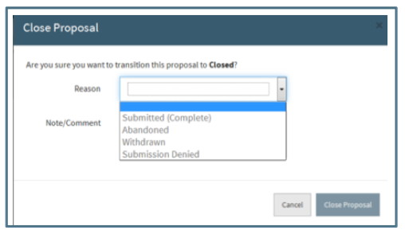

# Proposal Action Menu
The Actions Button is located at the top right of the proposal screen to the left of the Save button.

When the User clicks on the Action button, a dropdown is displayed revealing several actions available.  Depending upon the status of the proposal and type of User, different actions are available.

# Close
The Close action is only available for open proposals and to Pre-Award Users.  This action moves the proposal from the Open Navigation Items to the Closed Navigation Items.  When the User chooses this option, a dialogue box appears prompting them to enter the required Reason for Closure and add an optional note/comment.  

The Reasons for Closure are:
-	Submitted: Indicates the proposal has been submitted to sponsor and given to Processors to enter into Banner.  Proposals cannot be closed as ‘Submitted (Complete)’ unless all Submitted Proposal Information is completed in the Proposal Management Section and the Proposal is not in Admin Review.
-	Abandoned: Indicates PI has chosen not to submit proposal or proposal is no longer actively being worked on.
-	Withdrawn: Indicates the proposal was withdrawn from the sponsor.
-	Submission Denied: Indicates a proposal that was in Admin Review and marked “Do Not Submit.”

# Mark as Submitted
This action is available to all Users in open proposals except those in Admin Review or already marked as Submitted.  This marks the proposal as one that has already been submitted to the sponsor but is still in the User’s “My/All Open” proposals because there is outstanding required data or documents.  Indicators are displayed in the Header and Summary Pane.  This status is an optional tool available for Users to manage their workload.  A proposal may be closed directly without having been in the Submitted state.

# Unmark as Submitted
This action is available to all Users in proposals in the Submitted status.  This removes the submitted status and returns the proposal to the default Open status.  Information about the submission in the Submitted Proposal Info fields is not affected.

# Send to Admin Review
This action is available to all open proposals except those already in Admin Review or in Submitted status.  Only Pre-Award Users have access to this action. This action moves the proposal to the Admin Review navigation folder seen by Pre-Award Users for Pre-Award Management to review.  Indicators are displayed in the Header and Summary Pane.   This is an optional action that may be used by Pre-Award Associates to move the proposal manually to Admin Review instead of the automatic change that occurs in compliance with OSP Policy 10-01.

# Reassign
Reassignment from one Pre-Award Associate to another is an action available only to Pre-Award Users in any status except closed.  When this action is chosen, a dialogue box will prompt the User for the name of the new assignee.

This action will remove the proposal from the original Pre-Award assignee’s “My Open” proposals to the new assignee’s “My Open” proposals.  The original assignee will still have access to the proposal through the “All Open” Navigation Item.  The Support Staff subsection of the Personnel section will reflect the change.

# Duplicate
Duplicating a proposal is available to all Users in every proposal status.  Duplicating a proposal allows the User to copy specific information from one proposal to create a new but similar proposal. This may be useful when one PI is submitting multiple proposals to the same opportunity and the submission information is the same or when using the same proposal team on a different proposal. When a User chooses to duplicate a proposal, a dialogue box will prompt the User to enter the information to be duplicated.  

The middle section in the dialogue box requires the User to indicate if either or both proposal team and submission information will be duplicated.  At least one must be answered yes in order to duplicate the proposal.
If the User indicates the Submission Type is “Revision” or “Other,” an additional field for the Proposal ID or Grant Number is required.  After the User answers the Sponsor Deadline question, the Target Date question will appear.

A proposal duplicated by the Proposal Team or Support Staff is automatically assigned to the Pre-Award Associate assigned to the Submitting Org regardless of the Pre-Award Associate assigned to the original (duplicated) proposal.  A proposal duplicated by a Pre-Award Associate is assigned to that User regardless of the Submitting Org assignment.  In either case, the proposal can be reassigned by a Pre-Award User if necessary.

# Reopen
This action is available to Pre-Award Users for closed proposal.  Reopening a proposal removes the closed status and returns the proposal to the default Open status.  The proposal is moved from the Closed Navigation Items to the Open Navigation Items.  
