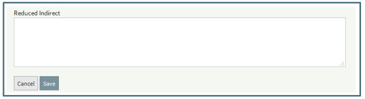
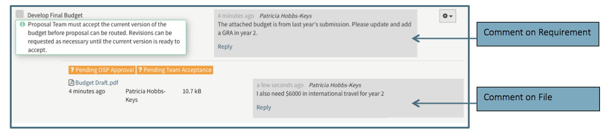
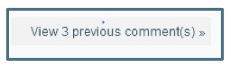

**Tools / Comments**

The Comments feature of Summit allows all Users with access to a proposal to communicate about the proposal in the system.    The Comments feature includes both the ability to comment at specific points in the Editor as well as a running log of all comments on a proposal.

# Navigation
Comments in the Editor are visible at specific Requirement or file level.  Only the most recent comment in the thread is visible.

The Comments log is located at the top right of the proposal in the header section next to the Actions button.

The Comments Log includes  a list of all comments made on the proposal. The comment threads appear with the most recent on top and each thread displays the most recent.

Each Comment Thread in the Comments Log includes the following information:

Each Comment Thread in the Editor includes the same information in a slightly different format.

Comments in the Log are also displayed in the Editor under the requirement item or file with which they are associated.  Comments made in the Editor always appear in the Log.  Replies on comments made in the Log are also displayed in the Editor.

# New Comment
New Comment Threads should be started in the Editor so that they will be associated with the correct requirement item or file.  See “New Topics in Comments Log” section below for new comments not associated with a checklist item or file.  

To create a new comment thread, the User can click on the “Add Comment” option in the gear menu next to any requirement item or file.  This will display a comments field.  The User must Save the comment for it to save to the Editor and Log.  

Note that comments can be made on both the Requirement Item and the file associated with that Requirement Item so that two separate comment threads can be tracked.

# Replying to a Comment
All Users with access to the proposal can reply to any comment made by themselves or other Users. To make a reply, the User can click on the Reply link in the Editor or Comments Log.  Clicking on Reply will display a comments field.  The User must click Save the comment for it to save to the Editor and Log.

# New Topic in Comments Log
Users can make a comment that is not associated with a checklist or file by using the “Start New Topic” option in the Comments Log.  These unassociated comments created through the “New Topic” option are not associated with an item in the editor and therefore only appear in the log.  The Topic/Subject entered with the new comment will be the title of the thread in place of the requirement or file name used for comments associated with a specific item.

It is recommended to use this feature when there is not relevant checklist item or file on which to comment.  For example, if the User wanted to notify the other team members that he had changed the Target Date, he should use this feature since there is no comment feature on the Target Date field

# Viewing Previous Comments
In both the Comments Log and the Editor, the most recent comment in a thread is displayed.  Previous comments in the thread are visible when the User clicks “View Previous Comments.”  Previous comments can be hidden by clicking on “Hide Previous Comment(s).”

When the User has the Comments Log open, a notification will display when a new comment has been made.  Clicking on the notification will refresh the Comments Log and the new comment will appear at the top of the list.

# Notifications on Comments
When a User makes a comment or replies to a comment from either the Comments Log or Editor, other Users with access to the proposal will receive a notification.  

# System Messages in Comments
The Comments Log includes a log of all system generated messages.  
-	Status changes such as marking the proposal as submitted or closed
-	Notes associated with status changes
-	Notification there was a failure to create EFD folder.  This is the internal OSP file used to store documents outside the system.  The message is for OSP use.

