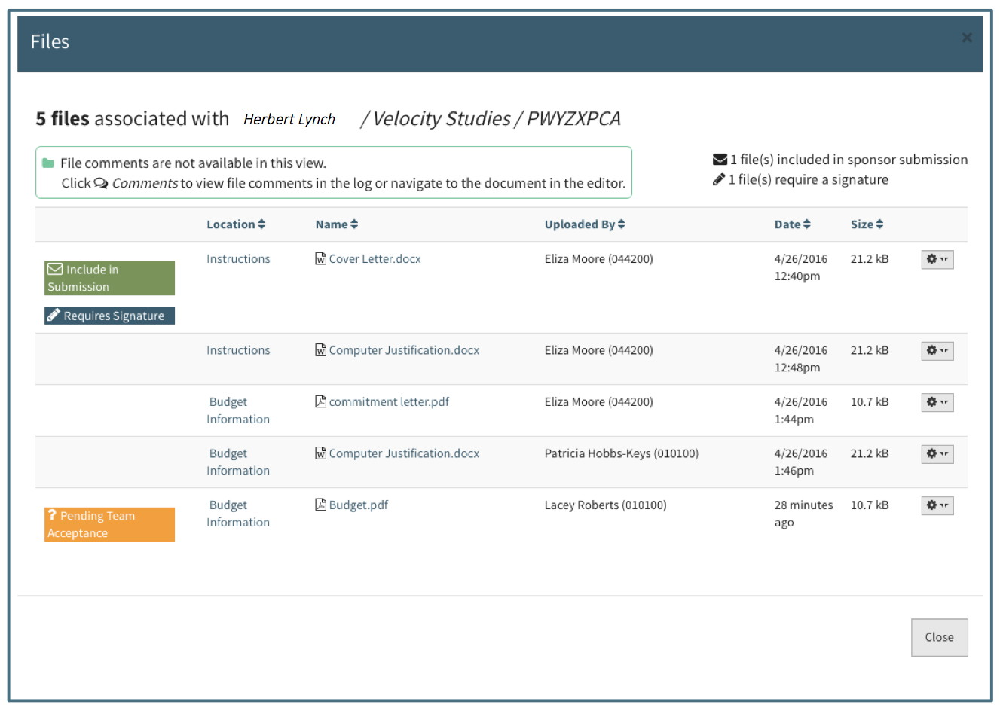

**Tools / Files**

Files can be uploaded into Summit from a requirement, a question, or a specific file field such as the solicitation document field or the third party cost share commitment letter field.  

# File Actions
Each uploaded file has a set of actions available to it.  An action gear will appear next to the file when the User hovers over a file:

The action gear menu changes depending upon user and the document status.  The following details each item on the menu and which users have access when.

## Add Comment
Available to all Users for all Files.  Choosing this action will allow the User to type into a comment box which can be canceled or saved.  See Tools/Comments section for further details.

## Upload New Version
Available to all Users for all Files.  Once a file is uploaded from the Checklist Action Gear, there is an option to “Upload New Version.”  Uploading a new version allows the user to “replace” the current version with an update.  Clicking on this action will bring a popup window allowing the User to drag or search for the file.

## Delete
Available to all Users for all Files.  This action will delete all versions of the file, not just the most recent file that is visible.  All comments will be deleted along with all versions.

## View All Versions and Reverting
Available to all Users for all files that have more than one version uploaded.  This action allows the User to see a list of all versions of a specific file.  

Selecting a previous version and clicking on the Revert button will display the reverted document in the editor:

Once a User has reverted to a previous version, the “View Previous Versions” will show the history of which version was chosen when:

## Include in Submission
Available to all Users on all files.  This feature allows the User to designate which files will be included in the proposal submission to the Sponsor.  When it is chosen, an indicator will appear above the document and in the Files log.  It is recommended to use this feature to indicate to the Pre-Award Associate, Support Staff or other team members that the current version displayed is to be included in the proposal submission packet.

Available to all Users for files marked “Include in Submission.”  This feature allows the User to remove the “Include in Submission” designation on the file.  When it is chosen, the “Include in Submission” indicator will no longer be displayed on the file.

## Signature Needed
Available for all Users on all files.  This feature allows the User to designate which files require a signature.  When it is chosen, an indicator will appear above the document as well as in the Files log.  It is recommended to use this feature to indicate to the Pre-Award Associate, Support Staff or other team members that the current version of the document needs to be signed.  Comments can be used to indicate who needs to sign.

Available to all Users for files marked “Signature Needed.”  This feature allows the User to remove the “Signature Needed” designation on the file.  This can be used when the signature is no longer needed or once the User has uploaded the signed document.

# File Log
A log of every file attached in the proposal is located to the right of the Comments Log.  The Files log is an interactive list of all the current versions of the files.  All the actions associated with a file except comment are accessible in the Files log.  Clicking on the file location will take the User to the file in the proposal editor.  Clicking on the file name will open the file in a separate window.

The File Log includes a total count of files, the total number needing signature and the total number to be included in submission.  Each file is listed with it's location in the Proposal, the file name, who last updated it, when, and the size.  Also included are any status indicators and an action menu.  The action menu allows for all standard file actions except comments.
