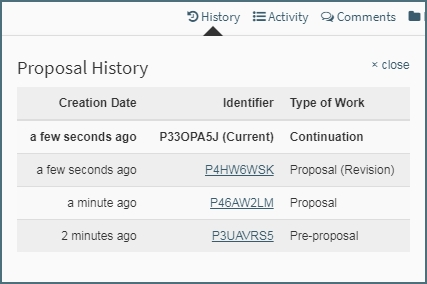

**Tools / History**

# History Log

The History log is located at the beginning of the toolbar at the top right while in a type of work.

### Display

Below shows the display in Summit when a user clicks "History".  

Sorted by creation date, the earliest work will be at the bottom and most recent created at the top.  

In the example above the user started with a Pre-proposal, then advanced to a Proposal, then advanced the Proposal to another Proposal making it a revision.  Lastly, the user advanced the Proposal (Revision) to a Continuation.

Each work listed shows the Creation Date and Time, Identifier, and the Type of Work.  

All types of work in that cycle can be accessed from any another work while having the History display up, simply click the hyperlink of the Proposal ID you wish to navigate to and that work will open.

### Revision Handeling

The only type of work that displays "(Revision)" next to the type of work are on proposals that have been advanced from a proposal.  Any other type of work advanced to itself will not display "(Revision)".

 
