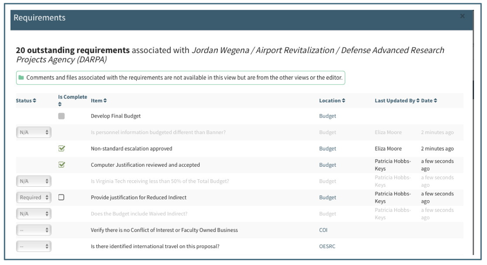

Each proposal has many conditions that must be met before it can be submitted to the Sponsor.  The Requirements feature was designed to keep track of and manage the specific conditions.  The Requirements are a "checklists" or "to do list" that is customizable to each individual proposal. Each requirement consists of six sections: dropdown, checkbox, details, comments, action menu and files.

# Dropdown
Each checklist item has a dropdown field with three options:

## System Required
Several items do not have dropdown fields.  These are items that are always required and are marked required automatically by the system.  They cannot be marked “N/A” or “—“ but must be completed before the proposal is submitted.  

Some of these are always required such as Budget Development or PI Approval.

Others are marked required in response to the answers to questions, such as Secure Folder requirement in the OESRC section

When there is a dropdown field, all Users have access to change the status.

## Dropdown Options
**"--"**
Indicates that the requirement has not yet been reviewed to determine if it should be designated as required or not applicable.   This is the default state of the dropdown boxes.

**"N/A"**
Requirement is not applicable to this proposal and is therefore not a requirement.  When an item is marked as “N/A,” it fades to light gray.  

**"Required"**
Item is an applicable requirement for this proposal but has not yet been completed.  When an item is marked as "Required" a checkbox appears to the right of the dropdown, giving the user the ability to mark it as complete.  

# Checkbox
An item marked “Required” or automatically required by the system will have a checkbox appear to the right of the dropdown box. The checkbox can be checked or unchecked.  When it is checked, it represents the requirement being fulfilled or completed.  Completed checklist items no longer show the dropdown box.  Checkboxes that are greyed out are ones that can only be completed by OSP.

The status of most checklist items can be updated by any User, though there are several that are restricted.  Only Pre-Award Users have the ability to edit the checkbox field for the restricted items such as Administrative and Technical Documents, Budget Development and the Secure Folder Creation.  Such checkboxes are grayed out for Users other than Pre-Award.

Hovering over a completed checkbox item will display the name of the person who marked the item as complete.  

# Details
The third section is the requirement detail.  This is the title or description of the requirement as well as any help text associated with the requirement.  

## Requirement labels
Each Requirement includes a different label depending upon which state it is in.  For example, before it has been reviewed and is in the default "--" state, the label may be in a question form.  When it is required it will be a description of who needs to do what and when it is complete it will state what has been done.

## Requirement Help
There are two types of help text associated with Requirements.  Each requirement may have one, both or neither of the following:

**Hover Help**
Hover Help appears when the cursor is hovering over a requirement for several seconds.  This type of help includes definitions to assist the User in determining if this requirement is applicable or not.

**Action Help**
Action Help appears below the label of a Required item to provide additional information on how to complete the requirement.  The label does not appear when the item is in the "--," "N/A" or completed state.

# Comments
The most recent comment is visible in the comments section.  See Tools/Comments for details on how to use the Comments feature.

# Requirement Action Menu
An Action gear appear next to each checklist item when the User hovers over the item.  There are several actions available, though they vary depending upon the item’s state:

**Mark Completed**
This is available only for unrestricted items marked Required.  Only Pre-Award Users will see this option on restricted items. Choosing this action will check the checkbox and hide the dropdown.

**Mark Imcomplete**
This is available only to unrestricted items marked Complete.  Only Pre-Award Users will see this option on restricted items. Choosing this action will uncheck the complete box, and unhide the dropdown menu reverting to the Required status.

**Add Comments**
This is available to all checklist items and all Users.  Choosing this action allows the User to make a comment on the item that is added to the comments log.  See the Tools/Comments section for further details.

**Attach Files**
This is available to all checklist items and all Users.  Choosing this action allows the User to attach one or more files to be associated with the checklist item.

**Duplicate**
This is available only to items marked Required, whether completed or not.  All Users have access to duplicate.  Choosing this action will create a new checklist item with the label in the “Required” state and the complete cleared (if the original was already completed).   When, the User is given the option to add a distinguishing description to the original title and duplicated title (for example, to distinguish the approval needed at the department level and college level).   The duplicated item can be removed before it is saved, but cannot be deleted after saving (mark it n/a if it is no longer applicable).

# Files
When the User chooses "Attach File(s)" from the Requirement Action Gear menu, a dialogue box will direct the User to search for the document or drag it into the box:

Once a file is uploaded, there are several sections of the file view:

For details on using the files, see the Tools/Files section.

##File Action Menu
In addition to the actions available on the Checklist item, each file that is uploaded to a checklist item has a set of actions available to it.  An action gear will appear next to the file when the User hovers over a file:

**Add Comments**
Available to all Users for all Files.  Choosing this action will allow the User to type into a comment box which can be canceled or saved.  See Tools/Comments section below for further details.

If there is already a comment, clicking this will create a reply to the current comment.

**Upload New Version**
Once a file is uploaded from the Checklist Action Gear, there is an option to “Upload New Version.”  Uploading a new version allows the user to “replace” the current version with an update.  Clicking on this action will bring a popup window allowing the User to drag or search for the file.

    Note:  Uploading a new version replaces the current version.  To add a separate document with its own versions, use the Action Gear on the Requirement item (see further details in the Data/Budget Development section)

**Delete File**
Available to all Users for all Files.  This action will delete **all versions of the file**, not just the most recent file that is visible.  All comments will be deleted along with all versions.

**View and Revert**
Available to all Users for all files that have more than one version uploaded.  This action allows the User to see a list of all versions of a specific file.

Selecting a previous version and clicking on the Revert button will display the reverted document in the editor.

Once a User has reverted to a previous version, the “View Previous Versions” will show the history of which version was chosen when:

**Accept/Approve**
This action is available only on the Budget Development documents. Choosing these options will update the label.  See Data/Budget Development section for further details.

**Include in Submission**
Available to all Users on all files.  This feature allows the User to designate which files will be included in the proposal submission to the Sponsor.  When it is chosen, an indicator will appear above the document and in the Files log.  It is recommended to use this feature to indicate to the Pre-Award Associate, Support Staff or other team members that the current version displayed is to be included in the proposal submission packet.

**Signature Needed**
Available for all Users on all files.  This feature allows the User to designate which files require a signature.  When it is chosen, an indicator will appear above the document as well as in the Files log.  It is recommended to use this feature to indicate to the Pre-Award Associate, Support Staff or other team members that the current version of the document needs to be signed.  Comments can be used to indicate who needs to sign.

# Add Requirement
Most Requirement lists have an option at the bottom allowing all Users to add additional requirements that are specific to the proposal.  

Clicking on the “Add Requirement Item” link creates a new checklist item and allows the User to name it.  The new item can be removed before it is saved, but cannot be deleted once it is created.  If the new item becomes irrelevant to the proposal, it can be marked “N/A” as an alternative to deletion.

# Requirement Log
An interactive log of every requirement in the proposal is located to the left of the Save Button.

The Requirements log includes the status, completion state, item details, location and last updated information.  The status and completion status can be updated from this view.  Clicking on the location will take the User to the item in the proposal Editor.

