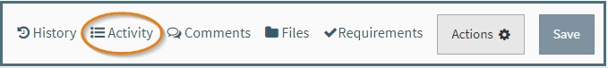
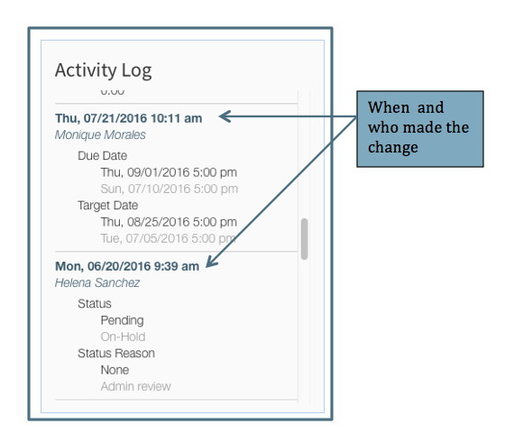
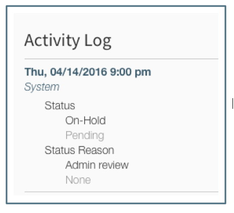
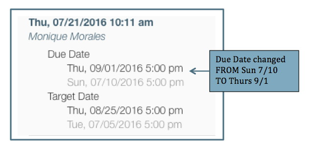
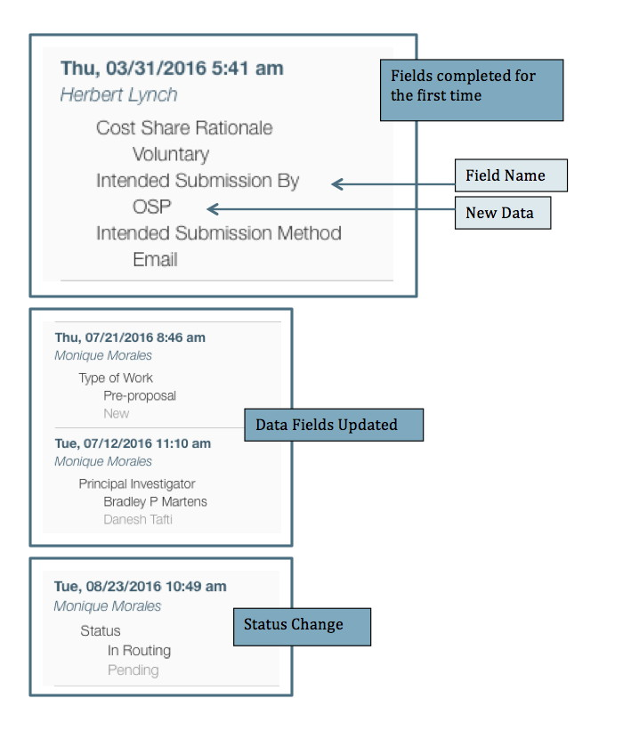

**Tools / Activity Log**

# Activity Log

The Activity log is located in the toolbar at the top right of the proposal.

It contains a history of the activity that has occurred in the proposal.  Each entry is documented with the date and time and the person who made the change.

If the entry is a system change, "system" is listed as the person making the change.  For example, when there is an automatic status update, the Activity Log will show that the "system" made the change.

For changes, the old information is gray and the new information that replaced it is normal font.

# What is Tracked in the Activity Log

The Activity Log tracks three types of changes in a proposal:

- data fields completed
- data fields updated
- proposal status changes

The following are **NOT tracked** in the Activity Log:

- changes to any Requirements
- changes to any compliance questions, including additional coordination questions

 
