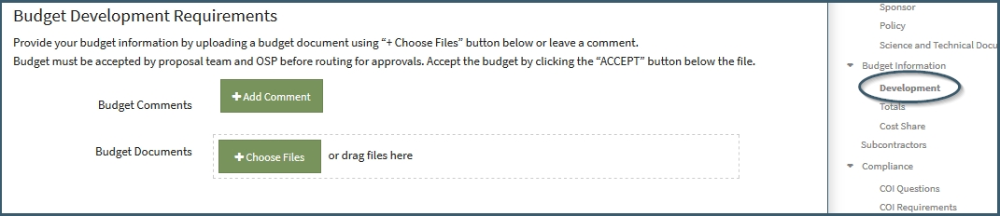

** Data / Budget Development**

Budget Development is facilitated using the comments and actions of the Develop Final Budget Requirement.  The action menu includes several additional features to facilitate communication around the development and finalization of the budget.

# Navigation
The Develop Final Budget Requirement is located at the top of the Budget Development Requirements list

The Budget Information only appears when a budget has been requested, so access to the Budget Development item requires a budget request.

# Initial Budget Request
Users can initially request a budget in the Proposal Initiation process or through “Request a Budget” option in the editor.  Both of these options allow the User to comment, describing the budget.  The Proposal Initiator allows the user to also attach documents:

Comments included in the budget request display on the Budget Development checklist item.  Files included in the Proposal Initiation request are associated with the Budget Development checklist item.  The User is not required to include comments or files in the initial request.  In such cases nothing will display next to the Budget Development item

It is recommended that future comments about the budget file are associated with the specific file instead of continuing at the Budget Development level.  This is important for when there are multiple files attached so that the comments can be linked directly to a specific file instead of the more general level.

# Budget Versions
The Budget Development function was designed to assist users in tracking the versions of the budget.  It is therefore recommended that every time a new budget version is uploaded, it is uploaded as a new version of the current file, not uploaded as a new file on the Develop Final Budget requirement item. Uploading a new version allows the user to “replace” the current version with an update.  Clicking on this action will bring a pop-up window allowing the User to drag or search for the file. See the Tools/Requirements section for more information on using the Requirements feature.

# Alternate Budgets
When the User wishes to develop multiple budgets simultaneously, it is recommended to upload the files as separate files to the Develop Final Budget requirement item.  This will allow the Users to track versions, approvals and comments regarding each Alternate Budget:

  

# Approval and Acceptance
The approval and acceptance feature of the Budget Development checklist facilitates finalizing the budget.  The terms are defined as follows:

- **Approval**: The OSP designation that the budget is in compliance with sponsor guidelines and university policy
- **Acceptance**: Proposal Team or Support Staff designation that the budget accurately represents the costs of doing the work described in the technical proposal.

The User can designate the budget as accepted by choosing the “Yes, Accept File” option in the gear menu for the file.

The following represents how the approval and acceptance feature works:

    Note: At any time during this process, if a new version of the file is uploaded, the status is reset to Pending OSP Approval and Pending Team Acceptance

User can "revoke" acceptance or approval to put the budget back in the Pending state by clicking on the "Pending Acceptance" or "Pending Approval" option in the menu that appears after the User has accepted/approved.  The User can also has the option to "revoke" the not accepted/not approved status.

# Submit to Sponsor
At any time after a file is uploaded, any User may indicate that this file will be part of the proposal submission to the sponsor.  To indicate this, the User must choose the “Include in Submission” option from the dropdown menu.  An indicator will display above the file, tagging the file as one to be included in the submission package.

After a file is marked for submission to sponsor, the gear menu will include the option to “Exclude from Submission.”  Choosing this action will remove the indicator from the file.

 
