The Proposal Editor contains topical sections for proposal data and checklists.  After Proposal Initiation, the Proposal Editor contains all of the information provided in the Initiator and also includes additional fields and sections.  The following is a brief overview of the additional sections and features of the Proposal Editor.
# Personnel
In the Editor, the Personnel section is split into four sections:  The Submitting Org, the Proposal Team, the Support Staff, and the Personnel Requirements.

## The Submitting Organization
This field contains the Submitting Organization included in the Proposal Initiation.  If it is different from the PI Home Org, the option is provided to change it back to PI Home Org.

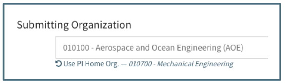

If the Submitting Organization is changed in the Proposal Editor:
-	The Pre-Award Associate remains the same.  If the new organization should be assigned to a new Pre-Award Administrator, it can be done manually at the Pre-Award Associate’s discretion.
-	Support Staff are not automatically removed from the proposal, but can be deleted manually.  The User is given a warning if there is additional support staff from this new organization that should be added to the Support Staff section.   

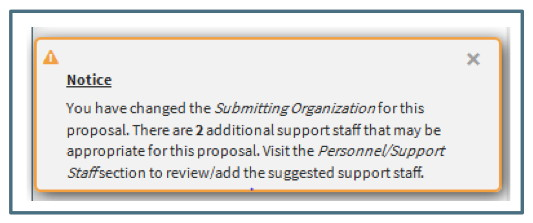

For further details on searching for, choosing and creating an organization, see the Data/Initiator section.

## Proposal Team
The Proposal Team section initially includes only the PI.  Additional Team Members can be added by clicking the “Add Proposal Team Member” button.

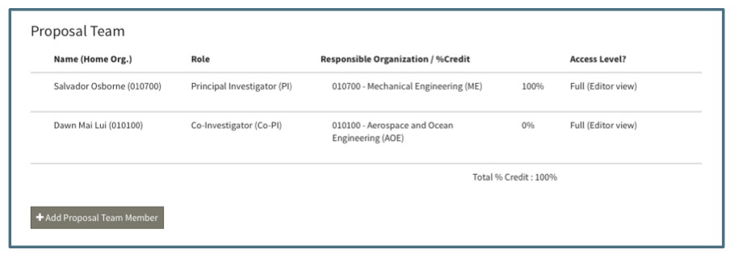

Each person listed can be edited or deleted by clicking on the gear icon that appears when the User hovers over a specific Proposal Team Member:

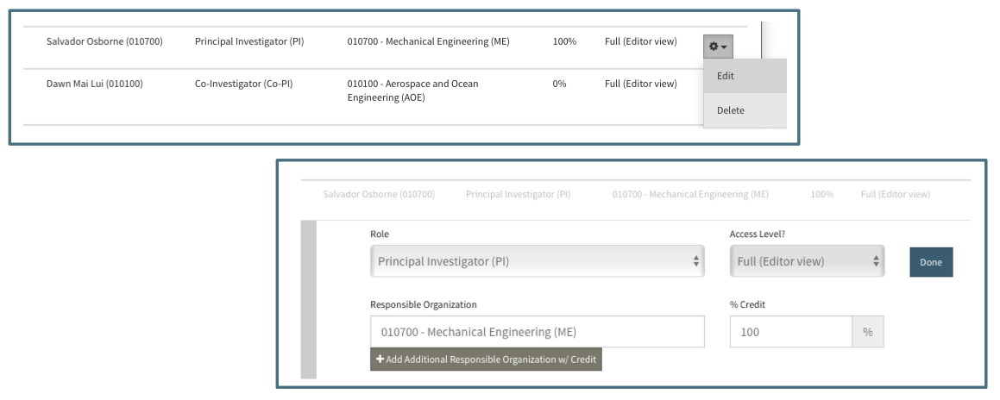

Though all the fields are editable, there are several validations that will prevent the User from saving the proposal:

 - There must be a PI on the proposal.  If the PI role is changed or the PI is deleted, the User will receive a warning in the Editor and an error on the Save button:

 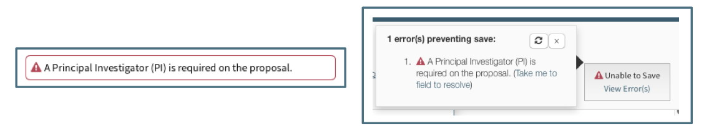

 - If more than one person is listed as a PI the User will receive a warning in the Editor that only one is permitted and an error on the Save button:

 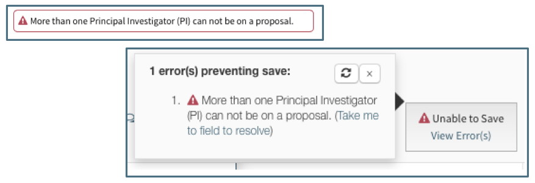

 - Persons listed in the Support Staff section cannot be added to the Proposal Team unless they are first deleted from the Support Staff section:

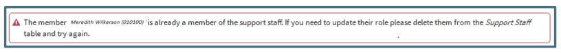

## Support Staff
Support Staff includes the assigned Pre-Award Associate as well as any department or college administrative personnel who require access to the proposal.  This may include grant administrators, business managers or project managers.

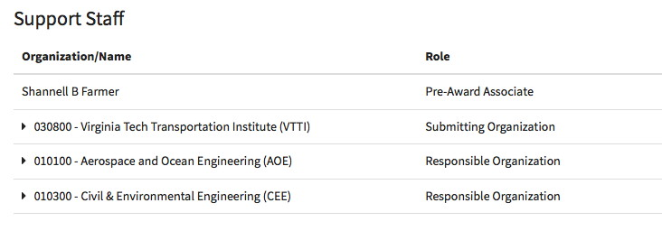

There are several unique features for Support Staff:

-	Some Support Staff are automatically included for the Submitting Organization that was entered at the Proposal Initiation.  OSP maintains a list of required Support Staff for each organization.  

-	Deleting Support Staff for the Submitting Org that are automatically included will generate a notice suggesting they be included:

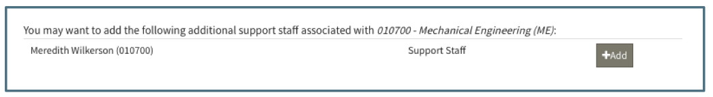

- Changing the Submitting Org will generate a notice suggestion the support staff associated with the new org be included:

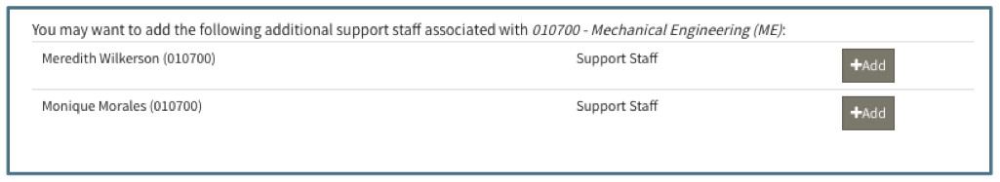

- Support Staff can be designated as Support Staff Lead.   This role indicates that the Support Staff will see the proposals on which they are marked as Lead in their “My Open” navigation item.  This can be done automatically through the OSP maintained list or by manually editing the role.  There is no limit on the number of Support Staff that can have the Support Staff Lead role.

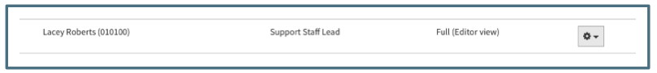

## Access Levels
All personnel are given full access by default when they are added to the proposal.  This means that they have full access to view, edit, save and perform proposal actions.  Persons given limited access will only have access to see a summary view of the proposal.  PI’s cannot be given limited access.  If the User tries to change their own or the PI’s access from Full to Limited they will receive the following error message:  

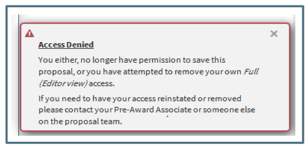

## Personnel Requirements
Within the Personnel Section is a Requirements Subsection listing all requirements regarding personnel that need to be reviewed before the proposal is submitted.  See the Tools/Requirements section for more information on using the Requirements feature.

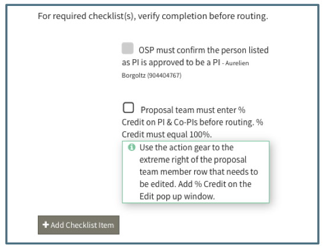

# Submission Information
## Instructions and Instruction Requirements
The Submission Information Instructions Subsection includes data fields describing the submission instructions such as how and when the proposal must be submitted and any specific requirements such as a solicitation or master agreement.  See the Tools/Requirements section for more information on using the Requirements feature.

Answering yes to the questions in this section will create new requirements elsewhere in the Proposal Editor.  For example, if there is a "yes" answer to "Is this a limited submission," the following item will be added the Submission Instruction Requirements list:

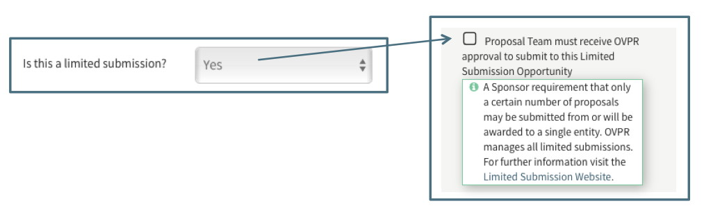

The first item in the Submission Instruction Requirements list asks if there are any unique RFP Instructions or Submission Requirements.  This item should be used to communicate and track unique requirements such as specific file types to be emailed or if there are different deadlines for separate sections of the proposal.

## Policy
This subsection contains checklist and data for OSP personnel to manage the status of the proposal.  The Administrative Documents Received Checklist item tracks the receipt of documents in compliance with OSP Policy 10-01. Administrative documents can be attached here and the notes feature used to communicate about them.  The SPAF should be attached to the Administrative Documents checklist item.   See the Tools/Requirements section for more information on using the Requirements feature.

## Science and Technical Documents
This subsection currently includes only a checklist item for Technical Documents Received.  Except for proposals being submitted through Cayuse or Fastlane, the Support Staff User must attach the proposal documents to be submitted to the sponsor in the Technical Documents checklist item.  This should include the full proposal the Pre-Award Associate will submit to the sponsor.  The checklist is marked complete to track compliance with OSP Policy 10-01. See the Tools/Requirements section for more information on using the Requirements feature.

# Budget
If a Budget Request was made during the Proposal Initiation, the information displays in this section.  If no Budget Request was made, the option to request a budget is available:

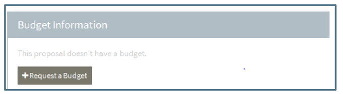

Requesting a budget will open a dialogue box similar to the Initiate Proposal wizard in which the User will be asked to complete the required data fields. Once the request is complete, it will display in the Budget Information section along with the additional budget fields available.

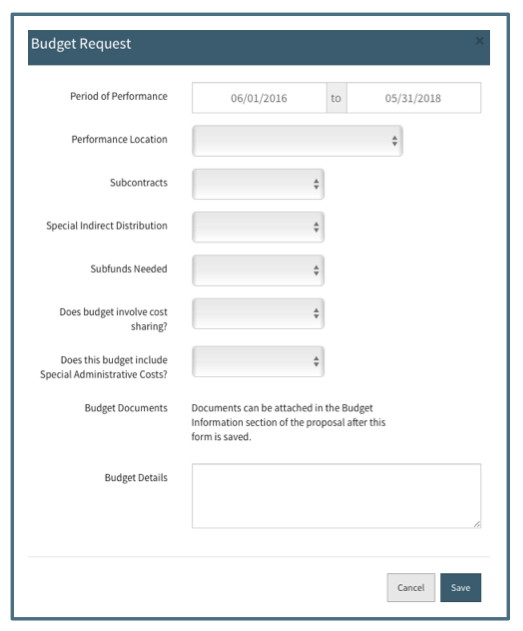

After a Budget Request is made, this section will display the data fields associated with the budget, including new fields that will need to be completed.

## Development and Requirements
The Budget Development subsection contains the budget documents and budget details included in the original budget request information.  The Budget Development Requirements subsection includes a list of standard proposal requirements relating to the budget.  Answering yes to the questions in this section will create new items requirements section.  For example, if there is a "yes" answer to "Subcontracts" the subcontractor section will become active and when there is a "yes" answer for "Does this budget involve Special Administrative Costs?" a new item will be added to the budget development requirements.

DataEd_AdminCostsExample  IMAGE HERE - NEED IMAGE SHOT

The Budget Development Requirement is a special requirement with enhanced capabilities. It is meant to be used for the communication around the development of the final budget(s).  Using the standard Requirements actions, budget development allows for attaching files, viewing and reverting to previous versions of files, commenting and replying as well as a unique feature of approving or rejecting a document.  See the Data/Budget Development and Tools/Requirements sections for details on using this feature.

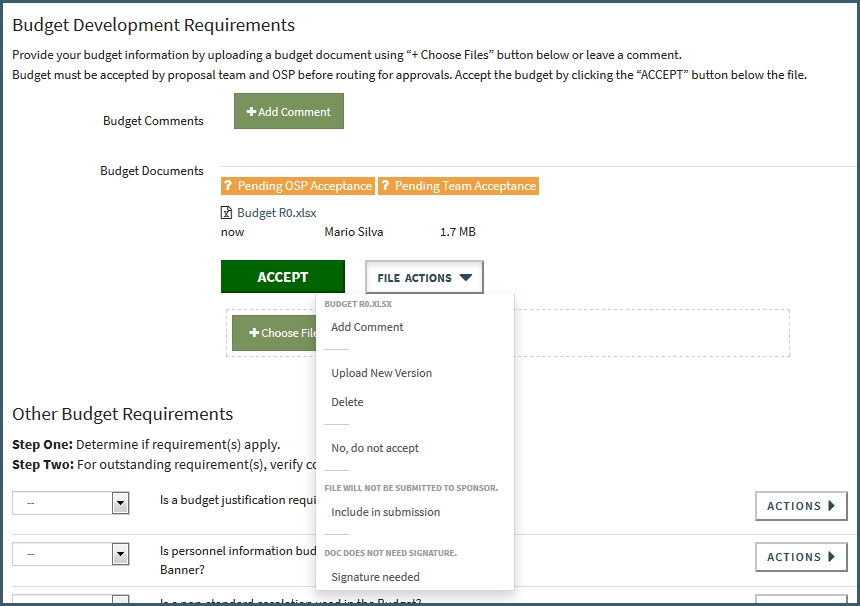

## Totals
The Totals subsection includes fields to input the final direct and indirect amounts from the final approved budget that will be submitted to the Sponsor.  The additional fields for Total Costs and Total Cost Share are automatically calculated.  The Total Costs sums the Total Direct and Indirect fields and the Total Cost Share sums the Cost Share budget entries.

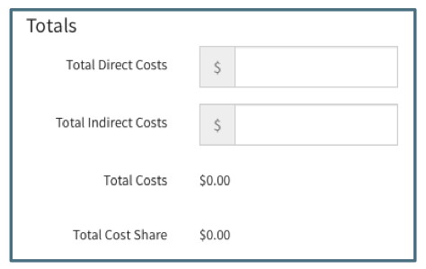

## Cost Share
The Cost Share subsection includes general fields describing the nature of the cost share as well as fields detailing the specific sources of the cost share commitment.  

The general fields include indicating if there is cost share and if it is a requirement from the sponsor or a voluntary inclusion in the budget to enhance proposal competability.  If it is voluntary, a budget requirement will be created as a reminder to include the approval for such voluntary cost sharing.  The Requirement field is for describing the exact sponsor requirement for the amount of cost share to be included in the budget.

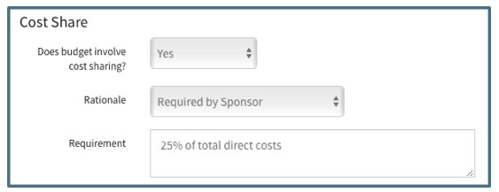

The details of the cost sharing are captured in several tabs.  Each tab has an initial question asking if the cost share includes a specific type of cost: personnel, non-personnel direct, indirect or third party.  If yes, the tab will expand to include fields describing the amount and sources of the cost share.  The total of each tab is indicated in the tab name.  Each tab includes a button to add cost share and include a comment. The third party tab also requires a commitment letter be attached.

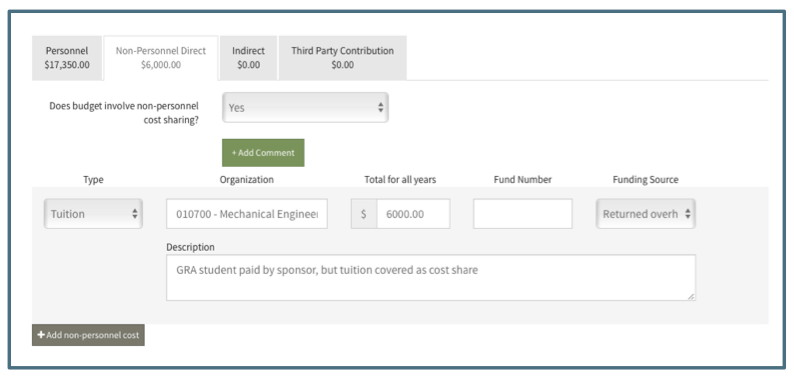

# Subcontractors
This section is available to manage subcontractor documents and requirements.  If the Subcontractor question in the Budget section has a "no" answer, it will be greyed out in the right hand navigation and appear inactive in the Editor:

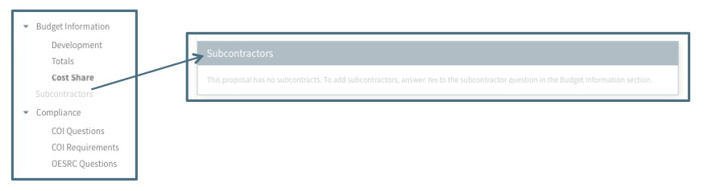  

If the Subcontractor question in the Budget section is answered "yes," the Subcontractor section will be enabled and ready for completing the subcontractor information.  Note that the most recent changes must be saved before a subcontractor can be added.

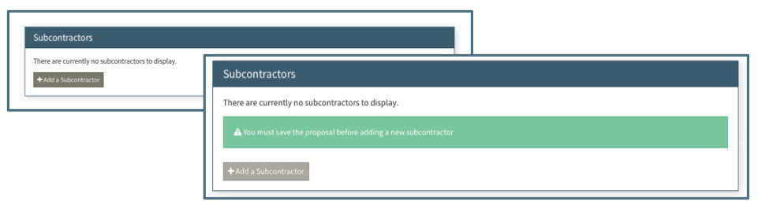

To add a subcontractor, the User must click "+Add a Subcontractor" and provide a name in the dialogue box that appears.   The Name need not be an official name.  The field is meant as an identifier for the User’s convenience, not an official record.

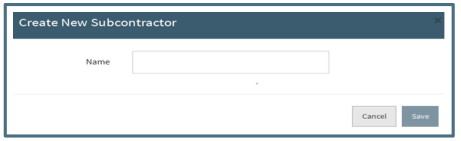

Once a Subcontractor has been entered, contact information fields and a checklist of possible required items is displayed.  Each item should be marked “n/a” or “complete” before the proposal is closed. See Tools/Requirements sections for details on using this feature.

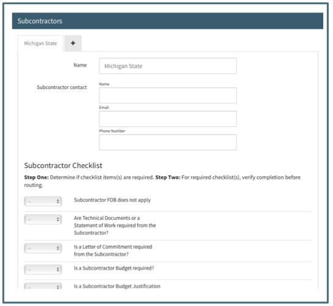

To add another Subcontractor, click the  + mark in the tab at the top of the Subcontractor section.  Once saved, Subcontractors will display in alphabetical order.  Five Subcontractor tabs will be displayed at one time.  All others will be available by clicking the dropdown menu tab.

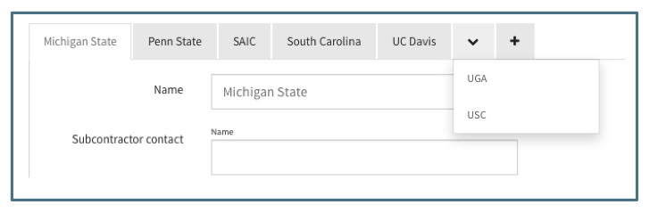

# Compliance
The compliance section includes a subsection for Conflict of Interest (COI), Office of Export and Secure Research Compliance (OESRC), Institutional Animal Care and Use Committee (IACUC), Institutional Review Board, and Institutional Biosafety Committee (IBC).  All of the subsections contain questions to be answered by the proposal team.  The COI and OESRC subsections also contain a requirements list which contain some standard requirements as well as some items that are system generated based upon keywords associated with selected sponsors and answers to various questions.

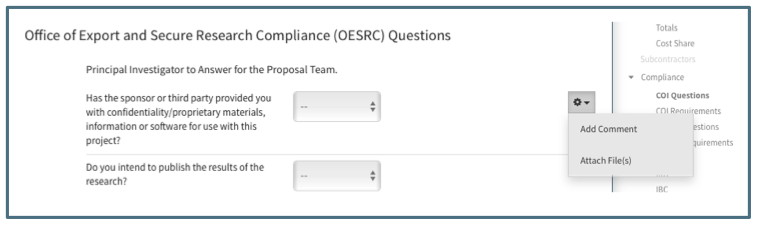

# Proposal Team Development
The Proposal Team Development section is available to the Proposal Team to use in collaborating on proposal documents.  The default items in the section are the most commonly used documents.  Additional items can be added.  The action gear can be used to collaborate with document versions, comments and mark for inclusion in submission.  See the Data/Budget Development and Tools/Requirements sections for details on using this feature.

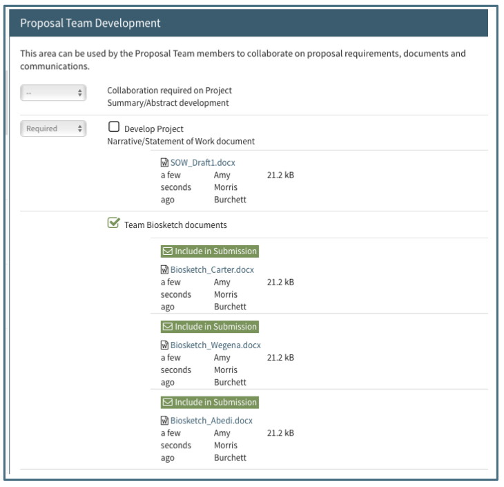

# Proposal Management
This section contains data about the proposal useful for Virginia Tech management purposes, including several questions regarding the use of Virginia Tech resources and fields capturing the submission information.
