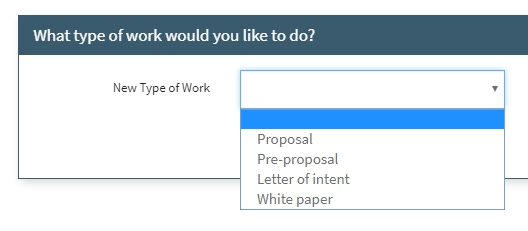
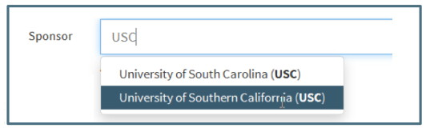

**Data / Proposal Initiator**

# Get Started

To initiate a new proposal in Summit, click the ‘Get Started’ button located above the Summary View.

The initiate proposal wizard opens in a dialogue box and has several screens to collect different types of data.  The progress bar at the top of the wizard shows the Users where they are in the process.  Each screen must have the required fields completed before the User can move to the next.

# Start
On the Initiate Proposal Screen, the User selects the type of work they are initiating.

If the User chooses the first option for new work, the Activity Type must be identified as well.

# Type of Work
This section is only available when Advancing from a current proposal.  See the information on Advancing located in the Tools/Actions section.

# Details
The next screen prompts the User to complete basic data about the proposal.  Depending upon the answers to some of the questions, additional fields are available to enter more information or attach documents.  

## Sponsor Field
The Sponsor field is a search field that searches the list of Sponsors currently in the Summit system.  The Search can be done by Sponsor Full Name or Abbreviation.  Since there will be many sponsors that have the same first few words in their official full name, searching by abbreviation will narrow down the search.

The User must select the sponsor name from the drop down by clicking to make their selection.  If the User does not click on their choice before pushing enter, they will be asked to confirm a new sponsor.  A new sponsor **should not be confirmed if the name appeared in the dropdown.**

The Sponsor search also allows for Alternate Names.  Alternate names are names used for sponsors that are not their official full name.  These include nicknames, previous names and shortened words.  When a User searches in the sponsor field, the dropdown will bring back alternate names with an indication which is the official name.  Whether the User chooses the official name or one of the alternate names, the same sponsor will be linked to the proposal.  

In the Proposal Editor, the official name will appear with a note indicating that there are alternate names.  The “i” icon indicates there is further information available by hovering over it:

When a User enters a name in the sponsor field that is not vetted, a warning will appear indicating that this is an Unknown Sponsor.

The user must click either “Try search again” or “Confirm, new sponsor.”  If they chose “Try search again,” the message will disappear and the original blank sponsor field will reappear.  If they chose “Confirm, new sponsor,” the sponsor will be added to the Pending Review list for OSP to vet and a note will appear indicating that the sponsor must be vetted by OSP (before proposal is closed).  

## Sponsor Deadline vs Target Date
The Sponsor Deadline is the date the Sponsor must receive the proposal.  This date is found in the RFP or other communication from sponsor.  If the answer is yes, a date field becomes required:

The User is then asked if they would like to submit early.  If yes, a date field becomes required:

If the User answers that there is no Sponsor Deadline the User is asked when they would like to submit.  

Both the answer to “Would you like to submit early” and “When would you like to submit” are considered “soft deadlines.”    This “soft” deadline is referred to as the Target Date and is displayed in the Proposal Editor as such.  When there is no Target Date entered by the User, the Sponsor Deadline defaults as the Target Date.  Alerts and emails are processed using the Target Date.

# Budget
The Budget section first asks the User if they want to request a budget.  If they answer “no,” they can request a budget from the Proposal Editor.  If they respond “yes,” they will be asked a series of questions about the budget and be given the opportunity to attach budget documents.  

The Budget Document field should be used to attach sample or draft budgets for Pre-Award’s review.  The Budget Details field should be used to describe the initial budget request or give further information about the attached budget documents.  Both fields need not be used.

# Personnel
The Personnel screen requests the User to indicate the PI and submitting org.

## Principal Investigator Field  
The Principal Investigator field will default to the User unless the User has an OVPR role.   If someone has a display name different than their Banner name, both will appear in the search.  Selecting either name will have the same result.

## Submitting Organization Field
The Submitting Organization field will default to the PI’s home organization.  The automatic assignment of Pre-Award Associate and Support Staff are based upon the Submitting Org entered at time of Proposal Initiation.  Changes in Submitting Org after Initiation do not automatically update the Support Staff but there is a note recommending the addition of the newly applicable Support Staff (see description in Navigation/Editor).

When a User enters a name or number of an organization that is not in the system, a warning will appear indicating that this is an unknown org.

The User must click either “Try search again” or “Confirm, new organization.”  If they chose “Try search again,” the message will disappear and the original blank sponsor field will reappear.  If they chose “Confirm, new organization,” they are asked to enter the full name of the organization and VT Org Code.

After entering the name and org number of the new organization, the user must save before the new organization is created.

When the new organization has been saved, the organization will be added to the Pending Review list of organizations for OSP to vet and a note will appear indicating that the organization must be vetted by OSP.

If the submitting org is not the PI’s home org, an option to return the Submitting Org to the PI Home org is located under the field.

# Review

The final step for initiating a proposal is a review of the information provided and a confirmation that it is correct.   The User can click on the “revise” link to be taken back to the section that needs editing.

Before the Proposal can be initiated, the Confirm section at the bottom of the Review screen must be completed with the Proposal Label, optional Keywords and confirmation before initiating the proposal.   The Proposal Label is a brief name that describes this proposal to assist Users in identifying it in the future.  

# Finish
After Initiating the Proposal, the wizard confirms the proposal was received and provides a summary of the proposal information.  From this screen the User can return to the Dashboard.

