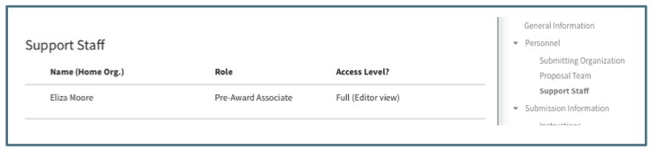

# Welcome to Summit User Guides
The Summit User Guide is here as a training tool, Help reference, and FAQ list.  

<gcse:search></gcse:search>

The tabs at the top will take you to the specific topics within the User Guide (or use the layout below with links to those sections):

- Home
- Navigation
    - [General](Navigation/general.md)
    - [Work Navigation](Navigation/proposal.md)
    - [Internal Notifications](Navigation/notifications.md)
    - [Summary View indicators](Navigation/indicators.md)
    - [User Preferences](Navigation/preferences.md)
- Data
    - [Initiator](data/Initiator.md)
    - [Editor](data/Editor.md)
    - [Budget Development](data/Budget Development.md)
    - [Exporting Data](data/Data Exports.md)
- Toolbar
    - [Actions](Tools/Actions.md)
    - [Activity Log](Tools/activity.md)
    - [Comments](Tools/Comments.md)
    - [Files](Tools/Files.md)
    - [History](Tools/History.md)
    - [Requirements](Tools/Requirements.md)
- Approvals
    - [Routing](Approvals/Routing.md)
    - [Approving](Approvals/Approving.md)
    - [Canceling](Approvals/Canceling.md)
- Management
    - [Sponsors](Management/Sponsor Editor.md)
    - [Sponsor Vetting](Management/Sponsor Vetting.md)
    - [Organizations](Management/Org Editor.md)
    - [Bulk Operations](Management/Bulk Operations.md)
    - [Assignees](Management/Assignees.md)
- [Videos](videos.md)
- [Release Notes](releaseNotes.md)

 

# Help
For questions about a specific proposal, contact the Pre-Award Associate listed in the proposal support staff section

To report an error message, contact [4Help](https://vt4help.service-now.com/sp) with a copy the error message and proposal ID.

 

# Video Tutorials
Access short videos, as well as longer overviews and demonstrations, showing how to use specific functions in Summit on the [Summit Help You Tube channel](https://www.youtube.com/channel/UC882QBwFDrfXbILKRvq2aiA) or see a list of all videos [here](videos.md) .

Several Key videos:
- [Summit Overview](https://www.youtube.com/watch?v=uwGLAqFzC_Q)

- [Initiating a Proposal in Summit](https://youtu.be/9uypak-E9K8)

- [Developing a Budget using Summit](https://www.youtube.com/watch?v=luRD8pZlVDg)

- [How to Submit a Proposal for Routing and Approval](https://www.youtube.com/watch?v=dVuW3nVRUng)

- [How to Approve a Proposal](https://www.youtube.com/watch?v=sfmdQqFPBPc)

 

#  Known Issues
- Proposal creation fails when a PI does not have a home org in Banner or default home org in Summit.  
    - **Workaround**: The PI should work with their department to update Banner to add their home org or add a default home org in their manage preferences (see [Manage Preferences](Navigation/preferences.md)).
- Notifications on Cost Share and Subcontractors
    - Due to the Cost Share and Subcontractor sections being tabulated, it is currently not possible for the notifications to scroll to a particular comment within these two sections.  It will only scroll if the comment happens to be on the tab that is currently open.  If the comment is on a tab that is not open, it will open the comment thread at the top right of the proposal screen.
- Named Proposal Team members (PI, Co-PI, Proposal Team member) who are also support staff members from an organization, will not have the "Add/Remove Lead Support" functionality in the Actions menu.
    - **Workaround**: As a proposal team member, you can simulate the same effect of adding the lead support, by clicking the star icon to add the work to your favorites, this will move the work into your My Open.  To simulate removing lead support, you can do the opposite, which removes the work from your My Open.

 

# FAQs
**How do I add a support staff or approver on an organization?**

- The Department Head or Business Manager of the org in question should email <summitHelp@vt.edu> with the name of who they would like added and as what role type(s) (ex. support staff, support staff lead, approver, approver delegate).

 
