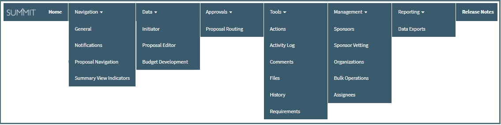

# Welcome to Summit User Guides
The Summit User Guide is here as a training tool, Help reference and FAQ list

### Documentation Organization
The tabs at the top will take you to the specific topics within the User Guide:

# Help
For questions about a specific proposal, contact the Pre-Award Associate listed in the proposal support staff section

To report an error message, contact [4Help](https://vt4help.service-now.com/sp) with a copy the error message and proposal ID.

# Video Tutorials
Access short videos, as well as longer overviews and demonstrations, showing how to use specific functions in Summit on the [Summit Help You Tube channel](https://www.youtube.com/channel/UC882QBwFDrfXbILKRvq2aiA).

Several Key videos:
- [Summit Overview](https://www.youtube.com/watch?v=uwGLAqFzC_Q)

- [Initiating a Proposal in Summit](https://youtu.be/9uypak-E9K8)

- [Developing a Budget using Summit](https://www.youtube.com/watch?v=luRD8pZlVDg)

- [How to Submit a Proposal for Routing and Approval](https://www.youtube.com/watch?v=dVuW3nVRUng)

- [How to Approve a Proposal](https://www.youtube.com/watch?v=sfmdQqFPBPc)

#  Known Issues
- Proposal creation fails when a PI does not have a home org in Banner or default home org in Summit.  
    - **Workaround**: The PI should work with their department to update Banner to add their home org or add a default home org in managed preferences.
- Notifications on Cost Share and Subcontractors
    - Due to the Cost Share and Subcontractor sections being tabulated, it is currently not possible for the notifications to scroll to a particular comment within these two sections.  It will only scroll if the comment happens to be on the tab that is currently open.  If the comment is on a tab that is not open, it will open the comment thread at the top right of the proposal screen.
- CAS Forbidden Login Message
    - If you login to Summit and CAS is set to 7 day reminder; then logout of Summit/CAS, then try to log back into Summit again, the Forbidden Access message will appear.
    - **Workaround**: Refresh the page

# FAQs
**How do I add a support staff or approver on an org?**

- The Department Head or Business Manager of the org in question should email <summitHelp@vt.edu> with the name of who they would like added and as what role type(s) (ex. support staff, support staff lead, approver, approver delegate).

 
