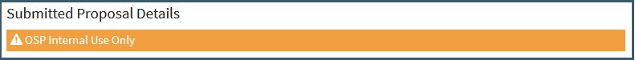
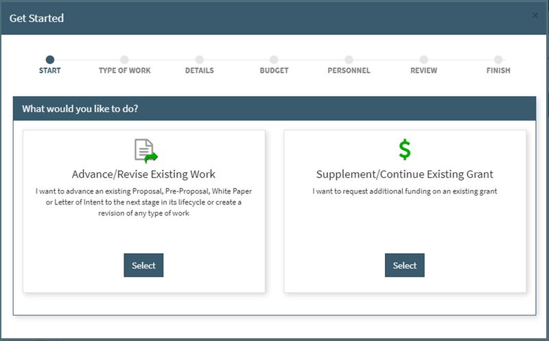
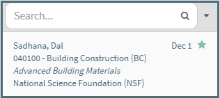
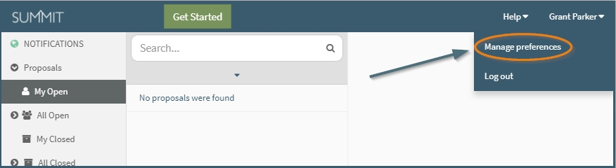
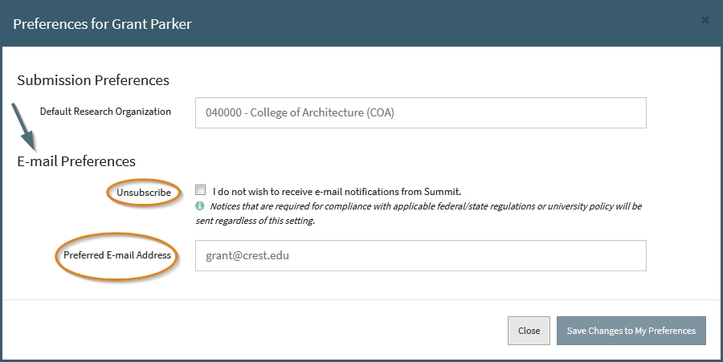
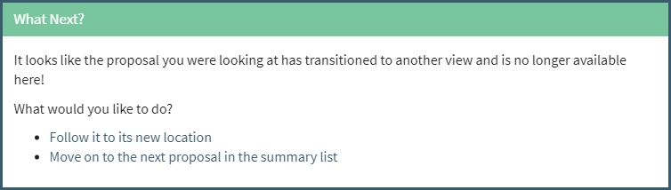

# Release 2.1.0 - September 2017

- Proposal Creator Cannot Add Responsible Org/Credit fix
    - When a proposal is created by someone outside of the PI's department, they are assigned the creator role. If that creator needed to be switched to a team role (Co-PI, Proposal Team), currently the button to allow that person to have their responsible org assigned and given a credit % is disabled.  This has been fixed and now the user can change themselves to another team role.
- Automated Emails Only for Open Proposals
   - If a proposal is not in the Open folder, automated emails will no longer be sent when a change is made on the proposal.
- "Type of Work" shown in Approver and Limited Views
    - examples: "Proposal" or "Supplement"
- Submitted Proposal Details Warning Label only Displayed for Proposals/Supplements/Continuations
    
    - Now that Pre-Proposals, White Papers, and Letter of Intents can be closed for reason of submitted by Proposal Team members (not just Pre Award associates), this section is open to more than just OSP to fill out and will not appear on those types of work.
- Various Small Bug Fixes

 

# Release 2.0.0 - August 2017

**Video Tutorials**

- [2.0.0 Release Overview](https://www.youtube.com/watch?v=PtN-a-8piUI&feature=youtu.be)
- [Get Started Update](https://youtu.be/9uypak-E9K8)
- [Pre-Proposals, White Papers, and Letter of Intent](https://www.youtube.com/watch?v=A3Ag-JNoUVI&feature=youtu.be)

 

**1. Get Started redesign**

**Get Started** will have all 3 options as seen above

- **Start New Work** will allow a user to create a new Proposal, Pre-Proposal, White Paper, or Letter of Intent.

- **Advance Existing Work** will allow a user to advance an existing Proposal, Pre-Proposal, White Paper or Letter of Intent to the next stage in its lifecycle or create a revision of any type of work.

- **Supplement/Continue Existing Grant** will allow a user to create a work item to request additional funding on an existing grant.

 

**2. Advance redesign**

**Advance** from within a proposal and you will see the same options as you do in the Get Started, except "Start New Work".

- Both options within this screen will automatically pull the proposal ID from the work the user was currently in.  By pulling in the proposal ID, it will also pull in all necessary data from the original proposal, to put on the newly advanced work.   

 

**3. Types of Work updated**
We have removed "Revision" and "Other" as a Types of Work.  For "Revision", you are now able to revise to the Type of Work you're are advancing from (ex. "Proposal" to "Proposal").  For "Other", you can specify if it is a "Supplement" or "Continuation".  This brings the current Type of Works that can be used in Summit as: White Paper, Letter of Intent, Pre-Proposal, Proposal, Supplement, Continuation

 

**4. History Log**
Users will now have the ability to view a list of all Types of Work that have been linked to each other via the advance feature.

Below shows the display in Summit when a user clicks "History".  Sorted by creation date, the earliest work will be at the bottom and most recent created at the top.  All types of work in that cycle can be accessed from another other work while having the History display up, simply click the hyperlink of the Proposal ID.

    Note: The History Log will only show work created after the release of this new feature, 8/18/17.  Works advanced before then will not display in the history log

 

**5. Minor Updates**  
- Compliance questions updated (OESRC and IRB)
    - Newly created proposals will only have the new questions.
    - All existing proposals will have the new OESRC questions added alongside the older ones.  
    - Before a proposal can be routed, the new questions will need to be answered by PI/Proposal team.    
    - Proposals already In-Routing or Approved will have those questions added as well but they will **NOT** be needed to be answered to get the proposal to next status level.
- Year Displayed in the Proposal Summary if not current year
- CDA/NDA requirement question added in the Submission Information section
- Various Bug Fixes
- Increased proposal summary pane width (Updated view shown below)

 

# Release 1.4.0 - May 2017

- Limited View Access for Submitted Proposal
    - When a proposal has been submitted and moves out of the Open folder, users who are a Co-PI/Proposal Team member with Limited View access, Co-PI/Proposal Team members' support staff, approvers will now have access to certain proposal details.
    - Details in Limited View once Submitted: Title, Personnel section, Submission Information (including sponsor details), Budget Information (including cost share breakdown), Subcontractors (if applicable), Compliance issues (if applicable), Approval Decisions graphic, Submitted Proposal Details, and all Files (in File folder)
- Approval transition bug fixed
    - If you approve a proposal and try to move to the next approval or follow the approval to its new location, it does not work. The "Loading approvals" just keep cycling.
- Duplication redesign
- Changed order of First and Last Name to Last, First name in proposal summary pane
- Various bug fixes

 

# Release 1.3.0 - March 2017

- Ability to change a user's preferred email address and unsubscribe from external notifications
    - This change can be made in the Managed Preferences section (located at the top right of the browser)
    
    - Once in the managed preferences section, you'll have the ability to unsubscribe from non-essenial Summit emails or add/change your preferred email address.
    
- Ability to add a description to the Third Party Cost Share tab
- Proposal Team can close non-proposals
    - Anyone on the proposal team can close Pre-Proposals, White Papers, or Letter of Intents.  These types of work do not need to go through the normal workflow (routed/approved) and thus can be closed after only filling out the Submitted Proposal Details section at the bottom of the editor.
- Non-Proposals no longer need to be routed
    - Action to routed non-proposals removed from action menu
- No auto loading for work transitions
    - Once a work has transitioned to another folder, a pop-up will display asking if you would either like to go with the work to the new location or go to the next work in your queue (if applicable).
    
- Notifications via Favoriting
    - Notifications within Summit by default only go to the PI, the Pre Award associate, and Support Staff Leads on the proposal.  Now a user can elect to receive notifications when they favorite the proposal, by clicking the start in the upper right corner of the entry in the proposal summary view or while in the proposal in the header.  This action will also add the proposal to your My Open folder.

 
