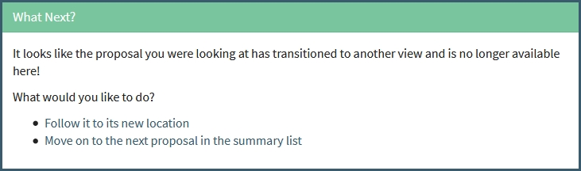

# Release 2.5.0 - May 2018
- Action menu Redesign/Restrictions
    - Proposals can be duplicated (copied) only while in Preparing status (before routing for approval).
    - Revisions can only be initiated from proposals, supplements, and continuations after they have been submitted to the sponsor.
    - Supplements or continuations can be initiated only from proposals that have been awarded by the sponsor.
    - Submitted LOIs, white papers and pre-proposals can be "advanced" to a higher level of a type of work:
        - You can initiate a new proposal by advancing a submitted pre-proposal, LOI or white paper, etc.
        - You can initiate a new pre-proposal by advancing a submitted LOI and white paper.
        - You can initiate a white paper from an LOI and vice versa.
- Proposal Team members will now be restricted to 0% Credit, only the role of PI and Co-PI will have a percent credit
- Various Small Updates and Bug fixes

 

-----

# Release 2.4.0 - April 2018
- **Email Notifications**
    - Work Initiation emails will now also be sent to the Principal Investigator at time of work creation.  This means when a user creates a work item in Summit (New or Advanced), an email will be sent to the Creator, Pre Award assignee, and the Principal Investigator.
- **Summary Pane Additions**
    - The work identifier and type of work will now display in the summary pane.

- **Small Updates**
    - Proposal Team section
        - Percent credit can only be in whole numbers and the total needs to be a 100% to adhere to the Banner system.  An error message will display if either are incorrect.
    - Two additional Conflict of Interest (COI) questions
    - Various Bug Fixes
    - General Information section
        - "Proposal Label" renamed to "Work Label"
        - "Proposal Full Title" renamed to "Full Title"
        - "Type of Work" field moved to the General Information section at the top of the editor, under the Full Title text box.

 

-----

# Release 2.3.0 - March 2018
- **User Preferences** - Updated interface and added functionality for a user's preferences, specifically email notifications.  For more details, click [Here](Navigation/preferences.md).

- **Email Notifications** - Increased capability on choosing what email notifications a user will receive through Summit. For more details, click [Here](Navigation/preferences.md#e-mail-preferences).
    - Previous canceled routing emails went to all users on the proposal team regardless of email setting.  Now to align with the added preferences functionality, it will only go to users that have the Routing/Approval preferences marked to receive and the proposal favorited.
- **Small Updates**  
    - Files ordered by original file's upload date/time
        - Previously there were issues where the order would seem random when a new file was uploaded to a field that already contained file(s).  Now placement is determined by the original file's date/time.  When new versions are uploaded or new files uploaded to a field, the file's position will remain constant.
    - Updated VT logo
        - New Virginia Tech logo is being used at the bottom left of the Summit screen
    - Type of Work field now read-only when In-Routing and Beyond.

 

-----

# Release 2.2.0 - February 2018

- **Approve and Return buttons on Approvals**
    - Separate buttons are now provided for approving or returning an approval.  
    
    - **"Approve" button** - [Click for more Info](Approvals/Approving.md#approving-the-proposal)
        -  Now as an approver, to approve you'll click the "Approve" button and click "Approve" in the approval modal that appears.  If you are approving on behalf of 2 or more organizations, you'll need to check the organizations you are approving on behalf of.
    - **"Return for Correction" button** - [Click for more Info](Approvals/Canceling.md#return-for-correction)
        - Now an approver can send an approval back to the proposal team for correction.  By clicking the "Return For Correction" button, a modal will appear asking for the reason why the approver would like to return the approval back for correction.  Once a comment is written, the "Return for Correction" button will become enabled.  Once pressed, it will take the proposal out of routing and give the proposal team a chance to correct any deficiencies that were noted by the approver. Then once the proposal team is ready, they can put the proposal back into routing for the approvers to review again, then approve/return the approval.
- **Email Notifications for Approvals**
    - **Before update:** Email notifications went to approvers when a proposal was ready for approval at their stage in the routing chain.
    - **After update:** Email notifications still go out when a proposal is ready to be approved at a specific stage in the routing chain, but also if an approval is canceled everyone that has been previously notified of an approval, will be notified that the approval has been canceled and the reason for the cancelation displayed in the email notification.
- **Approval History** - [Click for more Info](Approvals/Approving.md#approval-history)
    - All past routing actions will be logged in a new section within the editor and approval called the Approval History.  This section is located in the Proposal Management of the Editor or in the Approval.  The Approval Decisions section will still display, but is only for routing currently being done.
    
- **IRB question update**
    - The IRB question has been modified to now read "Does the work involve human subjects research (e.g., surveys, observation, lab or clinical research, analysis of existing data/specimens)?".  It is still located in the Compliance section of the editor.
    - The question has also been added to the Initiator screen when going through the Get Started wizard.  This way if the sponsor or prime sponsor has the IRB keyword (mostly NIH related sponsors), as well as having the IRB question answered "Yes" or "Don't Know", an email will be sent to the IRB team to follow-up with the Proposal Team regarding new NIH rules on Human Subjects.
- **Credit Organization**
    - "Responsible Organization" has been renamed "Credit Organization" in the Proposal Team section of Personnel of the Editor.
    
 

-----

# Release 2.1.0 - September 2017

- **Status added to History Log**
    
- **Proposal "Creator" Cannot Add Responsible Org/Credit fix**
    - When a proposal is created by someone outside of the PI's department, they are assigned the "creator" role. If that creator needed to be switched to a team role (Co-PI, Proposal Team), currently the button to allow that person to have their responsible org assigned and given a credit % is disabled.  This has been fixed and now the user can change themselves to another team role.
- **Automated Emails Only for Open Proposals**
    - If a proposal is not in the Open folder, automated emails will no longer be sent when a change is made on the proposal.
- **"Type of Work" shown in Approver and Limited Views**
    - examples: "Proposal" or "Supplement"
- **Submitted Proposal Details Warning Label only Displayed for Proposals/Supplements/Continuations**
    - Now that Pre-Proposals, White Papers, and Letter of Intents can be closed for reason of submitted by Proposal Team members (not just Pre Award associates), this section is open to more than just OSP to fill out and will not appear on Pre-Proposals, White Papers, and Letter of Intents.
    
- **Improved functionality on Bulk Operations**
    - View documentation on the feature [here](data/Data Exports.md).
    
- **Various Small Bug Fixes**

 

-----

# Release 2.0.0 - August 2017

**Video Tutorials**

- [2.0.0 Release Overview](https://www.youtube.com/watch?v=PtN-a-8piUI&feature=youtu.be)
- [Get Started Update](https://youtu.be/9uypak-E9K8)
- [Pre-Proposals, White Papers, and Letter of Intent](https://www.youtube.com/watch?v=A3Ag-JNoUVI&feature=youtu.be)

 

**1. Get Started redesign**

**Get Started** will have all 3 options as seen above

- **Start New Work** will allow a user to create a new Proposal, Pre-Proposal, White Paper, or Letter of Intent.

- **Advance Existing Work** will allow a user to advance an existing Proposal, Pre-Proposal, White Paper or Letter of Intent to the next stage in its lifecycle or create a revision of any type of work.

- **Supplement/Continue Existing Grant** will allow a user to create a work item to request additional funding on an existing grant.

 

**2. Advance redesign**

**Advance** from within a proposal and you will see the same options as you do in the Get Started, except "Start New Work".

- Both options within this screen will automatically pull the proposal ID from the work the user was currently in.  By pulling in the proposal ID, it will also pull in all necessary data from the original proposal, to put on the newly advanced work.   

 

**3. Types of Work updated**
We have removed "Revision" and "Other" as a Types of Work.  For "Revision", you are now able to revise to the Type of Work you're are advancing from (ex. "Proposal" to "Proposal").  For "Other", you can specify if it is a "Supplement" or "Continuation".  This brings the current Type of Works that can be used in Summit as: White Paper, Letter of Intent, Pre-Proposal, Proposal, Supplement, Continuation

 

**4. History Log**
Users will now have the ability to view a list of all Types of Work that have been linked to each other via the advance feature.

Below shows the display in Summit when a user clicks "History".  Sorted by creation date, the earliest work will be at the bottom and most recent created at the top.  All types of work in that cycle can be accessed from another other work while having the History display up, simply click the hyperlink of the Proposal ID.

    Note: The History Log will only show work created after the release of this new feature, 8/18/17.  Works advanced before then will not display in the history log

 

**5. Minor Updates**  
- Compliance questions updated (OESRC and IRB)
    - Newly created proposals will only have the new questions.
    - All existing proposals will have the new OESRC questions added alongside the older ones.  
    - Before a proposal can be routed, the new questions will need to be answered by PI/Proposal team.    
    - Proposals already In-Routing or Approved will have those questions added as well but they will **NOT** be needed to be answered to get the proposal to next status level.
- Year Displayed in the Proposal Summary if not current year
- CDA/NDA requirement question added in the Submission Information section
- Various Bug Fixes
- Increased proposal summary pane width (Updated view shown below)

 

-----

# Release 1.4.0 - May 2017

- Limited View Access for Submitted Proposal
    - When a proposal has been submitted and moves out of the Open folder, users who are a Co-PI/Proposal Team member with Limited View access, Co-PI/Proposal Team members' support staff, approvers will now have access to certain proposal details.
    - Details in Limited View once Submitted: Title, Personnel section, Submission Information (including sponsor details), Budget Information (including cost share breakdown), Subcontractors (if applicable), Compliance issues (if applicable), Approval Decisions graphic, Submitted Proposal Details, and all Files (in File folder)
- Approval transition bug fixed
    - If you approve a proposal and try to move to the next approval or follow the approval to its new location, it does not work. The "Loading approvals" just keep cycling.
- Duplication redesign
- Changed order of First and Last Name to Last, First name in proposal summary pane
- Various bug fixes

 

-----

# Release 1.3.0 - March 2017

- Ability to change a user's preferred email address and unsubscribe from external notifications
    - A user can make these changes in the Managed Preferences section (located at the top right of the browser)
    
    - Once in the managed preferences section, you'll have the ability to unsubscribe from non-essenial Summit emails or add/change your preferred email address.
    
- Ability to add a description to the Third Party Cost Share tab
- Proposal Team can close non-proposals
    - Anyone on the proposal team can close Pre-Proposals, White Papers, or Letter of Intents.  These types of work do not need to go through the normal workflow (routed/approved) and thus can be closed after only filling out the Submitted Proposal Details section at the bottom of the editor.
- Non-Proposals no longer need to be routed
    - Action to routed non-proposals removed from action menu
- No auto loading for work transitions
    - Once a work has transitioned to another folder, a pop-up will display asking if you would either like to go with the work to the new location or go to the next work in your queue (if applicable).
    
- Notifications via Favoriting
    - Notifications within Summit by default only go to the PI, the Pre Award associate, and Support Staff Leads.  Now a user can elect to receive notifications when they favorite the proposal, by clicking the star in the upper right corner of the entry in the proposal summary view or in the header of the proposal.  This action will also add the proposal to your My Open folder.
    

 
