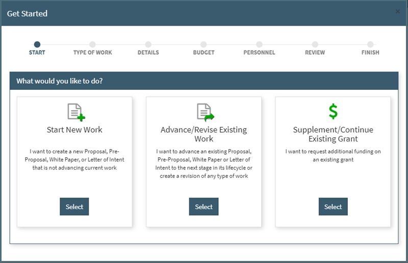

## Release 2.0.0 - August 2017
#### **1. Get Started redeisgn**

Options: Start New Work, Advance Existing Work, Supplement/Continue Existing Grant
  

#### **2. Types of Work updated**

  New: White Paper, Letter of Intent, Pre-Proposal, Proposal, Supplement, Continuation

  Old: White Paper, Letter of Intent, Pre-Proposal, Proposal, Revision, Other

  Changes: Revision and Other have been removed as a Type of Work.  For Revision, you are now able to revise to the Type of Work your are revising from (ex. Proposal to Proposal).  For Other, you can specify if it is a supplement or continuation.
  

#### **3. History Log**
  Users will now have the ability to view a list of all Types of Work that have been linked to each other via the advance feature.
  

#### **4. Minor Updates**  
- Compliance questions updated
- Increase proposal summary pane width (Updated view shown below)

  

#### **5. Bug Fixes**
- Help Text on search fields
- Activity Log erorrs  

---------
## Release 1.4.0 - May 2017

---------
## Release 1.3.0 - March 2017

---------
