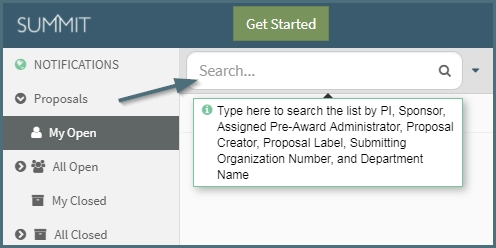

## Release 2.0.0 - August 2017
#### **1. Get Started / Advance redeisgn**

**Get Started** will have all 3 options, while selecting **Advance** from within a proposal only the lst two options will appear.

- **Start New Work**
    - I want to create a new Proposal, Pre-Proposal, White Paper, or Letter of Intent that is not advancing current work
- **Advance Existing Work**
    - I want to advance an existing Proposal, Pre-Proposal, White Paper or Letter of Intent to the next stage in its lifecycle or create a revision of any type of work
- **Supplement/Continue Existing Grant**
    - I want to request additional funding on an existing grant
  

#### **2. Types of Work updated**

**New:** White Paper, Letter of Intent, Pre-Proposal, Proposal, Supplement, Continuation

**Old:** White Paper, Letter of Intent, Pre-Proposal, Proposal, Revision, Other

**Changes:** Revision and Other have been removed as a Type of Work.  For Revision, you are now able to revise to the Type of Work you're are advancing from (ex. Proposal to Proposal).  For Other, you can specify if it is a supplement or continuation.
  

#### **3. History Log**
Users will now have the ability to view a list of all Types of Work that have been linked to each other via the advance feature.

Below shows the display in Summit when a user clicks "History".  Sorted by creation date, the earliest work will be at the bottom and most recent created at the top.  All types of work in that cycle can be accessed from another other work while having the History display up, simply click the hyperlink of the Proposal ID.

  

#### **4. Minor Updates**  
- Compliance questions updated (OESRC and IRB)
- Increase proposal summary pane width (Updated view shown below)

  

#### **5. Bug Fixes**
- Help Text on search fields

- Activity Log erorrs  

---------
## Release 1.4.0 - May 2017

---------
## Release 1.3.0 - March 2017

---------
